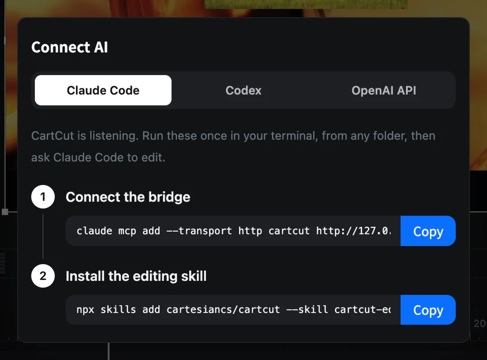

# Editing with AI

CartCut can be edited by an AI assistant. Connect [Claude Code](https://claude.com/claude-code), keep your project open, and ask for edits in plain language: "cut the silences out", "add subtitles", "trim the first 30 seconds". The changes appear in your timeline as you watch, and every one of them can be undone with <kbd>⌘</kbd> <kbd>Z</kbd>.

This works through MCP, a standard way for AI tools to use other apps. CartCut runs a small MCP server on your Mac while it is open; nothing about your project is sent anywhere except to the AI assistant you connect.

## The Connect AI panel

Click the **⚡** icon at the bottom right of the CartCut window.



The panel has three tabs:

- **Claude Code**: the commands to connect Claude Code.
- **Codex**: the same for OpenAI Codex.
- **OpenAI API**: an **OpenAI Key** field, used to transcribe speech when on-device transcription is not available.

If the panel says *The editor bridge is not running*, click **Start bridge**. This usually means another copy of CartCut is already open.

## Connect Claude Code

Choose **one** of these two ways. Using both creates two connections.

### Option A: the plugin (recommended)

In Claude Code, run:

```bash
/plugin marketplace add cartesiancs/cartcut
/plugin install cartcut-editing@cartcut
```

Claude Code asks for your CartCut token once. Find it in the ⚡ panel: it is the long code after `Bearer ` in the **Connect the bridge** command.

### Option B: the commands from the panel

1. In the ⚡ panel, click **Copy** next to **Connect the bridge** and run the command in your terminal. It looks like this:

```bash
claude mcp add --transport http cartcut http://127.0.0.1:9826/mcp --header "Authorization: Bearer <your-token>"
```

2. Click **Copy** next to **Install the editing skill** and run it too:

```bash
npx skills add cartesiancs/cartcut --skill cartcut-editing -a claude-code -g
```

Run these once, from any folder. To check, run `claude mcp list`: you should see `cartcut` (or `plugin:cartcut-editing:cartcut` with Option A).

## Other AI apps

Claude Desktop, Cursor, Codex and any other MCP client can connect through a small helper that finds the token by itself. It needs Node.js 18 or later.

For Claude Desktop or Cursor, add this to the app's MCP settings:

```json
{
  "mcpServers": {
    "cartcut": {
      "command": "npx",
      "args": ["-y", "@cartesiancs/cartcut-mcp"]
    }
  }
}
```

For Codex:

```bash
codex mcp add cartcut -- npx -y @cartesiancs/cartcut-mcp
```

## What to ask for

Open CartCut with your project, then ask in plain language. For example:

- "Cut the silences out of this interview."
- "Add subtitles to the whole video."
- "Trim the first 30 seconds."
- "Put a title that says Summer Trip over the first clip, then fade it out."
- "Add a cross dissolve between every clip."
- "Punch in when he raises his voice."

Each request becomes one or more normal edits in your undo history. If you do not like a result, press <kbd>⌘</kbd> <kbd>Z</kbd>.

> [!TIP]
> Edits that rely on what is said, such as removing silences or adding subtitles, need transcription: on-device on macOS 26 or later, or an OpenAI key in the ⚡ panel.

## Troubleshooting

| Message | What to do |
| --- | --- |
| Connection refused, or *CartCut is not running* | Open CartCut. If it is open, check the ⚡ panel for *Start bridge* |
| 401, or *CartCut refused the token* | The token changed or was copied wrongly. Copy the command from the ⚡ panel again |
| Two `cartcut` servers in `claude mcp list` | You used both options. Remove one with `claude mcp remove cartcut` |
