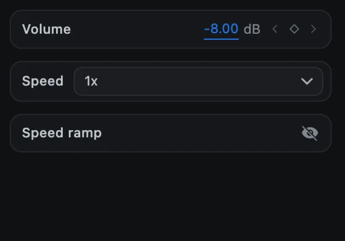
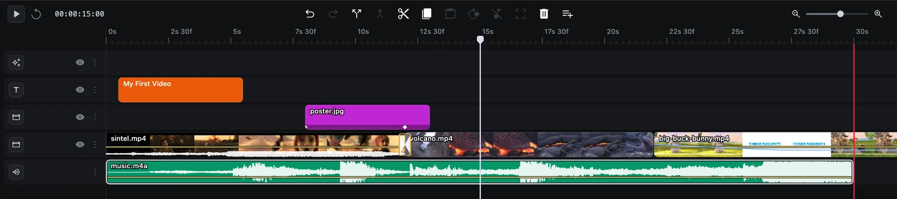

# Audio

CartCut mixes the sound of every audio clip and every video that has sound. This page covers volume, fades, separating sound from video, and recording narration.

## Volume

Select an audio clip, or a video with sound. The **Volume** row at the top of the options panel sets its level in decibels (dB).

- `0` dB leaves the sound unchanged.
- Negative values make it quieter. Background music usually sits around `-10` to `-15` dB under speech; `-60` dB is silent.
- Positive values up to `+12` dB make it louder.

## Fades and volume changes over time

Every audible clip shows a waveform and a thin horizontal **volume line**.

| To | Do this |
| --- | --- |
| Change the whole clip's level | Drag the line up or down |
| Add a point | <kbd>Option</kbd> + click the line |
| Remove a point | <kbd>Option</kbd> + click the point |
| Make a fade | Add two points and drag one of them down |

The points are volume keyframes. You can also add them with the diamond next to **Volume** in the options panel: move the playhead, change the value, and a keyframe is written there.

## Separate sound from video

To edit a video's sound on its own, select the video and click **Detach audio** in the toolbar (or right-click ▸ **Detach audio**). The sound becomes a new clip on an audio track, and the video goes silent. You can then trim, move or delete the sound independently.

## Silence a clip or track

There is no mute button on tracks. To silence a clip, set its **Volume** to `-60` dB, or detach its audio and delete the audio clip.

> [!NOTE]
> Hiding a track with its eye button hides the picture only. The sound still plays and is still exported.

## Record a voice-over

1. Open **Utilities** (the sliders icon) and click **Audio Record**.
2. An **Audio Record** tab opens over the preview: *Press record to capture the microphone.*
3. Click **record** and speak. A live waveform and timer show the recording.
4. Click **stop**. The recording is added to the timeline at the playhead.

macOS asks for microphone access the first time.

## Level meter

The meter at the bottom left of the preview shows the loudness of what is playing. Keep the loudest parts out of the top so the export does not clip.

## Generated narration

To turn typed text into speech, use [Text to Speech](utilities#text-to-speech).
