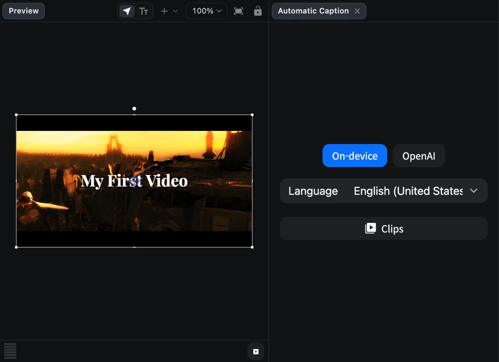
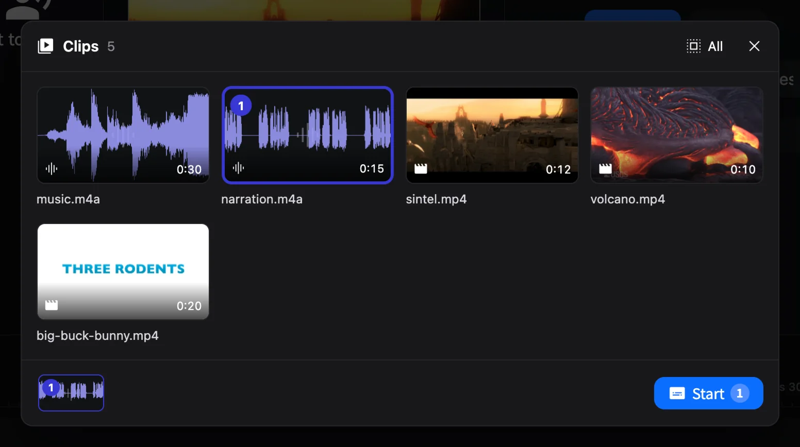
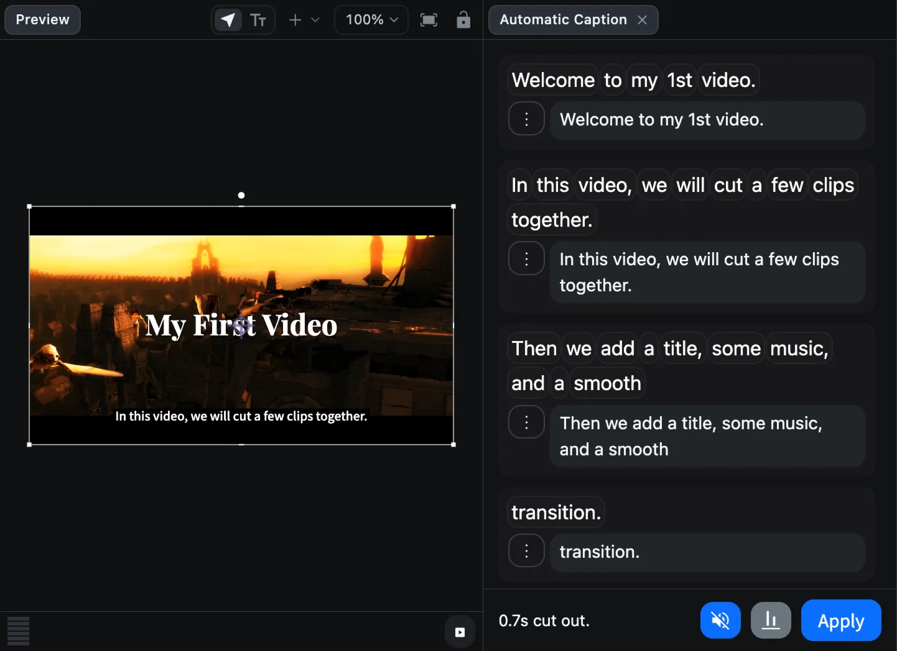
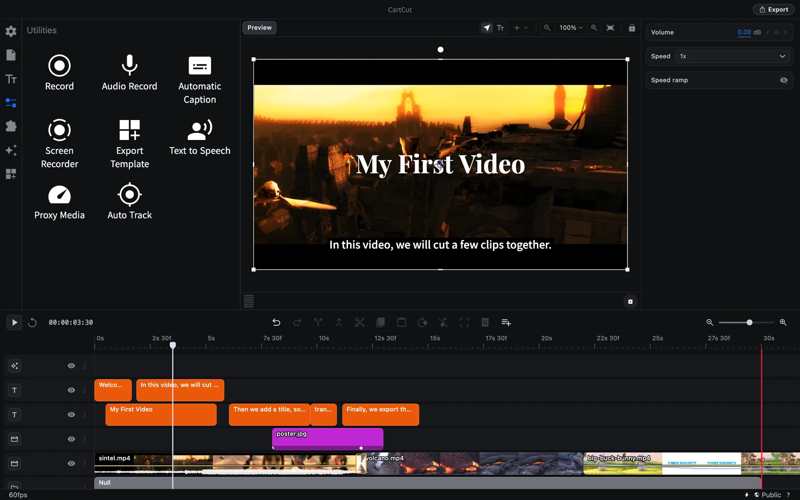
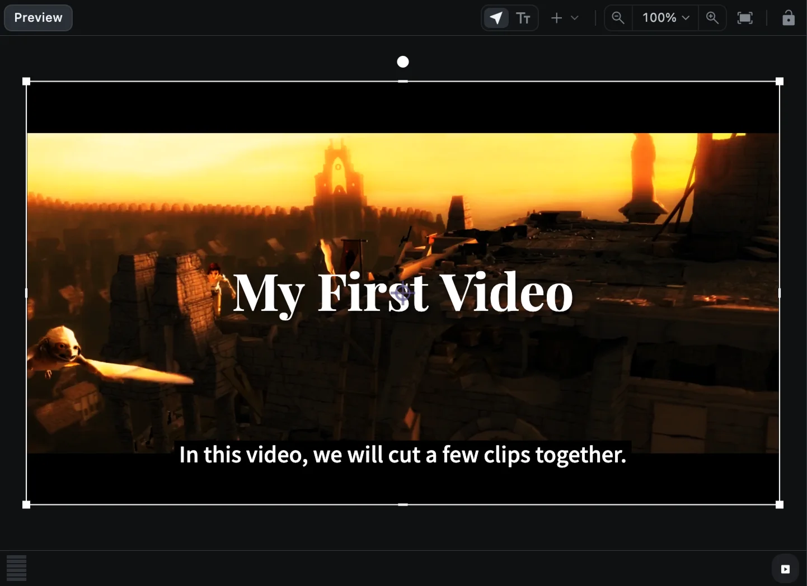

# Automatic captions

CartCut can listen to the speech in your clips, write it out as captions, place them on the timeline and cut out the silent pauses, all in one pass. You review the result, fix any words, and click **Apply**.

## What you need

There are two ways to transcribe:

| Method | Requirements | Notes |
| --- | --- | --- |
| **On-device** | macOS 26 or later | Runs on your Mac. Each language's model downloads once, then works offline |
| **OpenAI** | An OpenAI API key | Used automatically when On-device is not available |

To use OpenAI, add your key first: click the **⚡** icon at the bottom right of the window, open the **OpenAI API** tab and paste the key into **OpenAI Key**. It is stored only on your computer.

## Make captions

### 1. Open the caption panel

Open **Utilities** (the sliders icon) and click **Automatic Caption**. The **Automatic Caption** panel opens beside the preview.

### 2. Choose the method and language

- Click **On-device** or **OpenAI**. If On-device cannot run on your Mac, it is greyed out with the reason.
- For On-device, choose the spoken **Language**. Languages not yet on your Mac show *(downloads once)*. OpenAI detects the language by itself.

### 3. Choose the clips

Click **Clips**. A picker shows every video and audio clip on the timeline; clips you had selected on the timeline are already chosen.

- Click a clip to add or remove it. **All** chooses every clip.
- The tray at the bottom shows the order. Drag the chips to reorder them.
- Click **Start** (<kbd>⌘</kbd> <kbd>Return</kbd>).

### 4. Wait for the transcript

The panel shows each stage: extracting the audio, downloading the language model (first time only), transcribing, and finding the silent gaps. Then the captions are laid down on the timeline one by one. **Cancel** stops at any point.

### 5. Review and edit

Each spoken line becomes a row in the panel, and a caption on the timeline.

| To | Do this |
| --- | --- |
| Hear a word | Click it. The playhead jumps there |
| Fix the text | Type in the line's box. The caption updates immediately |
| Split a line | Put the cursor where it should break and press <kbd>Return</kbd> |
| Join with the line above | Press <kbd>Delete</kbd> at the start of the line |
| Join with the next line | Press <kbd>Fn</kbd> <kbd>Delete</kbd> at the end of the line |
| Undo a split or join | <kbd>⌘</kbd> <kbd>Z</kbd> |
| More options | The **⋮** button: merge into the line above, or delete the line **and cut its footage** |

The bottom of the panel shows how much silence was cut, and three buttons:

- **Silence** (the muted speaker): silent gaps are removed automatically. Click it to put them back, and again to remove them.
- **Placement**: captions in the **Lower third** (default) or the **Centre of the frame**.
- **Apply**.

### 6. Apply

Click **Apply**. The captions and cuts become part of your edit as a single undo step, and the panel closes.

> [!WARNING]
> Closing the panel with its **×** button without clicking **Apply** throws the captions away.

## Good to know

- **The timeline is locked while the panel is open.** You can still play, move the playhead and select clips, but edits wait until you click Apply or close the panel. The track menus show a padlock as a reminder.
- **Captions are ordinary text clips.** After applying, select them and style them like any text: font, size, color, background. See [Text](text).
- **Export them as a file.** **File ▸ Export Subtitles…** saves your captions as `.srt` or `.vtt` for YouTube and other players.
- **Clear audio gives the best results.** Reduce background music before transcribing, or caption the voice track on its own.
