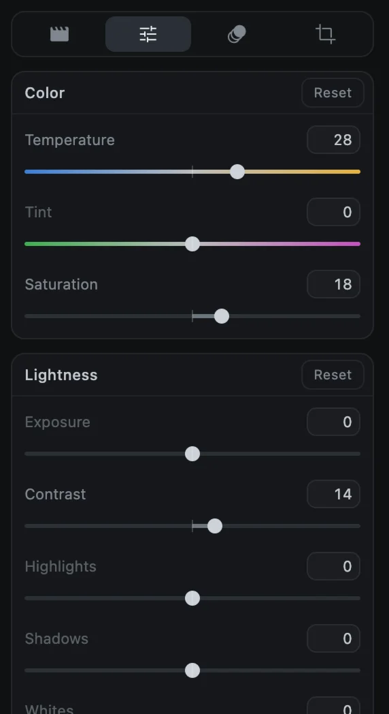
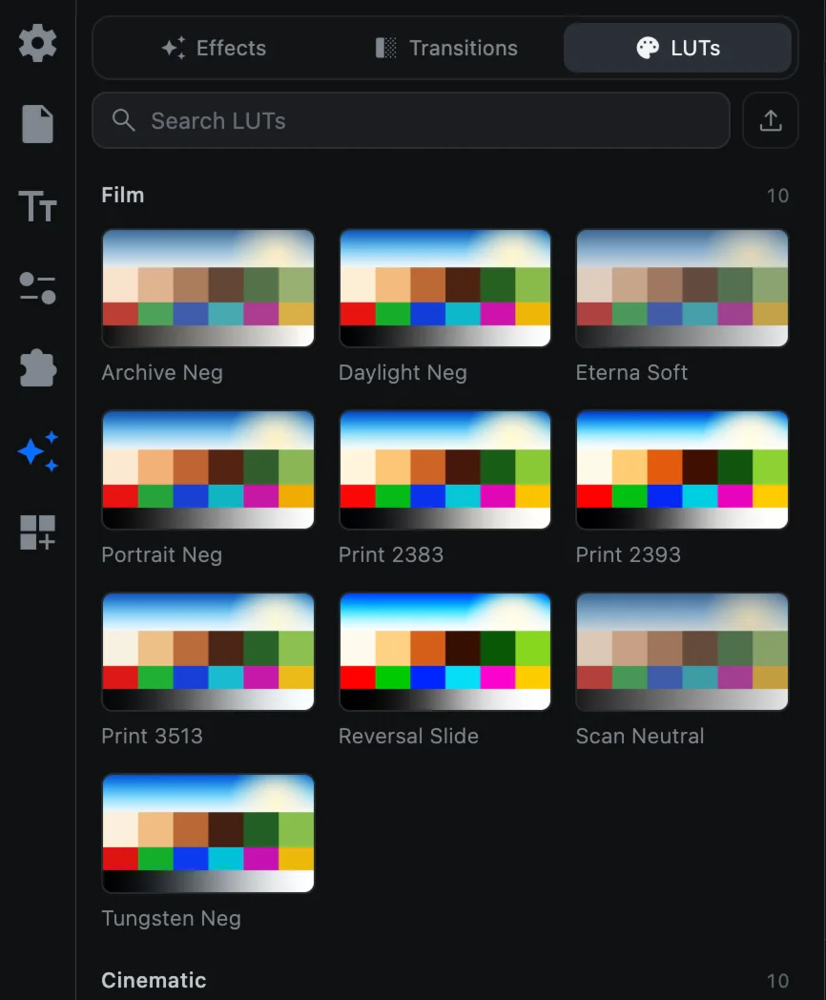
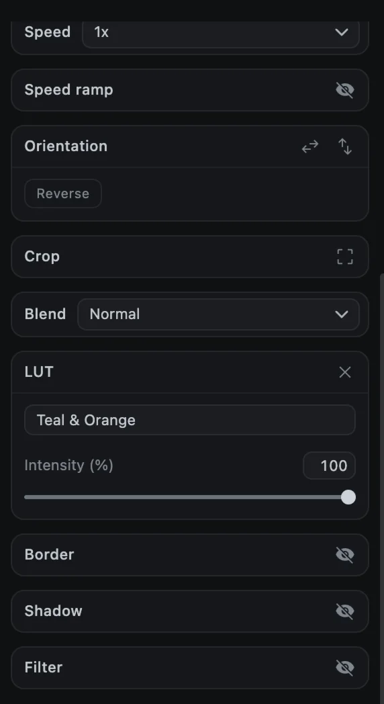

# Color and LUTs

CartCut has two tools for color: the **Adjust** sliders for fixing and fine-tuning, and **LUTs** for applying a complete look in one click. You can use both on the same clip.

## Adjust

1. Select a video, image, shape or text clip.
2. Open the **Adjust** tab in the options panel (the second tab).
3. Drag the sliders. The preview updates as you drag.

| Group | Sliders | What they do |
| --- | --- | --- |
| **Color** | Temperature, Tint, Saturation | Warmer or cooler, green or magenta, and how colorful |
| **Lightness** | Exposure, Contrast, Highlights, Shadows, Whites, Blacks, Brilliance | Overall brightness and how bright and dark areas are balanced |
| **Effects** | Sharpen, Clarity, Particles, Fade, Vignette | Detail, film grain, a washed-out look and darker or lighter corners |

Most sliders run from -100 to 100, with 0 meaning no change. Sharpen, Clarity, Particles and Fade run from 0 to 100.

- **Double-click a slider's name** to reset that one slider.
- **Reset** on a group resets the group; **Reset all** at the bottom resets everything.

> [!TIP]
> Fix first, then style: set exposure and white balance with Adjust, then add a LUT for the look.

## LUTs

A LUT (look-up table) remaps every color to give footage a consistent look, like a film stock or a cinematic grade. CartCut includes 80.

1. Open the **Effects** tab (the sparkles icon) and click **LUTs** at the top.
2. Select the clip you want to grade on the timeline.
3. Click a LUT tile. The look is applied to the selected clip.

| Category | Examples |
| --- | --- |
| Film | Archive Neg, Daylight Neg, Eterna Soft, Print 2383 |
| Cinematic | Teal & Orange, Golden Hour, Blockbuster, Nordic Noir |
| Vintage | Faded Seventies, Super 8, Sepia Print |
| Black & White | Mono Contrast, Mono Neutral, Mono Platinum |
| Warm and Cool | Sunset Glow, Honey, Arctic, Winter Blue |
| Vivid and Matte | Vivid Pop, HDR Look, Matte Film, Matte Pastel |
| Log Conversion | C-Log3, D-Log, HLG, LogC3, S-Log3, V-Log to Rec.709 |
| Utility | Contrast +/-, Exposure +/-, Broadcast Safe |

Use **Search LUTs** to find one by name.

### Adjust or remove a LUT

With the clip selected, the **LUT** section in the **Media** tab shows the LUT's name and an **Intensity** slider from 0 to 100%. Lower it for a subtler look. The **×** button removes the LUT.

### Grade several clips at once

Click a LUT tile with **nothing selected**. CartCut adds it as an **adjustment layer** at the playhead: an effect clip that grades every clip on the tracks beneath it. Stretch it across your whole edit for one consistent look.

You can also drag a LUT tile onto a clip to grade that clip, or onto empty track space to create an adjustment layer there.

### Import your own LUTs

Click the upload button next to the search box (**Import a .cube, .3dl or LUT image**), or drop files onto the panel. CartCut reads `.cube`, `.3dl` and HaldCLUT `.png` files. Imported LUTs appear under **My LUTs**.

## Blend modes

To control how a clip mixes with what is below it, use **Blend** in the Media tab. See [Position, size and rotation ▸ Blend modes](transform#blend-modes).
