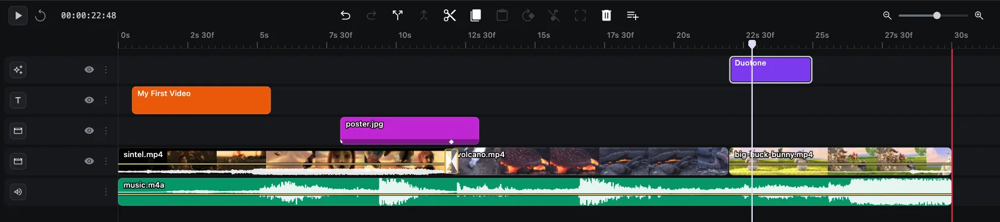
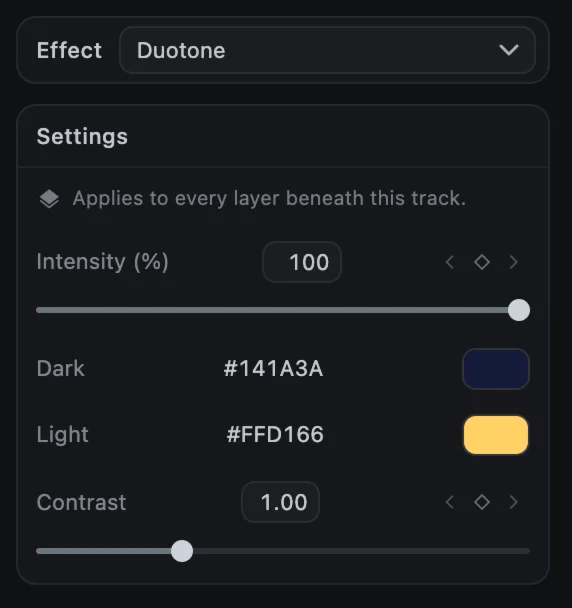
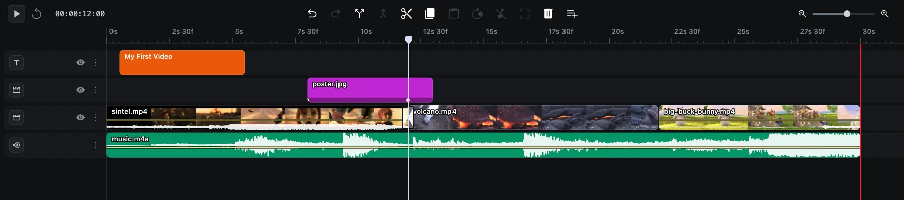
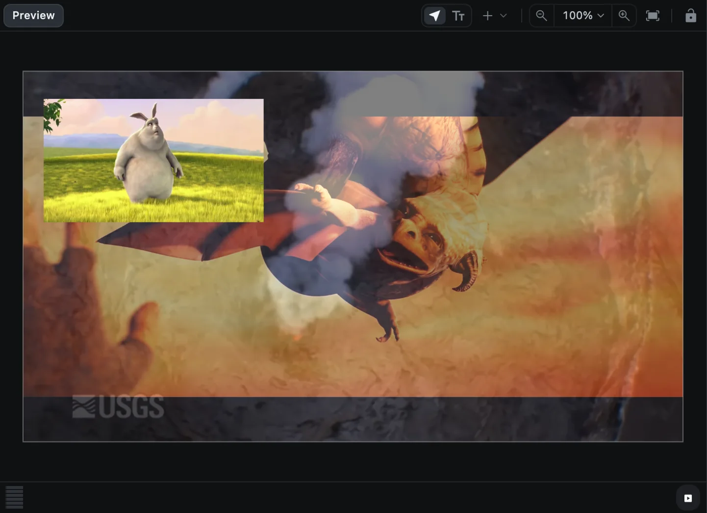
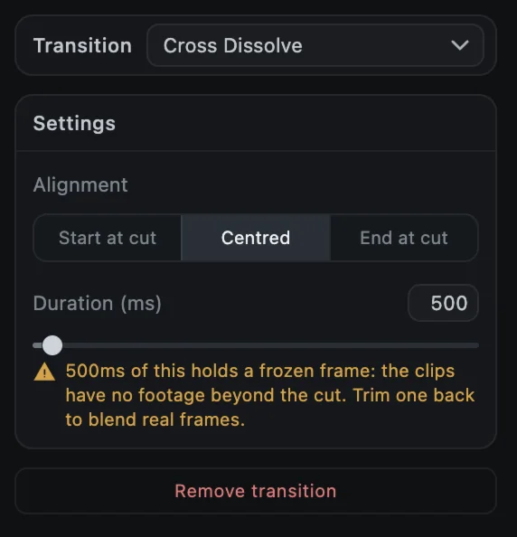
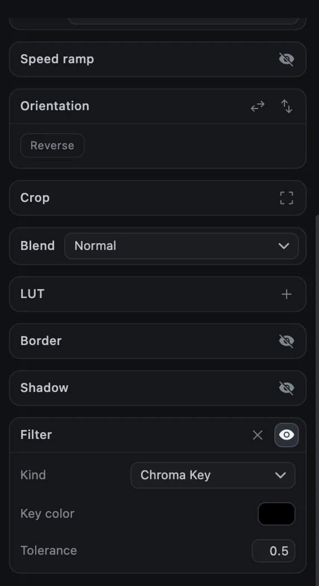

# Effects and transitions

Effects change how your footage looks, from blur and glow to VHS and glitch. Transitions blend one clip into the next. Both live in the **Effects** tab (the sparkles icon), which has three sections: **Effects**, **Transitions** and **LUTs** (see [Color and LUTs](color)).

Hover over any tile to see a moving preview of it.

## Effects

### Add an effect

1. Move the playhead to where the effect should start.
2. Click an effect tile, or drag it onto the timeline.
3. An **effect clip**, 3 seconds long, appears on its own track.

An effect clip changes **every layer beneath its track** for as long as it lasts. Drag its edges to change when it starts and stops, and move its track up or down to choose which layers it affects.

### Adjust an effect

Select the effect clip. The options panel shows:

- **Effect**: a menu to switch to a different effect. You can also select the clip and click another tile.
- **Intensity**: how strong the effect is, from 0 to 100%.
- The effect's own settings, such as colors, amount or angle.
- **Blend**, for effects that add light or texture on top of the picture.

Intensity and the numeric settings have keyframe diamonds, so an effect can fade in or change over time. See [Keyframe animation](keyframes).

### All effects

| Category | Effects |
| --- | --- |
| Colour | Channel Mixer B&W, Duotone, Exposure & Contrast, Lift Gamma Gain, Saturation, Split Tone, Temperature |
| Tone | Bleach Bypass, Faded Film, Invert, Posterize, Sepia, Threshold |
| Optical | Anamorphic Streak, Bloom, Chromatic Aberration, Halation, Lens Distortion, Vignette |
| Blur | Gaussian Blur, Motion Blur, Radial Blur, Tilt Shift |
| Texture | Dust & Scratches, Film Grain, Halftone, Scanlines, Static Noise, VHS |
| Stylise | Digital Glitch, Edge Detect, Kaleidoscope, Mirror, Pixelate, Sharpen, Teal & Orange |
| Light | Flicker, Light Sweep, Strobe |

## Transitions

### Add a transition

A transition goes on a **cut**: the point where one clip ends and the next begins on the same track.

**From the browser**

1. Select a clip next to the cut.
2. Click a transition tile. It is placed on the nearest cut that does not have one yet, 500 ms long and centered on the cut.

**From the timeline**

Hover over the cut between two clips on the timeline and click the marker that appears.

### Adjust a transition

Click the transition on the timeline. The options panel shows:

- **Transition**: a menu to switch to a different transition.
- **Alignment**: **Start at cut**, **Centred** or **End at cut**.
- **Duration** in milliseconds, with the longest length that fits this cut.
- **Remove transition**.

> [!NOTE]
> A transition needs footage from both clips overlapping the cut. If a clip has no extra footage beyond its edge (for example, a clip that starts at the very beginning of its file), CartCut warns that part of the transition holds a frozen frame. Trim the clip back a little to blend real frames instead.

### All transitions

| Category | Transitions |
| --- | --- |
| Dissolve | Additive Dissolve, Cross Dissolve, Dip to Colour, Film Dissolve |
| Wipe | Barn Door, Blinds, Clock Wipe, Iris Circle, Iris Diamond, Luma Wipe, Linear Wipe |
| Slide | Push, Slide, Split, Squeeze, Stretch |
| Zoom | Cross Zoom, Whip Pan, Zoom In, Zoom Out |
| Distort | Chroma Split, Glitch, Pixelate Dissolve, Ripple, Swirl, Wave |
| Pattern | Checkerboard, Grid Flip, Halftone Reveal, Noise Dissolve |
| 3D | Card Flip, Cube Rotate, Door, Page Curl |
| Light | Burn, Flash, Light Leak |

## Video filters: chroma key and blur

Video clips also have a **Filter** section at the bottom of the Media tab, for removing a green screen or blurring a single clip.

1. Select a video clip and scroll to **Filter**.
2. Click the **eye** to turn filters on, then **+** to add one.
3. Choose a **Kind**:
   - **Chroma Key** removes one color. Set **Key color** to the background color and raise **Tolerance** until the background disappears.
   - **Blur** and **Radial Blur** blur the clip by **Strength**.

The **×** button removes the filter, and the eye turns it off and on so you can compare.
