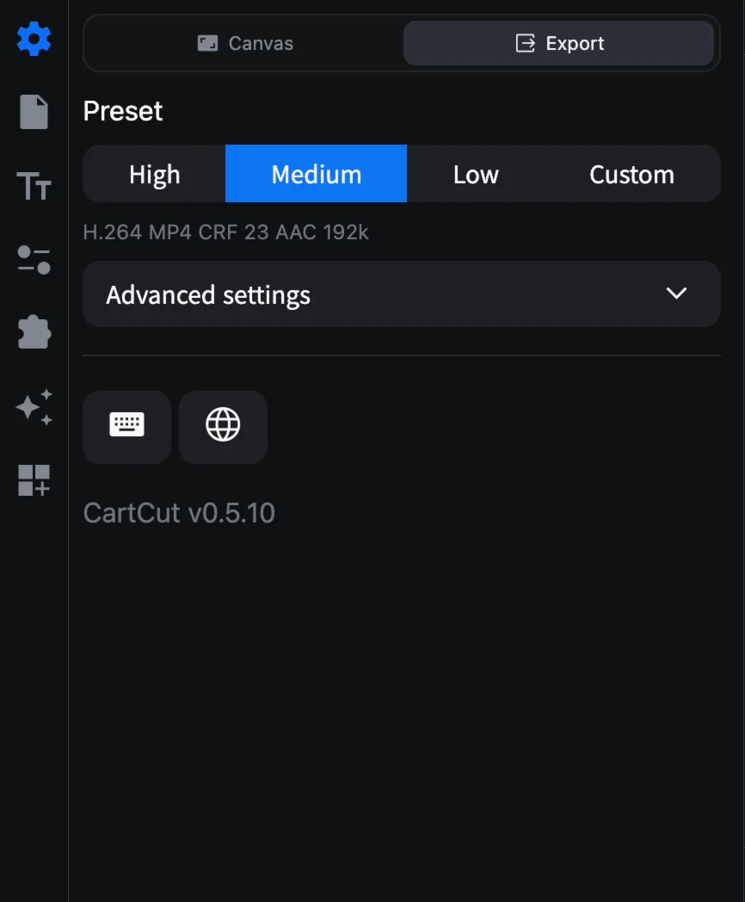
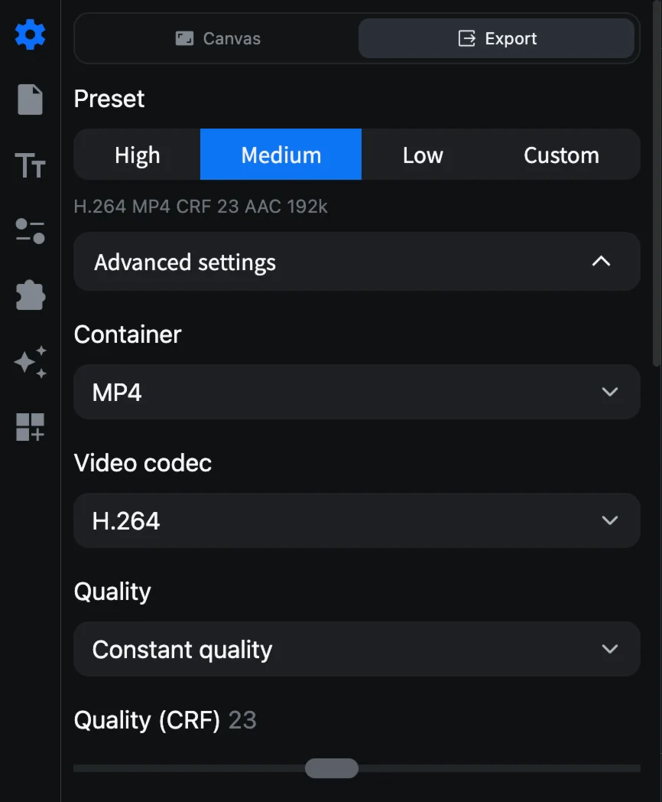
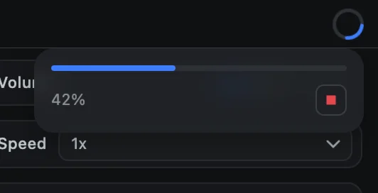

# Exporting a video

Exporting renders your project into a video file you can upload, share or play anywhere. You choose the format once in **Settings ▸ Export**, then export with one click.

## Before you export

- **Check the length.** The video is exactly as long as **Duration** in **Settings ▸ Canvas**, regardless of where your clips end. See [Project settings](project-settings#duration).
- **Check hidden tracks.** Tracks hidden with their eye button are left out of the export.
- **Save your project** with <kbd>⌘</kbd> <kbd>S</kbd>.

## Choose a quality

Open **Settings** (the gear icon) and click **Export** at the top of the panel.

Pick a **Preset**:

| Preset | Video | Encoding speed | Audio | Use it for |
| --- | --- | --- | --- | --- |
| **High** | H.264 MP4, CRF 18 | slow | AAC 320 kbps, 48 kHz | Final uploads where quality matters most |
| **Medium** (default) | H.264 MP4, CRF 23 | medium | AAC 192 kbps, 48 kHz | Most videos |
| **Low** | H.264 MP4, CRF 28 | veryfast | AAC 128 kbps, 44.1 kHz | Quick previews and small files |
| **Custom** | Your own settings | | | See below |

The line under the presets summarizes the current choice, for example *H.264 MP4 CRF 23 AAC 192k*.

### Advanced settings

Click **Advanced settings** (choosing **Custom** opens it too) to set everything yourself.

| Setting | Choices |
| --- | --- |
| Container | MP4, MOV, WebM |
| Video codec | H.264, H.265 (HEVC), VP9 (WebM only), ProRes (MOV only) |
| Quality | **Constant quality** (a CRF value) or **Target bitrate** (in kbps) |
| Quality (CRF) | 0 to 51 (0 to 63 for VP9). Lower means better quality and a bigger file |
| Hardware acceleration | Encode on the Mac's media engine. Much faster, slightly larger files. H.264, H.265 and ProRes |
| Encoding speed | ultrafast to veryslow. Slower gives smaller files at the same quality |
| ProRes profile | Proxy, LT, 422, 422 HQ, 4444, 4444 XQ |
| Audio codec | AAC or MP3 (MP4), AAC or PCM (MOV), Opus or Vorbis (WebM) |
| Audio bitrate | 96 to 320 kbps |
| Sample rate | 44100 or 48000 Hz |
| Channels | Mono or Stereo |

> [!TIP]
> **For sharing**, use H.264 MP4: it plays everywhere. **For editing in another app**, use ProRes MOV. **For the web**, VP9 WebM gives small files. ProRes files are very large, hundreds of MB per minute.

## Export

1. Click **Export** at the top right of the window, press <kbd>⌘</kbd> <kbd>E</kbd>, or choose **File ▸ Export Video…**.
2. Choose a name and a folder, and click **Export**. A file with the same name is replaced.
3. The Export button becomes a progress ring. **You can keep editing while it renders.**
4. Click the ring to see the progress. The red button stops the export.

5. When **Rendering is complete** appears, click **Open Saved Folder** to see the file in Finder.

## If something goes wrong

- *An export is already running*: wait for it to finish, or stop it from the progress ring.
- *Export failed*: the message explains why. If it mentions FFmpeg, choose **About ▸ Setting ▸ Reinstall FFmpeg**.
- Black frames at the end: the project Duration is longer than your edit. Shorten it in **Settings ▸ Canvas**.
- A clip missing from the export: its track may be hidden, or the clip may be past the red end line.
