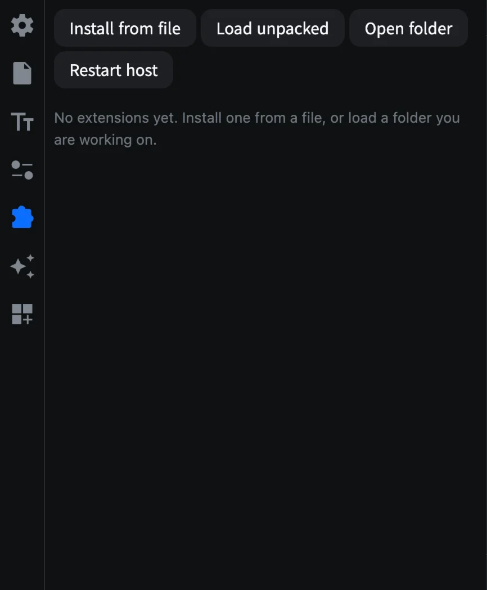
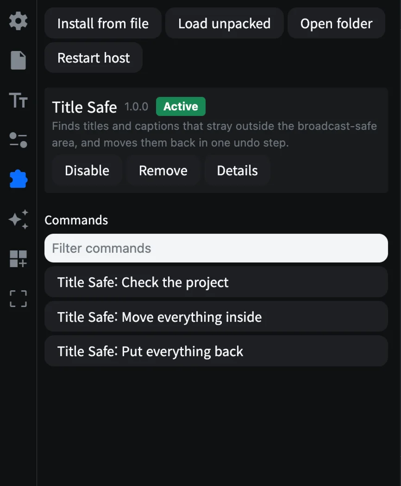
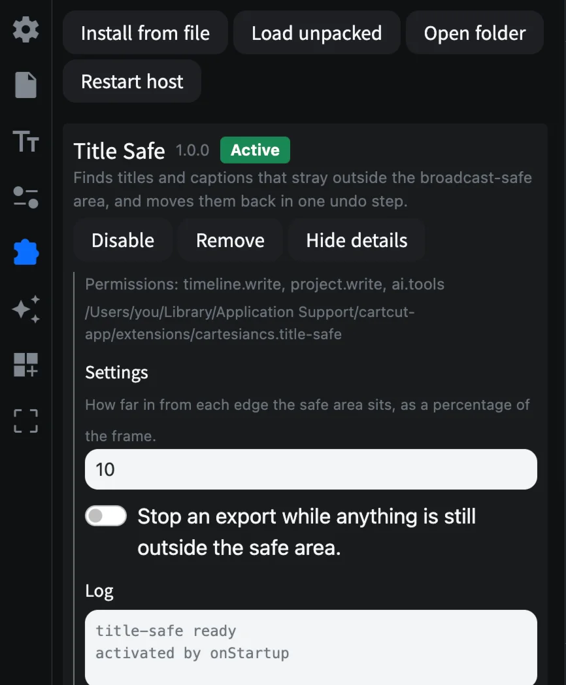

# Extensions

Extensions add features to CartCut: new commands, panels, effects, templates, animation presets and even tools for AI assistants. They are installed from a file or loaded from a folder.

## The Extensions tab

Open the **Extensions** tab (the puzzle piece icon in the sidebar).



| Button | What it does |
| --- | --- |
| **Install from file** | Installs an extension from a `.cartcut-ext` or `.zip` file |
| **Load unpacked** | Loads an extension from a folder, for developing your own |
| **Open folder** | Shows where installed extensions are kept |
| **Restart host** | Restarts all extensions, for example after one stops responding |

## Install an extension

1. Click **Install from file** and choose the extension's `.cartcut-ext` or `.zip` file.
2. CartCut shows the extension's name, version and everything it asks permission to do.
3. Click to confirm. A message says it was installed.



Each extension shows a status badge: **Active** (running), **Idle** (waiting until needed), **Disabled**, **Failed** or **Unpacked** (loaded from a folder).

| Button | What it does |
| --- | --- |
| **Enable** / **Disable** | Turns the extension on or off |
| **Remove** | Uninstalls it (**Forget** for a folder you loaded) |
| **Details** | Shows its permissions, folder, settings and log |

If an extension adds commands, they are listed under **Commands**; click one to run it, or use **Filter commands** to find it. Extensions can also add their own sidebar icon, items to the clip's right-click menu, an **Extensions** menu in the menu bar, keyboard shortcuts and items in the status bar.



## Permissions

Before installing, CartCut lists what the extension wants to do:

| Permission | Means the extension can |
| --- | --- |
| timeline.write | Change your timeline. Every change is one undo step |
| project.write | Store its own data in your project file |
| fs.read / fs.write | Read or write files in your project folder and folders you pick |
| process.spawn | Run programs on your computer, including the bundled FFmpeg |
| net | Connect to the internet |
| clipboard | Read and write your clipboard |
| shell.open | Open links and files in other apps |
| secrets | Store passwords and API keys in your system keychain |
| ai.tools | Offer tools to Claude Code when it edits this project |

> [!WARNING]
> Extensions run with the same access to your computer that CartCut has. The permission list tells you what an extension intends to do; it is not a sandbox. Only install extensions you trust.

Extensions run in a separate process. If one crashes or freezes, it is restarted, and your timeline, undo history and unsaved project are not affected.

## Build your own

An extension is a folder with a `package.json` manifest and a JavaScript file. A minimal one that adds a command:

```json
{
  "name": "hello",
  "publisher": "acme",
  "version": "1.0.0",
  "main": "main.js",
  "engines": { "cartcut": "^1" },
  "cartcut": {
    "activationEvents": ["onCommand:hello.say"],
    "permissions": ["timeline.write"],
    "contributes": {
      "commands": [{ "id": "hello.say", "title": "Hello: Say" }]
    }
  }
}
```

```js
const cartcut = require("cartcut");

exports.activate = (ctx) => {
  ctx.subscriptions.push(
    cartcut.commands.registerCommand("hello.say", async () => {
      const info = await cartcut.project.info();
      await cartcut.timeline.addText({
        text: "Hello",
        startMs: info.playheadMs,
        durationMs: 2000,
      });
    }),
  );
};
```

1. Click **Load unpacked** and choose the folder.
2. Run **Hello: Say** from the Commands list. A text clip appears at the playhead.
3. Saving any file in the folder restarts the extension, so your next run uses the new code.

For editor autocompletion, install the type definitions:

```bash
npm install --save-dev @cartcut/extension-api
```

A complete example, **Title Safe**, which finds titles outside the broadcast-safe area and moves them back in one undo step, is in the [`examples/extensions/title-safe`](https://github.com/cartesiancs/cartcut/tree/main/examples/extensions/title-safe) folder of the repository.
