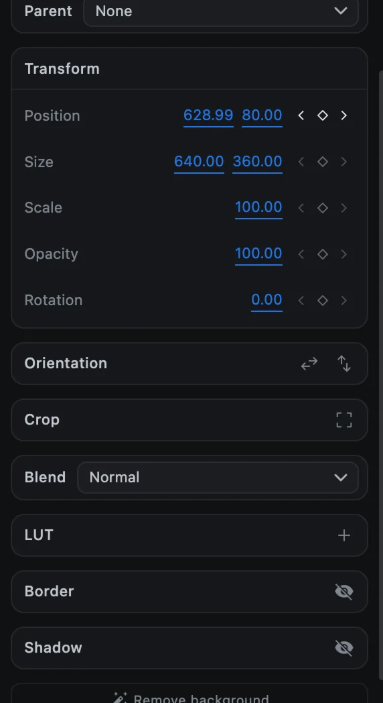
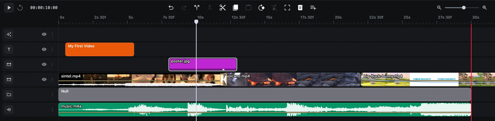

# Groups and parenting

When several clips should move as one, such as a logo and its caption, or a frame around a picture, you can group them or attach them to a parent.

## Group clips

1. Select the clips (for example with <kbd>Shift</kbd> + click).
2. Press <kbd>⌘</kbd> <kbd>G</kbd>, or choose **Clip ▸ Group**, or right-click ▸ **Group selected**.

A **Group** clip appears on a group track. Moving, scaling, rotating or animating the group affects everything in it.

| To | Do this |
| --- | --- |
| Ungroup | <kbd>⇧</kbd> <kbd>⌘</kbd> <kbd>G</kbd>, or right-click ▸ **Ungroup** |
| Take one clip out | Right-click it ▸ **Remove from group** |
| Delete a group and its clips | Select the group and press <kbd>Delete</kbd> |

Audio clips cannot be grouped. If you ungroup an animated group, CartCut warns you that the group's animation is discarded and only its position at the playhead is kept.

## Null objects

A null object is an invisible group with nothing in it. It never appears in the video; it exists only to carry other clips.

1. Click **Add a shape** (**+**) in the preview toolbar and choose **Null Object**.
2. A **Null** clip as long as the project appears on a group track, and a small cross-hair handle appears in the preview.

## Attach a clip to a parent

1. Select the clip you want to attach.
2. In the **Media** tab, find **Parent** above **Transform**. It appears once the project has at least one group or null.
3. Choose the group or null.

The clip stays exactly where it is on screen. From now on, moving, scaling, rotating or animating the parent carries the clip with it, while the clip can still have its own animation on top.

Choose **None** to detach a clip. Some choices are disabled, with a reason shown when you hover them: a clip cannot be its own parent, a group cannot go inside one of its own children, and nesting is limited to 8 levels.

> [!TIP]
> [Auto Track](utilities#auto-track) can make a null that follows something moving in your video. Attach a title or shape to it and it will stick to that thing.
