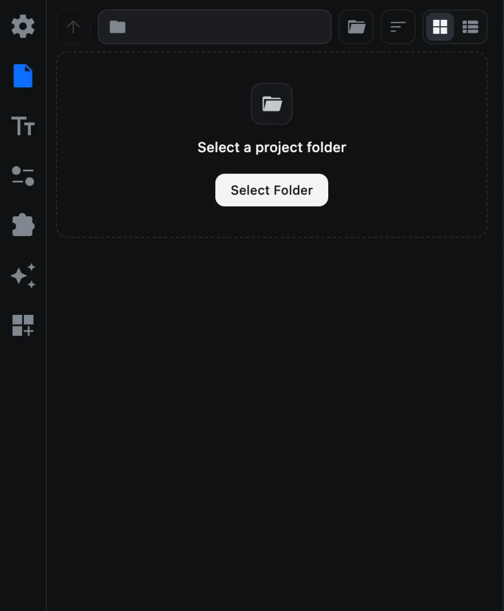
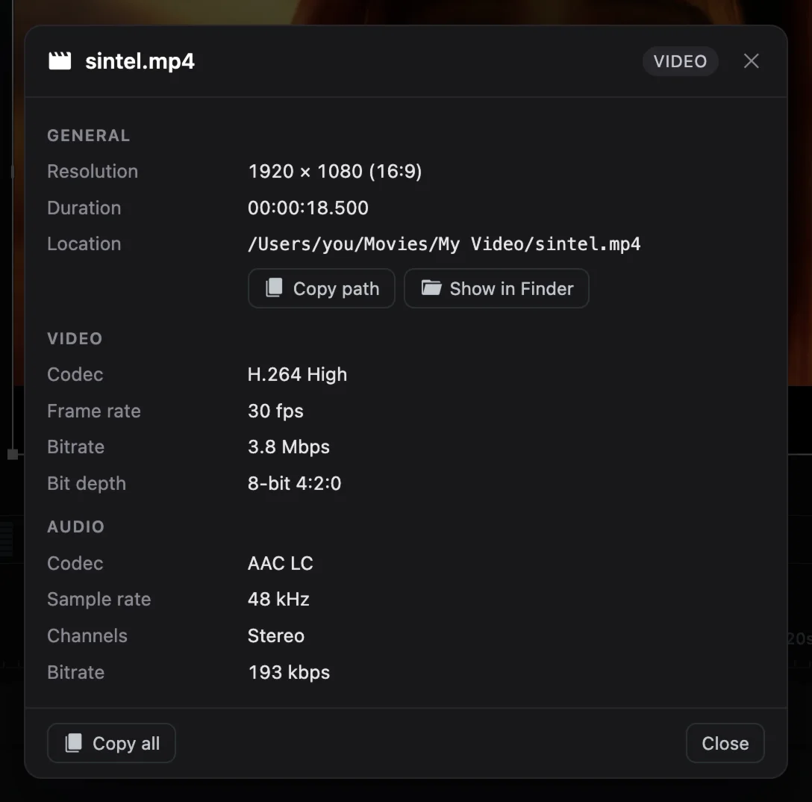

# Importing media

Before you can edit a clip, it has to be on the timeline. CartCut gives you four ways to get it there.

## Supported files

| Type | Formats |
| --- | --- |
| Video | MP4, MOV, MKV, WebM, AVI, WMV, MPG |
| Image | PNG, JPG, JPEG, WebP, SVG |
| Animated image | GIF |
| Audio | MP3, WAV, M4A |
| Subtitles | SRT, VTT (see [Text](text#subtitle-files)) |
| Templates | CTTPL (see [Templates](templates)) |

Files in any other format are skipped with a message explaining why.

## The File tab

The **File** tab (the document icon, second in the sidebar) is a file browser built into CartCut.

1. Click **Select Folder** and choose a folder. Its videos, images and audio appear as thumbnails, and its subfolders as folder icons.
2. Click a folder icon to open it. Click **Parent Folder** (the up arrow) to go back up.
3. Click **Change Folder** (the folder button next to the path) to browse somewhere else.

| Control | What it does |
| --- | --- |
| Sort | Sort by Name, Kind, Date Modified, Date Created or Size, in either direction |
| Grid / List | Show thumbnails, or a list with details such as duration and size |
| Hover | Hold the pointer over a video, image or GIF for a moment to see a large preview |
| Right-click | **Show Info** shows the file's resolution, codec, frame rate, audio format and location |

## Four ways to add media

### 1. Click a thumbnail

Click any file in the File tab. It is added to the timeline at the playhead.

### 2. Drag a thumbnail

Press and hold a thumbnail for a moment (about a fifth of a second), then drag it onto the timeline. It lands where you drop it. If you start dragging immediately, the panel scrolls instead.

### 3. Use the menu

Choose **File ▸ Import Media…** (<kbd>⌘</kbd> <kbd>I</kbd>) and pick one or more files. They are added at the playhead.

### 4. Drag from Finder

Drag files straight from Finder:

- Drop them **on the timeline** to place them where you drop.
- Drop them **anywhere else** in the window to place them at the playhead.

## Where new clips land

- A clip goes on a track of its own kind: videos, images and GIFs on a **video track**, sound on an **audio track**.
- CartCut uses the lowest free track of that kind. If none is free at that time, it creates a new track.
- Several files added at once are placed one after another, and count as a single undo step.
- Images and GIFs start out 1 second long. Drag the edge of the clip to make them longer.

## Show Info on the timeline

Right-click a single video, image, GIF or audio clip on the timeline and choose **Show Info** to see the same details as in the File tab. **Show in Finder** reveals the file, and **Copy all** copies every value as text.

> [!TIP]
> Footage from phones and screen recordings can be heavy to play back. If the preview stutters, create proxies with [Proxy Media](utilities#proxy-media).
