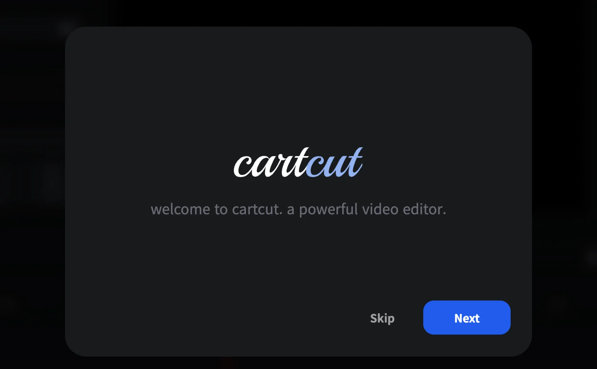
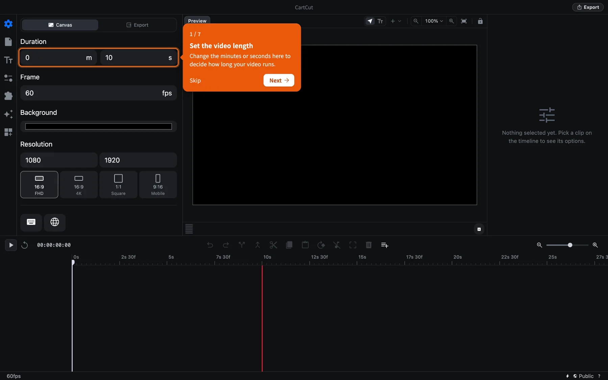

# Installation

CartCut runs on macOS. This page covers downloading it, opening it for the first time, and keeping it up to date.

## System requirements

| | Requirement |
| --- | --- |
| Operating system | macOS 13 Ventura or later |
| Processor | Apple Silicon (M1 or newer) or Intel |
| Download size | About 400 MB |
| For automatic captions on your Mac | macOS 26 or later (older versions can use OpenAI instead) |

> [!NOTE]
> Prebuilt installers are currently published for macOS only. Windows and Linux users can build CartCut from source by following the instructions in the [GitHub repository](https://github.com/cartesiancs/cartcut#installation).

## Download and install

1. Open [cartesiancs.com/cartcut](/cartcut) and click **Download for macOS**. The button downloads the Apple Silicon version. If your Mac has an Intel processor, use the **Intel Mac** link under the button instead.
2. Open the downloaded `.dmg` file.
3. Drag **CartCut** into the **Applications** folder.
4. Open **CartCut** from your Applications folder or with Spotlight (<kbd>⌘</kbd> <kbd>Space</kbd>, then type "CartCut").
5. macOS asks whether you want to open an app downloaded from the internet. Click **Open**. CartCut is signed and notarized by Apple, so this only happens once.

> [!TIP]
> Not sure which Mac you have? Open the Apple menu and choose **About This Mac**. If the **Chip** line says Apple M1, M2, M3 or newer, you have Apple Silicon. If it says Intel, download the Intel version.

You can also download any version from the [GitHub releases page](https://github.com/cartesiancs/cartcut/releases).

## First launch

The first time you open CartCut, a short welcome tour introduces the app. Click **Next** to read through it, or **Skip** to start right away.

When the tour ends, small orange cards point at the parts of the screen you need for a first edit: setting the video length, opening the File tab, choosing a folder, adding a clip, moving the playhead and adding text. Each card shows **Done** when you complete the step yourself.

You can replay both at any time:

- **Help ▸ Show Tutorial** starts the step-by-step cards again.
- **Help ▸ Reset Onboarding** shows the welcome tour again.

## Permissions macOS may ask for

CartCut only asks for access when you use a feature that needs it.

| Permission | When it is requested |
| --- | --- |
| Screen Recording | The first time you use the screen recorder |
| Microphone | When you record audio or a screen recording with a microphone |
| Camera | When you add a camera bubble to a screen recording |
| Speech Recognition | When you transcribe captions on your Mac |

If you clicked **Don't Allow** by mistake, open **System Settings ▸ Privacy & Security**, find the permission, turn CartCut on, then quit and reopen CartCut.

## Updating

CartCut checks for a new version each time it starts. When one is available, a card appears at the bottom right of the window.

1. Click **Download**. A progress bar shows the download.
2. When the card says **The update is ready to install.**, click **Restart to update**.
3. If you have unsaved changes, CartCut asks before restarting. Save first if you want to keep them.

If you close the card instead, an update you already downloaded is installed the next time you quit.

## Uninstalling

Drag **CartCut** from the Applications folder to the Trash. Your preferences and Auto Save files are kept in `~/Library/Application Support/cartcut-app`, which you can delete as well if you want to remove everything. Your own project files and media are never stored there.
