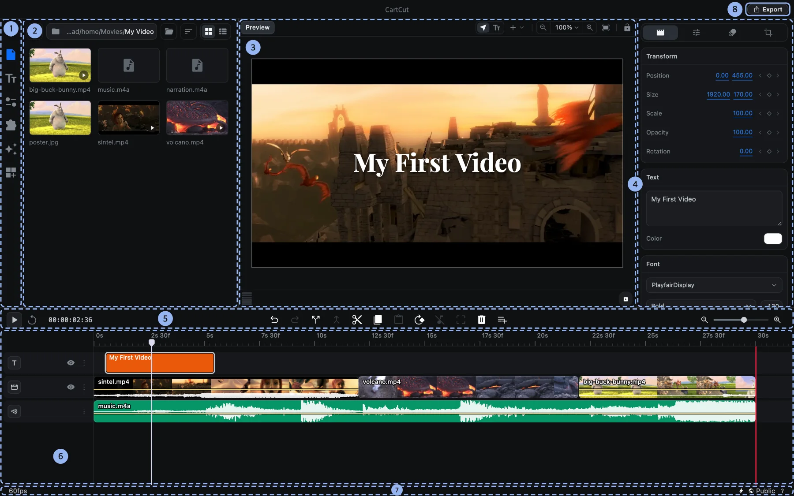

# The interface

CartCut's window is divided into eight areas. Once you know what each one does, every other page of this tutorial will make sense.

1. **Sidebar.** Icon buttons that switch what the left panel shows.
2. **Left panel.** Settings, your media files, text styles, utilities, extensions, effects and templates.
3. **Preview.** Shows the frame at the playhead. You can select, move, resize and rotate clips directly in it.
4. **Options panel.** Shows the settings of the selected clip. When nothing is selected it says *Nothing selected yet*.
5. **Timeline toolbar.** Play, the timecode, editing buttons and timeline zoom.
6. **Timeline.** Your clips, arranged on tracks over time.
7. **Status bar.** The project frame rate on the left; the AI connection (⚡), self-hosting and info buttons on the right.
8. **Export button.** Renders your project to a video file.

The borders between areas can be dragged to make any area bigger or smaller.

## The sidebar

The sidebar icons have no labels, so here is what each one opens, from top to bottom:

| Icon | Opens | Used for |
| --- | --- | --- |
| Gear | **Settings** | Canvas size, frame rate, length, background and export settings |
| Document | **File** | Browsing a folder and adding media to the timeline |
| Tt | **Text** | Adding text in a ready-made style |
| Sliders | **Utilities** | Captions, recording, text to speech, proxies and tracking |
| Puzzle piece | **Extensions** | Installing and managing extensions |
| Sparkles | **Effects** | Effects, transitions and LUTs |
| Grid with a plus | **Templates** | Reusable whole-edit templates |

Extensions can add more icons below these.

## The preview

The bar above the preview holds:

- **Select**, the normal pointer for picking and moving clips.
- **Add a shape** (the **+** button), which adds squares, triangles, circles, stars, polygons and null objects.
- **Zoom out**, the zoom percentage menu, **Zoom in** and **Fit to frame**.
- **Lock keyboard shortcuts** (the padlock), which turns the editor's keyboard shortcuts off until you click it again.

Under the preview are an audio level meter and **Playback preview**, which hides selection outlines and handles so you can watch the edit cleanly.

## The timeline toolbar

| # | Button | What it does | Shortcut |
| --- | --- | --- | --- |
| 1 | Play / Stop | Plays from the playhead | <kbd>Space</kbd> |
| 2 | Go to start | Moves the playhead to 0 | |
| 3 | Undo | Undoes the last edit | <kbd>⌘</kbd> <kbd>Z</kbd> |
| 4 | Redo | Redoes the undone edit | <kbd>⇧</kbd> <kbd>⌘</kbd> <kbd>Z</kbd> |
| 5 | Split at playhead | Cuts the selected clip in two | <kbd>⌘</kbd> <kbd>D</kbd> |
| 6 | Merge clips | Rejoins pieces of one clip | |
| 7 | Cut | Copies and removes the selection | <kbd>⌘</kbd> <kbd>X</kbd> |
| 8 | Copy | Copies the selection | <kbd>⌘</kbd> <kbd>C</kbd> |
| 9 | Paste | Pastes at the playhead | <kbd>⌘</kbd> <kbd>V</kbd> |
| 10 | Rotate 90° | Turns the selected clip a quarter turn | |
| 11 | Detach audio | Moves a video's sound onto its own clip | |
| 12 | Crop | Reframes a video or image | |
| 13 | Delete | Removes the selected clips | <kbd>Delete</kbd> |
| 14 | Add track | Adds a Video, Audio, Text, Effect or Group track | |

Buttons are greyed out when they cannot be used, for example **Paste** when nothing has been copied.

## The menu bar

| Menu | What is in it |
| --- | --- |
| File | Open, Save, Save As, Auto Save, Import Media, Import and Export Subtitles, Export Video |
| Edit | Undo, Redo, Cut, Copy, Paste, Delete, Select All, Deselect All |
| Clip | Split, Merge, Detach Audio, Rotate 90°, Group, Ungroup, Move Up or Down a Track |
| Playback | Play / Pause, Previous and Next Frame, Go to Start, Go to End |
| View | Fit Preview, Zoom In, Zoom Out, Full Screen |
| Help | Keyboard Shortcuts, Show Tutorial, Reset Onboarding |

An **Extensions** menu appears when an installed extension adds commands to it.
