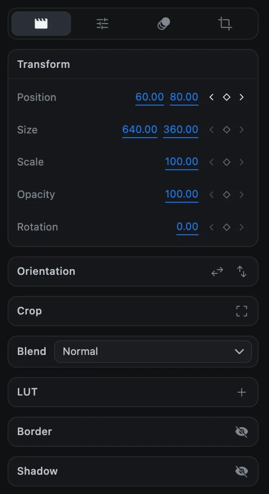
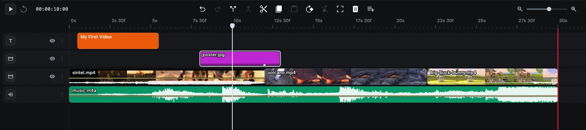
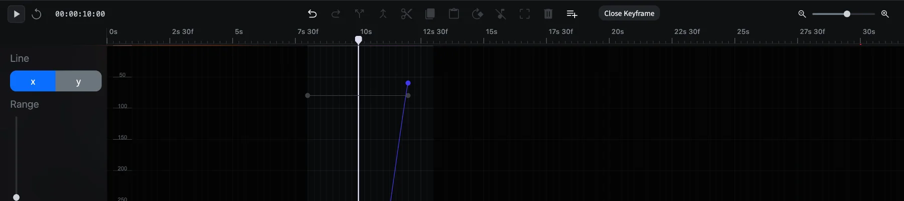

# Keyframe animation

A keyframe records a value at a moment in time. Give a property two keyframes with different values, and CartCut moves smoothly between them. That is all animation is.

You can animate **Position**, **Size**, **Scale**, **Opacity** and **Rotation** on every visual clip, **Volume** on anything with sound, the five mask settings, a text **Reveal**, and the strength and settings of effects.

## The keyframe diamond

Every animatable row in the options panel ends with three small buttons: **‹** (previous keyframe), a **diamond**, and **›** (next keyframe).

| Diamond | Meaning | Clicking it |
| --- | --- | --- |
| Hollow and dim | The property is not animated | Turns animation on and adds a keyframe at the playhead |
| Hollow and bright | Animated, but no keyframe at this frame | Adds a keyframe here |
| Filled | A keyframe sits exactly here | Removes it. Removing the last one turns animation off |

Once a property is animated, **changing its value anywhere writes a keyframe at the playhead**. You do not need to click the diamond again.

## Animate a clip step by step

This example slides a picture-in-picture across the frame.

1. Select the clip and move the playhead to where the movement should start.
2. Click the **diamond** on the **Position** row. The first keyframe is recorded.
3. Move the playhead to where the movement should end.
4. Change **Position**, either by typing new numbers or by dragging the clip in the preview. A second keyframe is recorded.
5. Press <kbd>Space</kbd> to play it.

Use **‹** and **›** to jump the playhead between keyframes. Small diamonds on the clip in the timeline show where its keyframes are.

## The curve editor

The curve editor shows a property's value as a line over time, so you can shape exactly how it changes.

1. Right-click the clip on the timeline.
2. Choose **Animate ▸** and a property, such as **Position**.
3. The editor opens at the bottom of the window.

| To | Do this |
| --- | --- |
| Choose which value to see | **x** or **y** under **Line** (y appears for two-value properties like Position) |
| Zoom the graph vertically | Drag **Range** |
| Add a keyframe | Click an empty spot on the line |
| Move a keyframe | Drag it. It snaps to the playhead; hold <kbd>Option</kbd> to move freely |
| Change the easing | Drag the handles on either side of a point |
| Delete a keyframe | Select it and press <kbd>Delete</kbd> |
| Close the editor | Click **Close Keyframe** |

There are no named easing presets in the editor; smooth starts and stops come from shaping the handles.

## Animation presets

Presets add a ready-made animation in one click.

1. Select one or more clips.
2. Move the playhead to where the animation should happen.
3. Open the **Animation** tab in the options panel and click a tile.

| Group | Presets |
| --- | --- |
| In | Fade In, Zoom In, Punch In, Overshoot, Pop, Slam, Rotate In, Move Up, Move Down, Move Left, Move Right |
| Out | Fade Out, Zoom Out, Exit Up, Exit Down, Exit Left, Exit Right |
| Emphasis | Drift, Shake |

Hover over a tile to see the motion. If the playhead is not over the clip, an In preset lands at the clip's start and an Out preset at its end. The **None** tile removes all animation from the clip.

Presets are ordinary keyframes, so you can adjust them afterwards with the diamonds or the curve editor.
