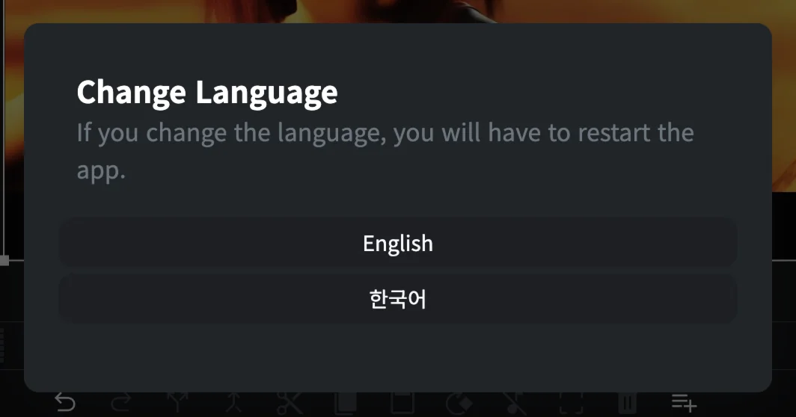
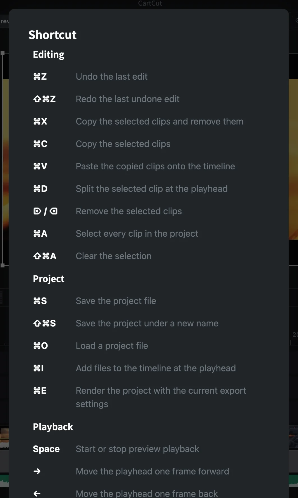

# Language and preferences

CartCut keeps its app-wide options in a few places. This page lists them all.

## Change the language

CartCut is available in English and Korean.

1. Open **Settings** (the gear icon).
2. Click the **globe button** at the bottom of the panel.
3. Choose **English** or **한국어**.
4. CartCut asks to restart. Save your project first, then click **Restart**.

> [!NOTE]
> Not every label is translated yet. Menus, the timeline toolbar and many panel names stay in English in the Korean interface.

## Keyboard shortcuts

Click the **keyboard button** next to the globe, or choose **Help ▸ Keyboard Shortcuts** (<kbd>⌘</kbd> <kbd>/</kbd>), to see every shortcut in the app.

The full list is also on the [Keyboard shortcuts](keyboard-shortcuts) page.

If you are typing in another app window or recording and do not want CartCut to react to keys, click the **padlock** in the preview toolbar (**Lock keyboard shortcuts**). Click it again to turn shortcuts back on.

## Tutorial and welcome tour

| To | Choose |
| --- | --- |
| Run the step-by-step tutorial cards again | **Help ▸ Show Tutorial** |
| See the welcome tour again | **Help ▸ Reset Onboarding** |

## Updates

CartCut checks GitHub for a new version every time it starts and shows a card at the bottom right when one is available. See [Installation ▸ Updating](installation#updating).

## Version

The version you are running is shown at the bottom of the **Settings** panel, for example *CartCut v0.5.10*.

## Repairing FFmpeg

CartCut uses FFmpeg, which is bundled with the app, to export video. If exports fail with an error about FFmpeg, choose **About ▸ Setting** and click **Reinstall FFmpeg**.

## Where preferences are stored

App preferences (language, tutorial progress, the AI connection token and your OpenAI key) are stored on your Mac in `~/Library/Application Support/cartcut-app`. They are not part of your project files.
