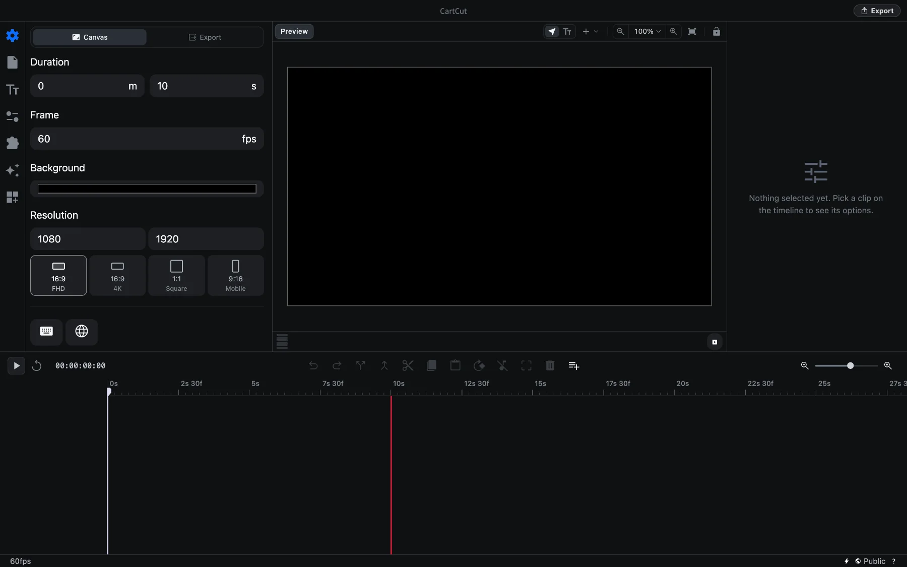
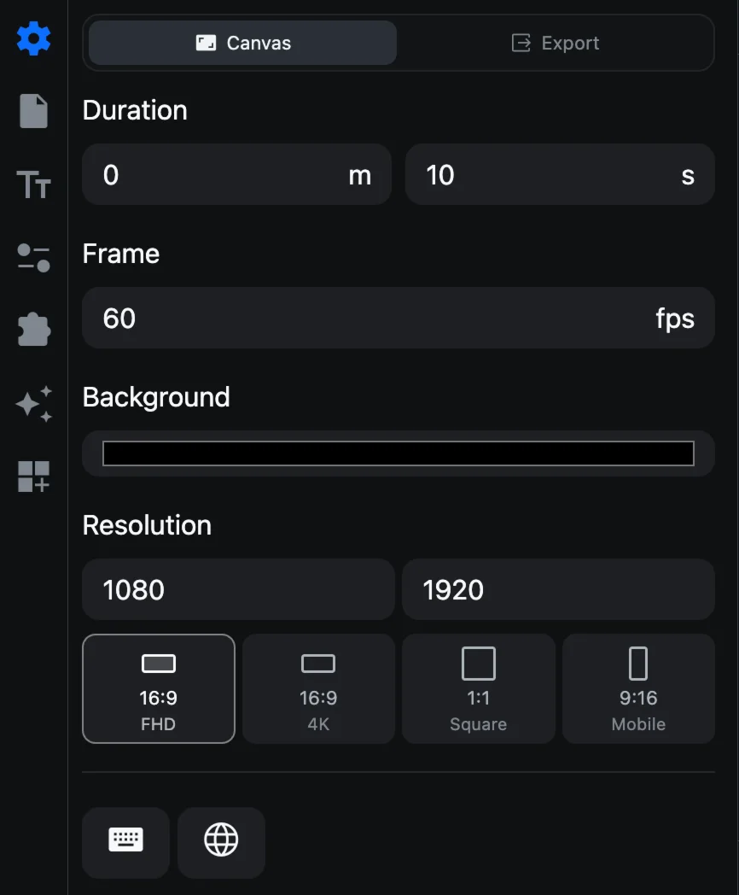
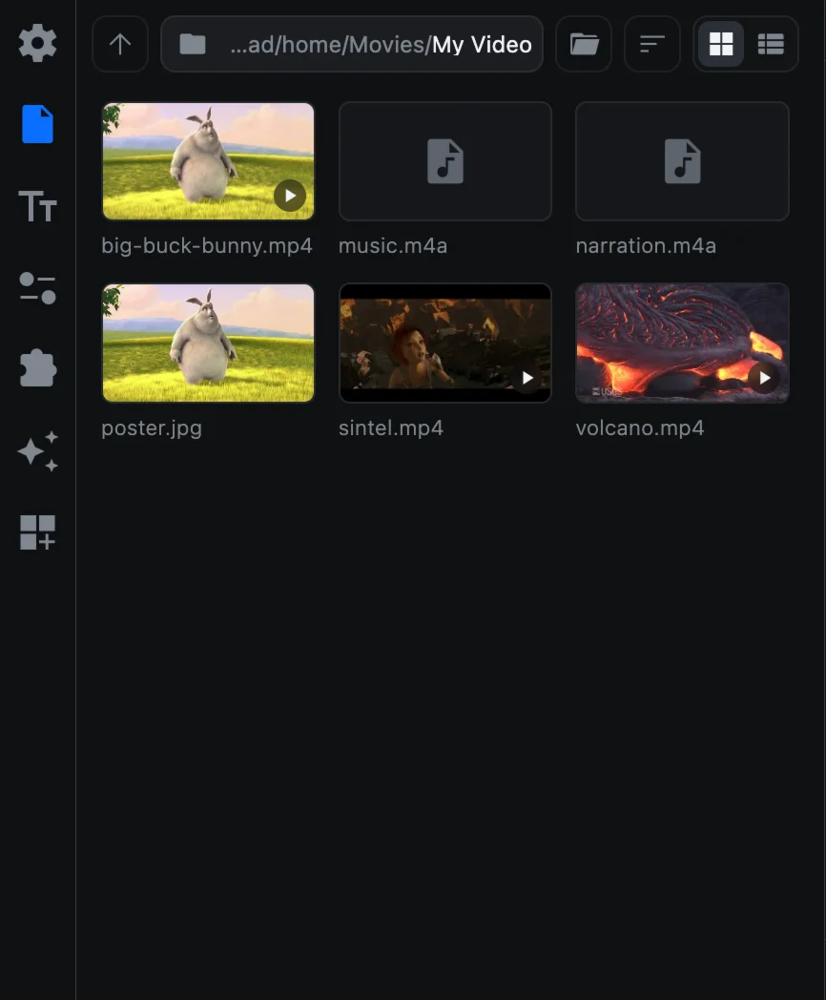
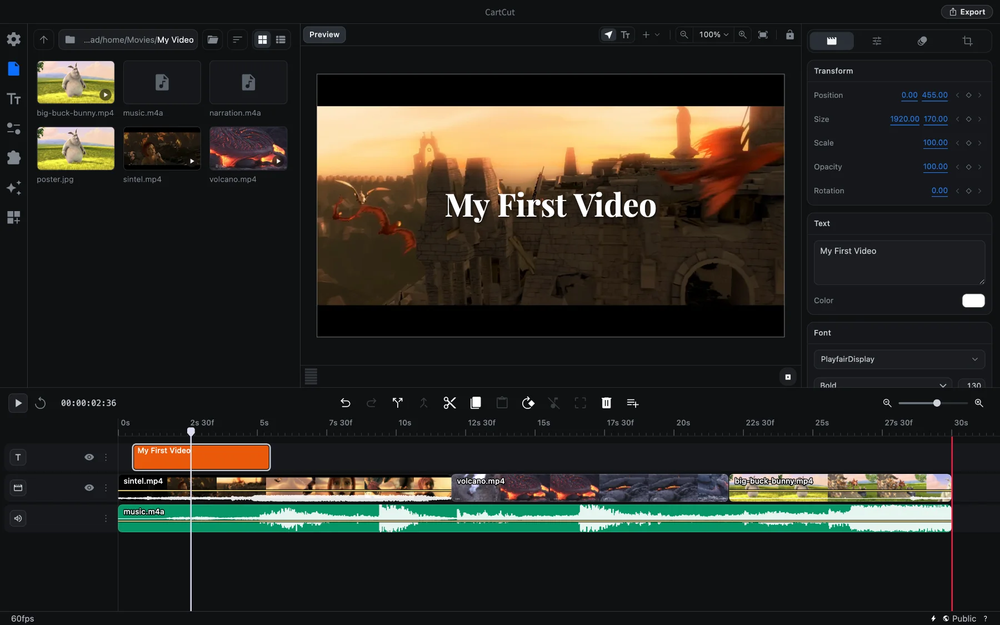

# Quick start

This page takes you from an empty project to an exported video in eight steps. It should take about ten minutes. Every step links to a page with more detail if you want it.

You need a few video clips and, optionally, a music file. Put them together in one folder before you start.

## 1. Open CartCut

When CartCut opens, you already have an empty project: a 1920 × 1080 canvas at 60 frames per second, 10 seconds long. There is no "New Project" command; every launch starts here.

## 2. Set the length of your video

The project's length decides how long the exported video is, so set it first.

1. Click the **gear icon** at the top of the left sidebar to open **Settings**.
2. Under **Duration**, type the minutes and seconds you want. For this guide, use `0` minutes and `30` seconds.

The red line on the timeline moves to mark the new end of the video. Anything to the right of it is not exported. [More about project settings](project-settings).

## 3. Choose your media folder

1. Click the **document icon** (the second icon in the sidebar) to open the **File** tab.
2. Click **Select Folder** and choose the folder that holds your clips.

Your videos, images and audio appear as thumbnails.

## 4. Add clips to the timeline

1. Click a video thumbnail. It is added to the timeline at the **playhead**, the white vertical line.
2. Drag along the ruler at the top of the timeline to move the playhead to the end of that clip.
3. Click the next video. It is added right after the first.

To put a clip anywhere else, press and hold its thumbnail for a moment, then drag it onto the timeline. [More about importing](importing-media).

## 5. Cut out the parts you do not want

1. Click a clip on the timeline to select it. It gets a white outline.
2. Move the playhead to where you want to cut.
3. Press <kbd>⌘</kbd> <kbd>D</kbd>, or click the **Split at playhead** button in the toolbar above the timeline. The clip is now two clips.
4. Click the piece you do not want and press <kbd>Delete</kbd>.

Made a mistake? Press <kbd>⌘</kbd> <kbd>Z</kbd> to undo. [More about cutting](cutting-and-trimming).

## 6. Add a title

1. Click the **Tt icon** (third in the sidebar) to open the **Text** tab.
2. Move the playhead to where the title should appear.
3. Click one of the style tiles. A text clip appears on a new track at the top of the timeline.
4. In the options panel on the right, replace the text in the **Text** box with your own words.
5. Drag the edges of the text clip on the timeline to make it longer or shorter.

[More about text](text).

## 7. Add music

1. Go back to the **File** tab.
2. Move the playhead to the start (press the **Go to start** button next to Play).
3. Click your music file. It is added on an audio track below the video.
4. With the music clip selected, lower **Volume** in the options panel to about `-8` dB so it does not drown out the clips. Drag the blue number to the left, or click it and type a value.

If the music runs past the red end line, move the playhead to the end line, press <kbd>⌘</kbd> <kbd>D</kbd> and delete the extra piece. [More about audio](audio).

Press <kbd>Space</kbd> to play your edit and <kbd>Space</kbd> again to stop.

## 8. Save and export

1. Press <kbd>⌘</kbd> <kbd>S</kbd> to save the project. The first time, choose a name and a place for the `.ngt` project file.
2. Click **Export** at the top right of the window, or press <kbd>⌘</kbd> <kbd>E</kbd>.
3. Choose where to save the video and click **Export**.
4. The Export button turns into a progress ring. You can keep working while it renders.
5. When **Rendering is complete** appears, click **Open Saved Folder** to see your video.

[More about exporting](export).

> [!TIP]
> Want CartCut to guide you through this inside the app? Choose **Help ▸ Show Tutorial**.
