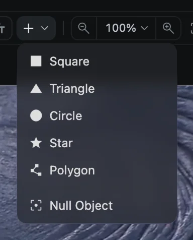
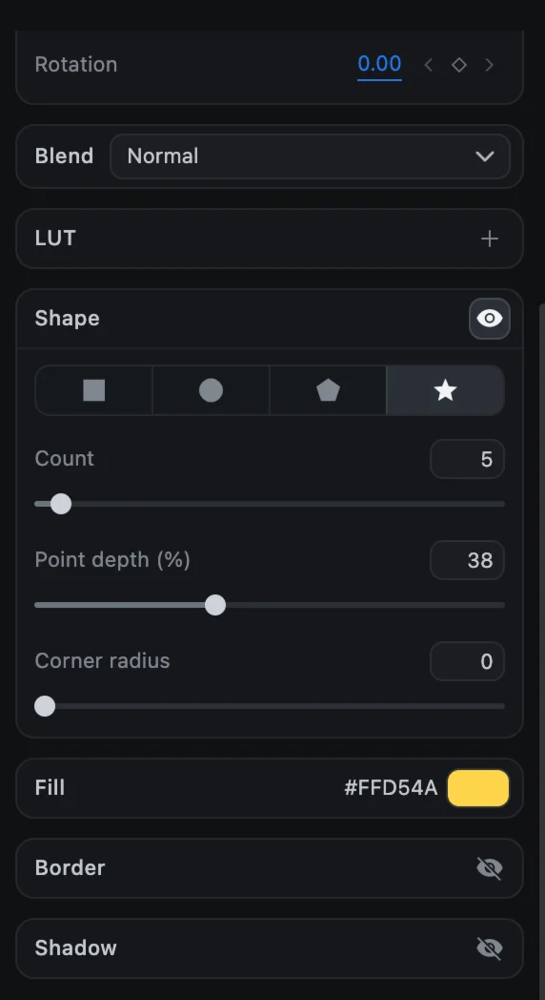
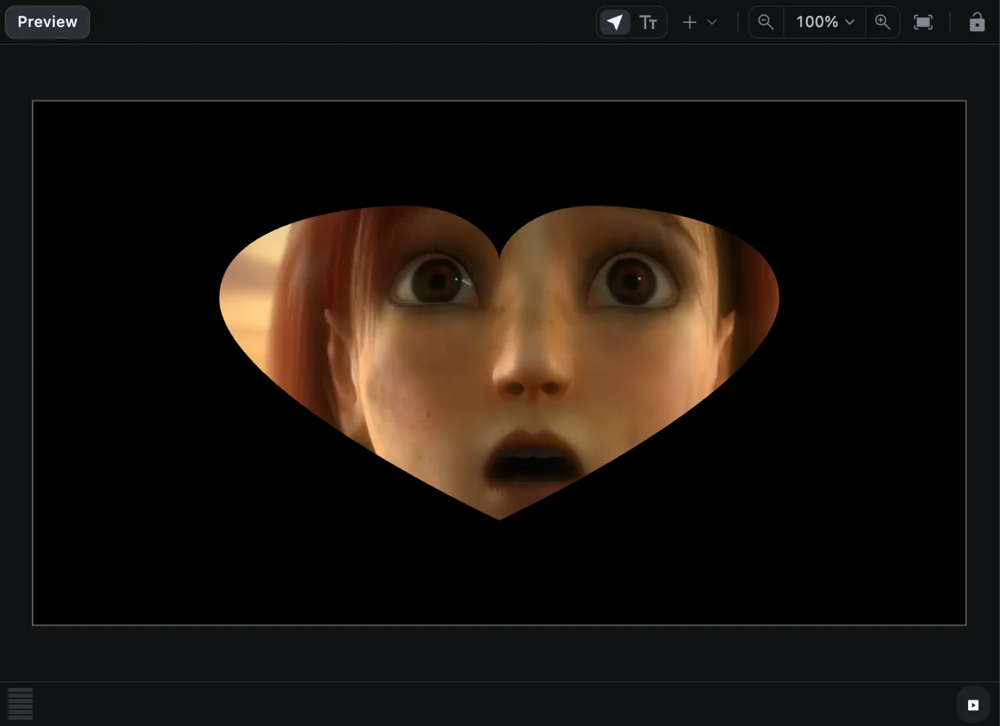
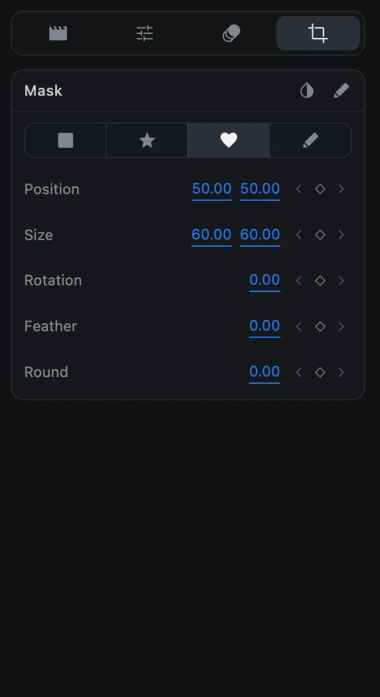

# Shapes and masks

Shapes are clips you draw instead of import. Masks cut a clip down to a shape so only part of it shows.

## Add a shape

1. Move the playhead to where the shape should appear.
2. Click **Add a shape** (the **+** button in the preview toolbar).
3. Choose **Square**, **Triangle**, **Circle**, **Star** or **Polygon**.

The shape is added as a new clip. Move and resize it in the preview like any other clip, see [Position, size and rotation](transform).

**Null Object**, at the bottom of the same menu, is an invisible handle used for moving several clips together. See [Groups and parenting](groups-and-parenting).

### Draw your own outline

1. Choose **Add a shape ▸ Polygon**. The **+** button stays highlighted.
2. Click in the preview to place corners. Each click adds a straight segment.
3. Click **Select** in the preview toolbar to finish.

## Shape settings

Select a shape clip and scroll to the **Shape** section.

| Setting | What it does |
| --- | --- |
| Kind | Rectangle, Ellipse, Polygon or Star |
| Arc start, Arc sweep, Hole | Ellipse only: draw part of a circle, or a ring |
| Count | Polygon and Star: the number of sides or points (3 to 60) |
| Point depth | Star only: how deep the points are cut |
| Corner radius | Rounds the corners. On a rectangle, the link button sets each corner separately |
| Fill | The shape's color |

Shapes also have **Border** and **Shadow** sections, just like videos and images.

## Masks

A mask hides everything outside a shape. Masks work on videos, images, shapes and text.

1. Select the clip and open the **Mask** tab in the options panel.
2. Click a mask shape: **rectangle**, **star**, **heart** or **pen**.
3. Adjust it with the rows below.

| Setting | What it does |
| --- | --- |
| Position | Where the mask sits, as a percentage of the clip |
| Size | How big it is, as a percentage of the clip |
| Rotation | Turns the mask |
| Feather | Softens the edge |
| Round | Rounds the mask's corners |
| Invert (button at the top) | Shows the outside instead of the inside |

To remove a mask, click the selected mask shape again.

### Draw a mask with the pen

1. Click **pen** in the Mask tab (or the **Draw** button at the top).
2. In the preview, click to place corner points, or click and drag to make a curve.
3. To close the shape, click the first point again or press <kbd>Return</kbd>.

| Key | While drawing |
| --- | --- |
| <kbd>Return</kbd> | Close the path |
| <kbd>Delete</kbd> | Remove the last point |
| <kbd>Esc</kbd> | Throw the mask away |

### Animate a mask

Every mask row has a keyframe diamond, so a mask can move, grow or soften over time. You can also right-click the clip and choose **Animate mask ▸** to edit a mask property on a curve. See [Keyframe animation](keyframes).
