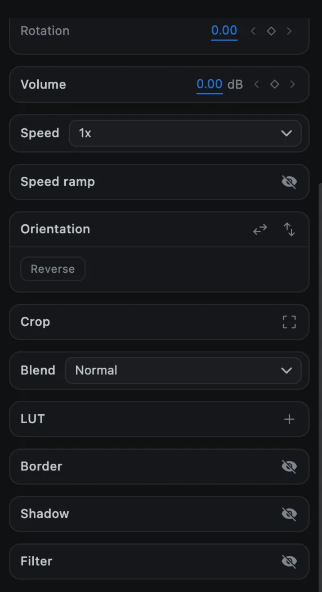
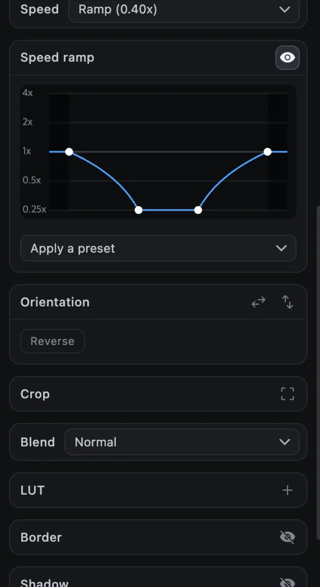

# Speed and reverse

Slow a clip down, speed it up, ramp its speed smoothly, or play it backwards. These options are for video and audio clips.

## Constant speed

1. Select a video or audio clip.
2. In the options panel, open the **Speed** menu.
3. Choose **0.25x**, **0.5x**, **1x**, **1.5x**, **2x** or **4x**.

Changing the speed changes the clip's length on the timeline. Later clips on the same track move to make room, or close up, so nothing overlaps.

## Speed ramp

A speed ramp changes the speed smoothly within one clip, for example slowing down in the middle of an action and speeding back up.

1. Select the clip.
2. Click the **eye** button on the **Speed ramp** row. A graph appears.
3. Choose a shape from **Apply a preset**, or edit the curve yourself.

| Preset | Effect |
| --- | --- |
| Constant | One speed throughout |
| Ramp up | Starts slow, ends fast |
| Ramp down | Starts fast, ends slow |
| Slow middle | Slows down in the middle |
| Fast middle | Speeds up in the middle |
| Ease in | Accelerates gently |
| Ease out | Decelerates gently |

### Edit the curve

| To | Do this |
| --- | --- |
| Add a point | Double-click the graph |
| Move a point | Drag it |
| Remove a point | Right-click it |

The graph runs from 0.25x at the bottom to 4x at the top. While a ramp is on, the Speed menu shows **Ramp** and the average speed, for example *Ramp (0.40x)*. Choosing a fixed speed from the menu, or clicking the eye again, removes the ramp. The sound of a ramped clip follows the ramp too.

## Reverse

1. Select a video clip.
2. Click **Reverse** in the **Orientation** section (or right-click the clip ▸ **Reverse**).
3. CartCut prepares a reversed copy in the background. The button shows **Waiting**, then **Reversing** with a percentage. You can keep editing.
4. When it is done, the button reads **Reversed** and the clip plays backwards.

To play it forwards again, click **Reversed** (or right-click ▸ **Un-reverse**).

> [!NOTE]
> Reverse works on video clips in the desktop app. Long or high-resolution clips take longer to prepare.
