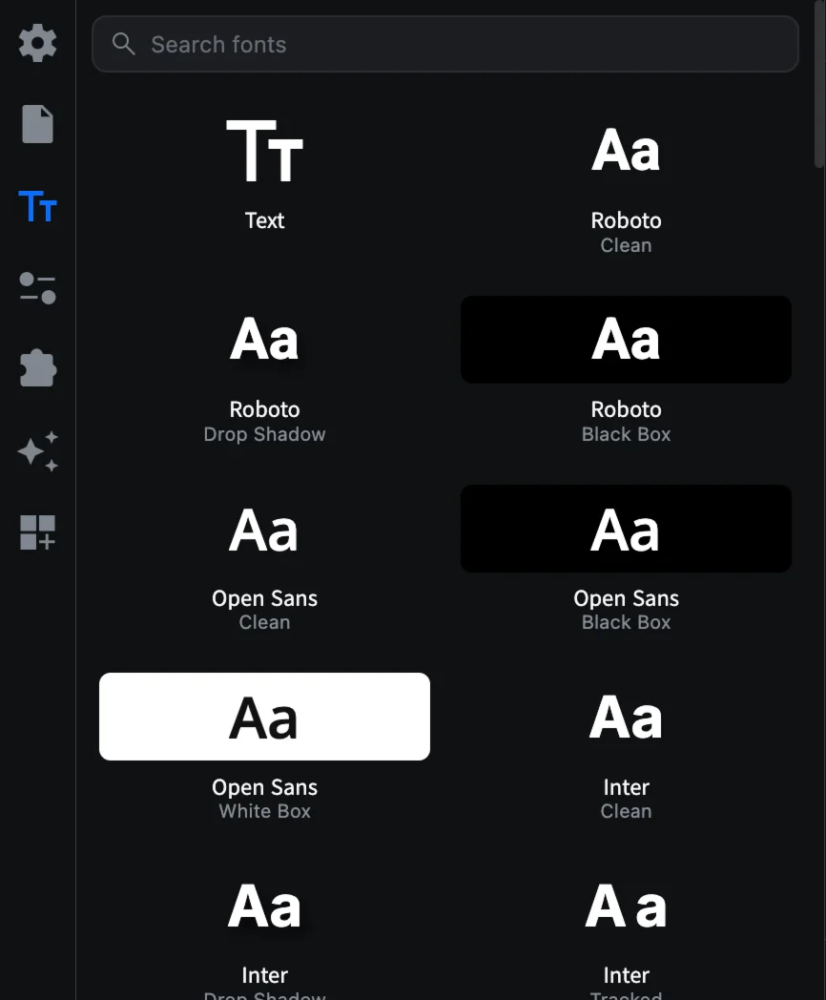
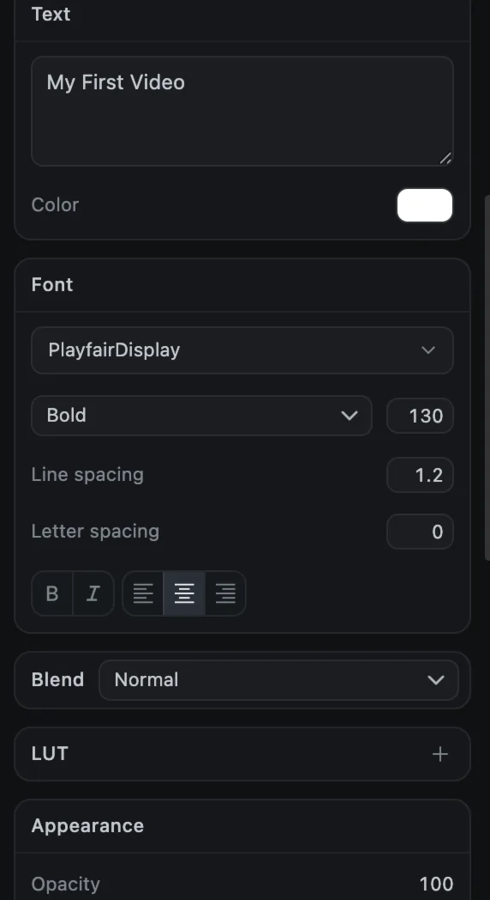
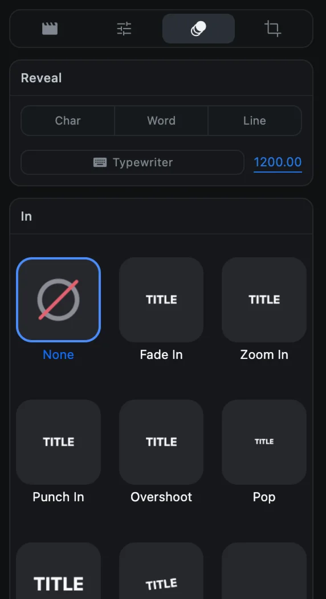

# Text

Titles, lower thirds and captions are all text clips. This page covers adding them, styling them and animating them letter by letter.

## Add text

1. Open the **Text** tab (the **Tt** icon in the sidebar).
2. Move the playhead to where the text should appear.
3. Click a tile. The text clip is added at the playhead, on a text track above your video.

The first tile, **Text**, adds plain white text. The other 60 tiles combine one of 20 bundled fonts with a style:

| Fonts | Styles |
| --- | --- |
| Roboto, Open Sans, Inter, Poppins, Montserrat, Raleway, Nunito, Oswald, Bebas Neue, Anton, Archivo Black, Playfair Display, Merriweather, Lora, Abril Fatface, Pacifico, Lobster, Caveat, Permanent Marker, Roboto Mono | Clean, Outline, Black Box, White Box, Yellow Pop, Pink Box, Tracked, Italic, Drop Shadow, Neon Glow, Gradient |

Type in **Search fonts** at the top to find a font quickly.

## Edit the words

Select the text clip. In the options panel, type in the **Text** box. Press <kbd>Return</kbd> for a new line. The preview updates as you type.

## Style the text

| Section | Settings |
| --- | --- |
| **Text** | The words, and the text **Color** |
| **Font** | Font family (bundled fonts plus the fonts on your Mac), weight, size, line spacing, letter spacing, **B**old, *I*talic, and alignment |
| **Appearance** | Opacity, letter case (none, uppercase, lowercase), and fill (solid or gradient with two colors and an angle) |
| **Outline** | Size, opacity and color of a stroke around the letters |
| **Shadow** | Offset, blur, opacity and color |
| **Glow** | Size, opacity and color of a soft glow |
| **Background** | A box behind the text: opacity, padding, corner radius, blur and color |

Sections with an eye button are off until you click the eye.

### Style only some of the words

Select characters in the **Text** box, then change a setting. Color, size, font, weight, bold, italic and outline then apply only to the selected characters. Every other setting applies to the whole clip.

### Turn text into an image

**Rasterize to Image** at the bottom of the panel (or right-click ▸ **Rasterize text**) bakes the text into an image clip with the same position and timing. Use it when you want to apply a mask or effect that treats the text as a picture. The text can no longer be edited afterwards.

## Typewriter and reveal

Text can appear one letter, word or line at a time.

1. Select the text clip and open the **Animation** tab in the options panel.
2. Under **Reveal**, choose **Char**, **Word** or **Line**.
3. Set the time between each unit in milliseconds (1200 by default).
4. Click **Typewriter**.

The reveal starts at the playhead if it is over the clip, otherwise at the clip's start. Once a reveal exists, **Progress** and **Softness** let you fine-tune it.

## Subtitle files

You can bring in subtitles from another tool, or hand yours to one:

- **File ▸ Import Subtitles…** reads an `.srt` or `.vtt` file and creates a text clip for each line. CartCut asks whether the file's times start at the beginning of the timeline or at a clip.
- **File ▸ Export Subtitles…** writes your text clips as an `.srt` or `.vtt` file.

To create captions from speech automatically, see [Automatic captions](auto-captions).
