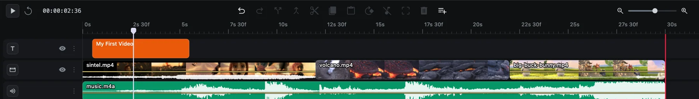
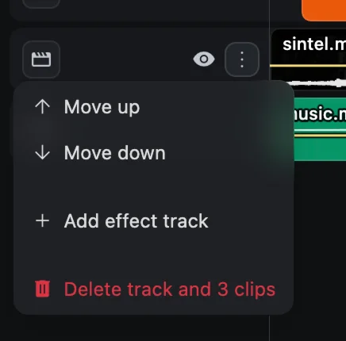
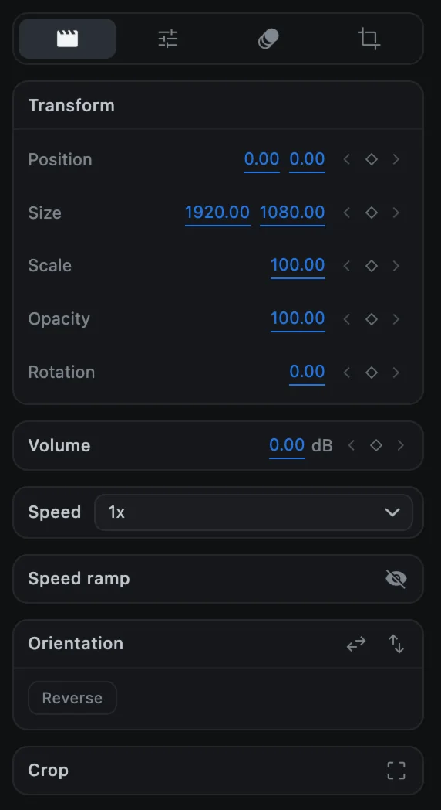
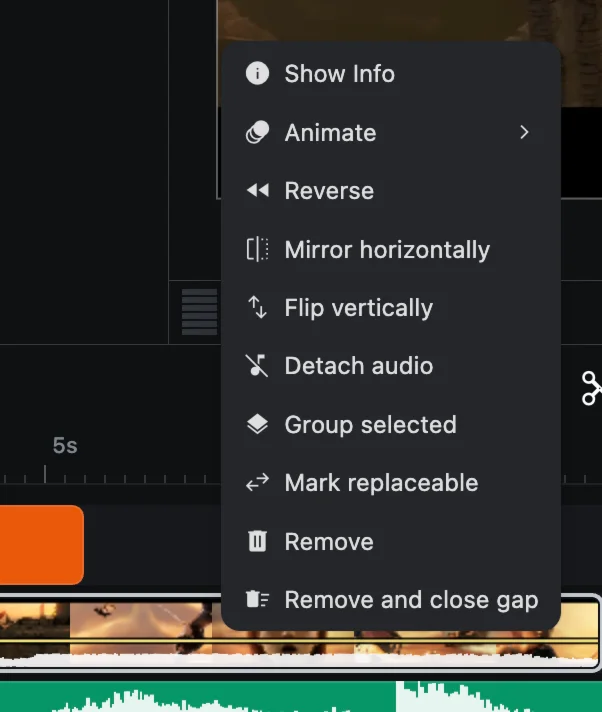

# The timeline

The timeline is where your video is assembled. Time runs from left to right; tracks are stacked from top to bottom.

## Parts of the timeline

| Part | What it is |
| --- | --- |
| **Ruler** | The time scale along the top. Labels read seconds and frames, for example `2s 30f`. |
| **Playhead** | The white vertical line. The preview shows the frame under it. |
| **Red line** | The end of the project, set by **Duration** in [Project settings](project-settings). |
| **Tracks** | Rows that hold clips. Each track holds one kind of clip. |
| **Track headers** | The column on the left, with each track's icon, eye button and options. |
| **Timecode** | Next to Play, in hours:minutes:seconds:frames. |

## Moving around

| To | Do this |
| --- | --- |
| Move the playhead | Click or drag along the ruler, or drag the playhead itself |
| Step one frame | <kbd>←</kbd> or <kbd>→</kbd> |
| Play and stop | <kbd>Space</kbd>, or the Play button |
| Jump to the beginning | The **Go to start** button |
| Zoom in and out | The slider at the top right, or pinch on the trackpad, or <kbd>Ctrl</kbd> + scroll |
| Scroll through time | Swipe left and right on the trackpad, or use the scrollbar at the bottom |
| Scroll through tracks | Scroll up and down |

## Tracks

There are five kinds of track. Each is marked by an icon in its header.

| Track | Holds |
| --- | --- |
| Video | Videos, images, GIFs and shapes |
| Audio | Music, voice and other sound |
| Text | Titles and captions |
| Effect | Effect clips that change every layer below them |
| Group | Groups and null objects |

**The track at the top is in front.** A title must sit on a track above the video to be visible. To change the order, use **Track options ▸ Move up** or **Move down**.

### Add a track

Click **Add track** at the right end of the toolbar and choose the kind of track. CartCut also adds tracks automatically when it needs them.

### Track options

Click the **⋮** button in a track's header:

- **Move up** and **Move down** change the layer order.
- **Add effect track** inserts an effect track.
- **Delete track** removes the track. If it holds clips, the item reads *Delete track and N clips*. One <kbd>⌘</kbd> <kbd>Z</kbd> brings them all back.

### Hide a track

Click the **eye** in a video, text or effect track's header to hide it. A hidden track disappears from the preview **and from the export**, but its clips stay on the timeline and can still be edited. Click the eye again to show it.

> [!NOTE]
> Audio tracks have no eye button, and hiding a track never silences its sound. To silence a clip, turn its volume down. See [Audio](audio).

## Selecting clips

| To | Do this |
| --- | --- |
| Select one clip | Click it |
| Add to the selection | <kbd>Shift</kbd> + click |
| Select a group of clips | Drag a box on an empty part of the timeline |
| Select everything | <kbd>⌘</kbd> <kbd>A</kbd> |
| Deselect everything | <kbd>⇧</kbd> <kbd>⌘</kbd> <kbd>A</kbd>, or click empty space |

The selected clip's settings appear in the options panel on the right.

## Snapping

Clip edges snap to other clips' edges, to the playhead and to the start of the timeline when they come within a few pixels. A guide line shows where. All edits also snap to whole frames. Snapping is always on.

## The clip menu

Right-click a clip to see what you can do with it. Only the items that apply to that clip are shown.

| Item | What it does |
| --- | --- |
| Show Info | File details for a video, image, GIF or audio clip |
| Animate ▸ | Opens the keyframe curve editor for a property. See [Keyframe animation](keyframes) |
| Reverse | Plays the video backwards. See [Speed and reverse](speed-and-reverse) |
| Mirror horizontally / Flip vertically | Flips the picture |
| Detach audio | Moves the sound of a video onto its own audio clip |
| Rasterize text | Turns a text clip into an image clip |
| Group selected / Ungroup / Remove from group | See [Groups and parenting](groups-and-parenting) |
| Mark replaceable | Makes the clip a slot when you export a [template](templates) |
| Remove | Deletes the clip and leaves a gap |
| Remove and close gap | Deletes the clip and slides later clips on the same track left to fill the gap |
