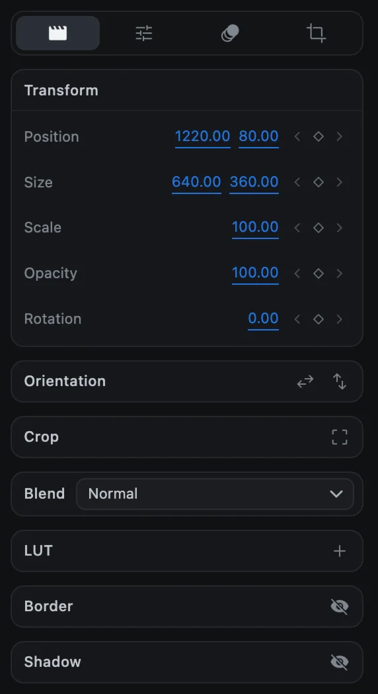
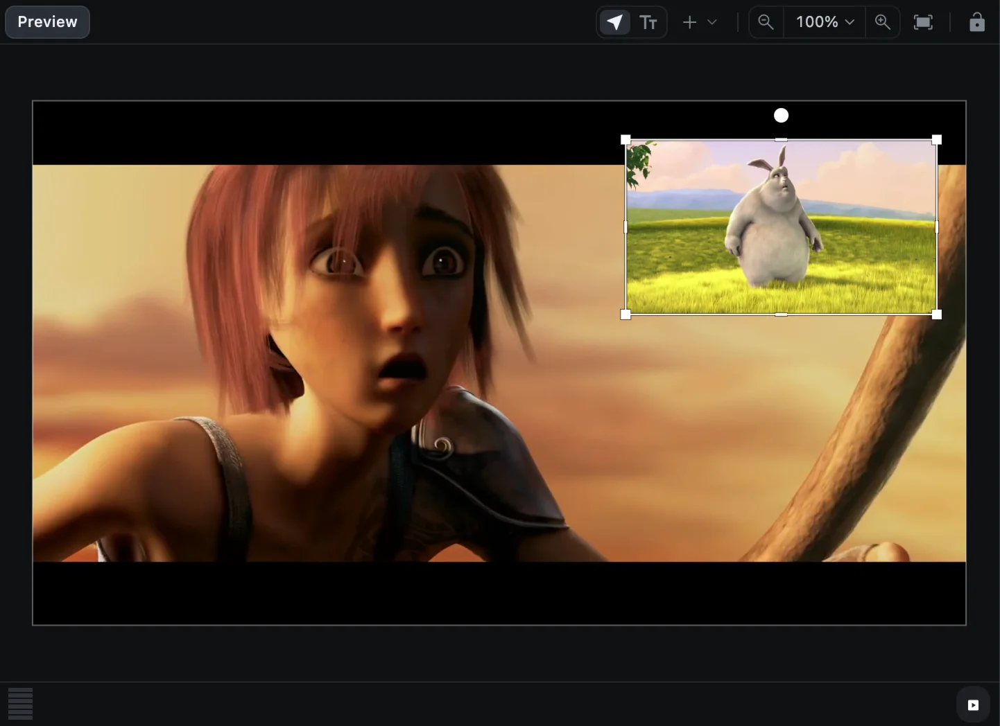
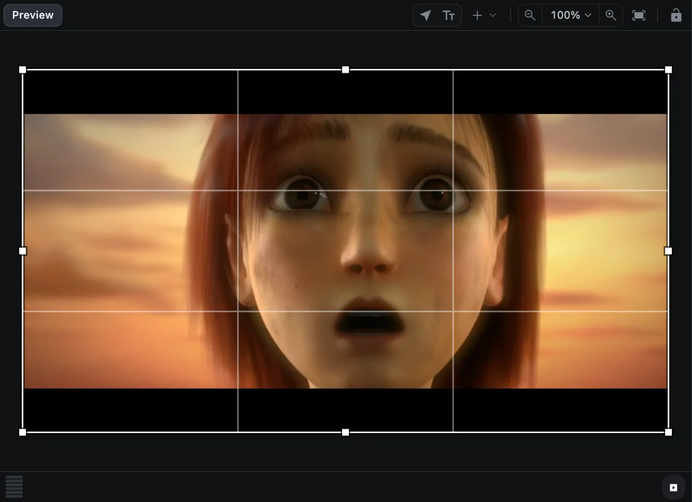
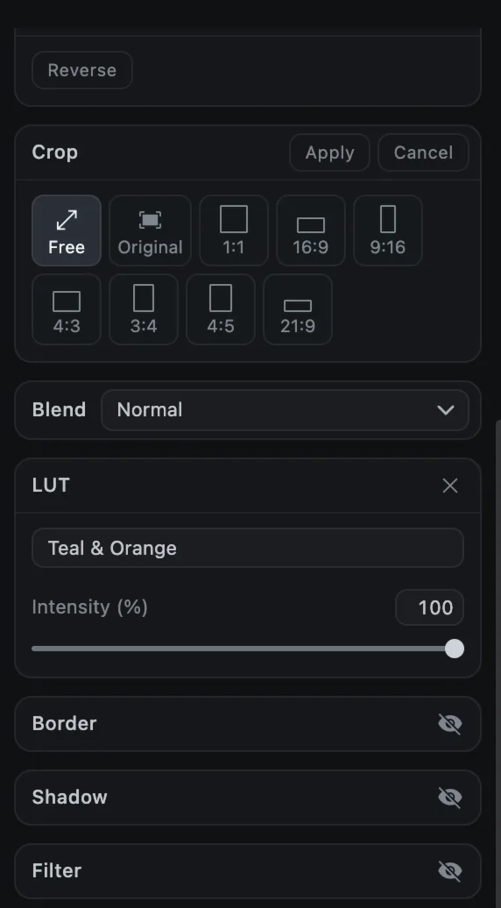

# Position, size and rotation

Every visual clip can be moved, resized, rotated, faded, cropped and flipped. You can do it with numbers in the options panel or directly in the preview.

## In the options panel

Select a clip and look at the **Transform** section at the top of the **Media** tab.

| Setting | What it means |
| --- | --- |
| **Position** | X and Y of the clip's top-left corner, in canvas pixels. `0, 0` is the top left of the frame |
| **Size** | Width and height in pixels |
| **Scale** | A percentage that shrinks or enlarges the clip around its center, without changing Size |
| **Opacity** | From 0 (invisible) to 100 (solid) |
| **Rotation** | In degrees, clockwise |

Drag a blue number to change it, or click it and type. The small diamond to the right of each row adds a keyframe; see [Keyframe animation](keyframes).

## In the preview

Click a clip in the preview to select it. A box with handles appears.

| To | Do this |
| --- | --- |
| Move | Drag inside the box. Guides appear at the frame's edges and center |
| Resize | Drag one of the eight square handles |
| Rotate | Drag the round knob above the box |
| Keep or free the proportions | Hold <kbd>Shift</kbd> while resizing |

Videos and images keep their proportions by default, and <kbd>Shift</kbd> frees them. Text, shapes and groups resize freely, and <kbd>Shift</kbd> locks them.

### Zoom and pan the preview

| To | Do this |
| --- | --- |
| Fit the whole frame | <kbd>⌘</kbd> <kbd>0</kbd> or **Fit to frame** |
| Zoom in or out | <kbd>⌘</kbd> <kbd>+</kbd> / <kbd>⌘</kbd> <kbd>-</kbd>, pinch, or the percentage menu (25% to 800%) |
| Pan | Drag an empty area, or swipe with two fingers |

Zooming the preview never changes the video, only your view of it.

## Orientation

The **Orientation** section has two buttons, **Mirror the picture left to right** and **Flip the picture top to bottom**. To turn a clip a quarter turn, click **Rotate 90°** in the toolbar.

## Crop

Cropping shows only part of a video or image.

1. Select one video or image clip.
2. Click **Crop** in the toolbar, or the crop button in the **Crop** section.
3. Pick a shape: **Free**, **Original**, 1:1, 16:9, 9:16, 4:3, 3:4, 4:5 or 21:9.
4. Drag the crop box and its handles in the preview.
5. Click **Apply** (or press <kbd>Return</kbd>). **Cancel** (or <kbd>Esc</kbd>) leaves the clip as it was.

Once a clip is cropped, a **Reset** button shows the whole frame again.

## Blend modes

**Blend** decides how a clip mixes with the clips beneath it. There are 17 modes:

| Group | Modes |
| --- | --- |
| Normal | Normal |
| Darken | Darken, Multiply, Color Burn |
| Lighten | Lighten, Screen, Color Dodge, Add |
| Contrast | Overlay, Soft Light, Hard Light |
| Comparative | Difference, Exclusion |
| Component | Hue, Saturation, Color, Luminosity |

> [!TIP]
> Put a light-leak or smoke video on a track above your footage and set it to **Screen** to blend only its bright parts.

## Border and shadow

Turn on **Border** with its eye button to outline the clip: set the width, opacity, color, and whether the line sits inside, across or outside the edge. **Shadow** adds a drop shadow with offset, blur, opacity and color.
