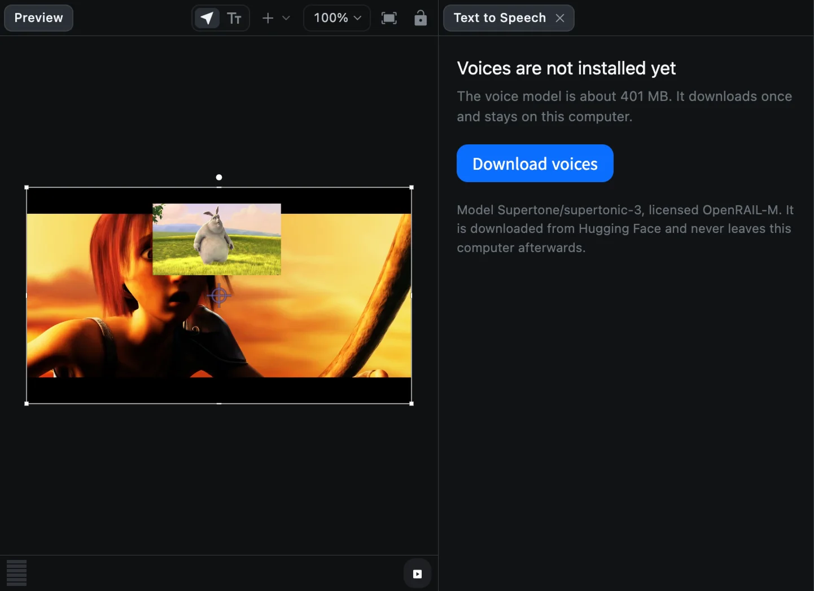
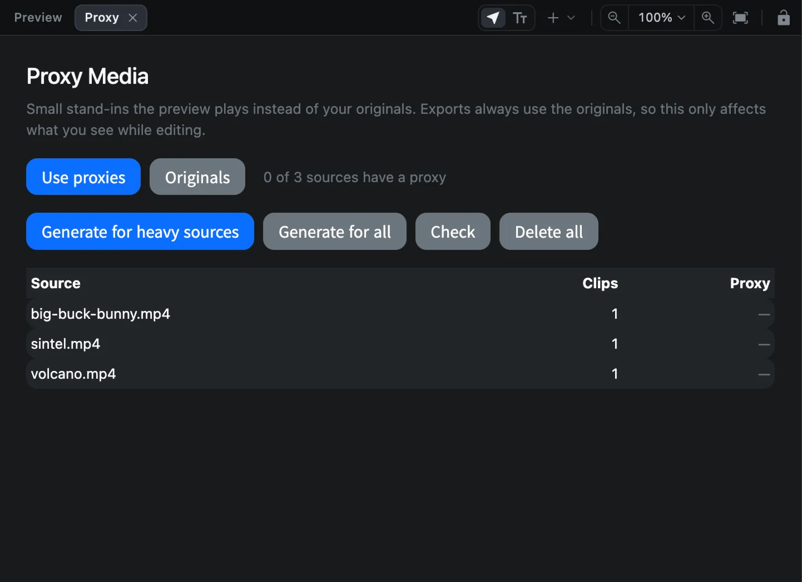

# More utilities

The **Utilities** tab (the sliders icon, fourth in the sidebar) collects tools that do more than one edit at a time.

| Utility | What it does | Page |
| --- | --- | --- |
| Record | Simple screen recording in a preview tab | [Screen recording](screen-recording#the-simple-recorder) |
| Audio Record | Records your microphone | [Audio](audio#record-a-voice-over) |
| Automatic Caption | Turns speech into captions and removes silences | [Automatic captions](auto-captions) |
| Screen Recorder | Screen recording with camera, drawing and auto zoom | [Screen recording](screen-recording) |
| Export Template | Saves the project as a reusable template | [Templates](templates#make-your-own-template) |
| Text to Speech | Generates narration from text | Below |
| Proxy Media | Makes light copies of heavy footage for smooth playback | Below |
| Auto Track | Follows a moving object and creates a null that moves with it | Below |

## Text to Speech

Text to Speech turns typed text into a voice-over, entirely on your Mac. It needs no account or API key.

1. Click **Text to Speech**. A panel opens beside the preview.
2. The first time, click **Download voices**. The voice model is about 400 MB and downloads once.
3. Type your narration into the text box.
4. Choose a **Voice**, a **Language** (Korean, English, Japanese, Chinese, Spanish, French, German or other), the **Speed** (0.5x to 2x) and the **Quality** (**Balanced** or **Best**).
5. Click **Generate**. The audio clip is placed at the playhead.

## Proxy Media

High-resolution or high-frame-rate footage, such as 4K phone video or Retina screen recordings, can be slow to play back. Proxies are small stand-in copies that the preview plays instead. **Exports always use your original files**, so proxies never lower the quality of the final video.

1. Click **Proxy Media**. A **Proxy** tab opens over the preview, listing each source file, how many clips use it, and whether it has a proxy.
2. Click **Generate for heavy sources** (or **Generate for all**).
3. Switch between **Use proxies** and **Originals** at any time.

**Check** re-scans the list and **Delete all** removes every proxy.

## Auto Track

Auto Track follows something in a video, such as a face, a logo or a car, and creates a **null object** that moves with it. Attach a title, a shape or a blur to the null and it follows the motion.

1. Select a video clip and click **Auto Track**. A tab opens over the preview.
2. Drag a box around the thing to follow. Pick something with contrast, such as a corner or an eye.
3. Click **Track** and wait while CartCut follows it frame by frame. **Cancel** stops.
4. Click **Create null**.
5. Attach a clip to the new null with **Parent**. See [Groups and parenting](groups-and-parenting#attach-a-clip-to-a-parent).

| Setting | What it does |
| --- | --- |
| Search radius | How far the object may move between frames |
| Smoothing | How freely keyframes may be simplified. 0 keeps every frame |
| Follow appearance changes | For objects that turn or change shape. Costs some accuracy |

To close a utility tab, click the **×** on its tab above the preview.
