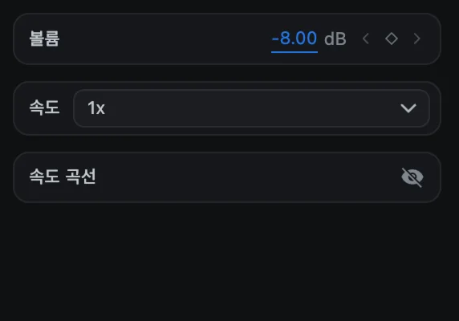
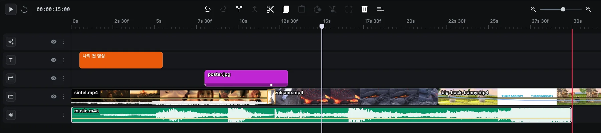

# 오디오

CartCut은 모든 오디오 클립과 소리가 있는 영상 클립의 소리를 섞어 줍니다. 이 페이지에서는 볼륨, 페이드, 영상에서 소리 분리하기, 내레이션 녹음을 설명합니다.

## 볼륨

오디오 클립이나 소리가 있는 영상 클립을 선택하면 옵션 패널 맨 위의 **볼륨**에서 소리 크기를 데시벨(dB)로 정할 수 있습니다.

- `0`dB는 원래 소리 그대로입니다.
- 음수로 내리면 작아집니다. 말소리 아래 깔리는 배경 음악은 보통 `-10`~`-15`dB 정도가 적당하고, `-60`dB는 무음입니다.
- 양수로 올리면 최대 `+12`dB까지 커집니다.

## 페이드와 시간에 따른 볼륨 변화

소리가 있는 클립에는 파형과 함께 가로로 된 얇은 **볼륨 선**이 표시됩니다.

| 하고 싶은 일 | 방법 |
| --- | --- |
| 클립 전체 볼륨 바꾸기 | 선을 위아래로 드래그 |
| 점 추가하기 | <kbd>Option</kbd> + 선 클릭 |
| 점 지우기 | <kbd>Option</kbd> + 점 클릭 |
| 페이드 만들기 | 점 두 개를 추가하고 그중 하나를 아래로 드래그 |

이 점들이 볼륨 키프레임입니다. 옵션 패널의 **볼륨** 옆 마름모 버튼으로도 추가할 수 있습니다. 재생 헤드를 옮기고 값을 바꾸면 그 위치에 키프레임이 기록됩니다.

## 영상에서 소리 분리하기

영상의 소리만 따로 편집하려면 영상을 선택하고 도구 모음의 **Detach audio**(또는 오른쪽 클릭 ▸ **Detach audio**)를 누르세요. 소리가 오디오 트랙의 새 클립으로 분리되고, 영상은 소리가 꺼집니다. 이제 소리만 따로 자르고 옮기고 지울 수 있습니다.

## 클립이나 트랙 소리 끄기

트랙에는 음소거 버튼이 없습니다. 클립 소리를 끄려면 **볼륨**을 `-60`dB로 내리거나, 오디오를 분리한 뒤 오디오 클립을 지우세요.

> [!NOTE]
> 트랙의 눈 버튼으로 트랙을 숨기면 화면만 사라집니다. 소리는 계속 재생되고 내보낸 영상에도 들어갑니다.

## 내레이션 녹음하기

1. **유틸리티**(슬라이더 아이콘)를 열고 **Audio Record**를 누릅니다.
2. 미리보기 위에 **Audio Record** 탭이 열리고 마이크로 녹음하라는 안내가 나타납니다.
3. **record**를 누르고 말합니다. 실시간 파형과 경과 시간이 표시됩니다.
4. **stop**을 누르면 녹음 파일이 재생 헤드 위치에 추가됩니다.

처음 녹음할 때 macOS가 마이크 사용 권한을 요청합니다.

## 레벨 미터

미리보기 왼쪽 아래의 미터는 재생 중인 소리의 크기를 보여 줍니다. 가장 큰 소리가 미터 꼭대기에 닿지 않게 하면 내보낸 영상에서 소리가 깨지지 않습니다.

## 텍스트로 내레이션 만들기

입력한 문장을 목소리로 바꾸려면 [Text to Speech](utilities#text-to-speech)를 사용하세요.
