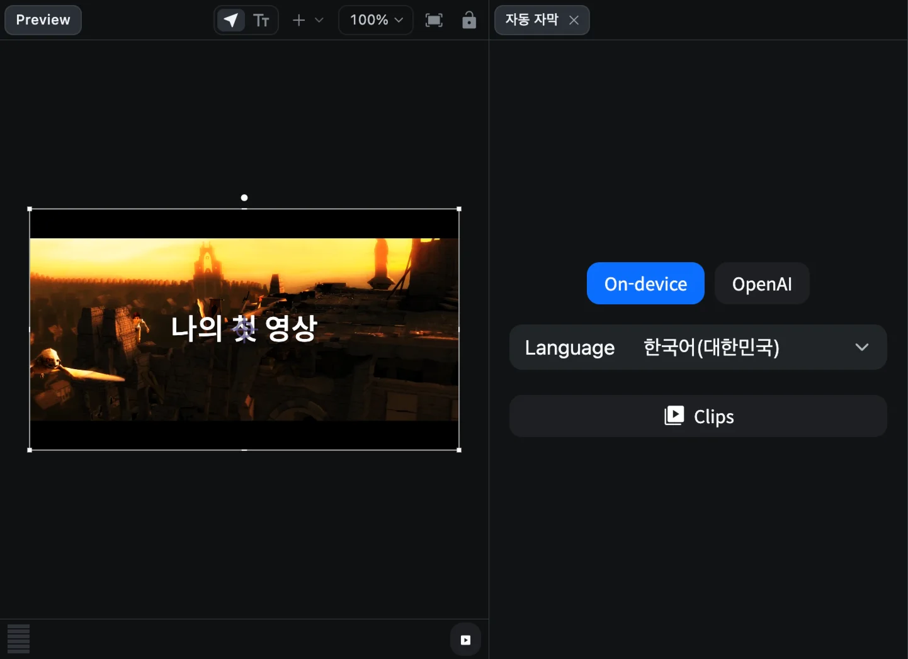
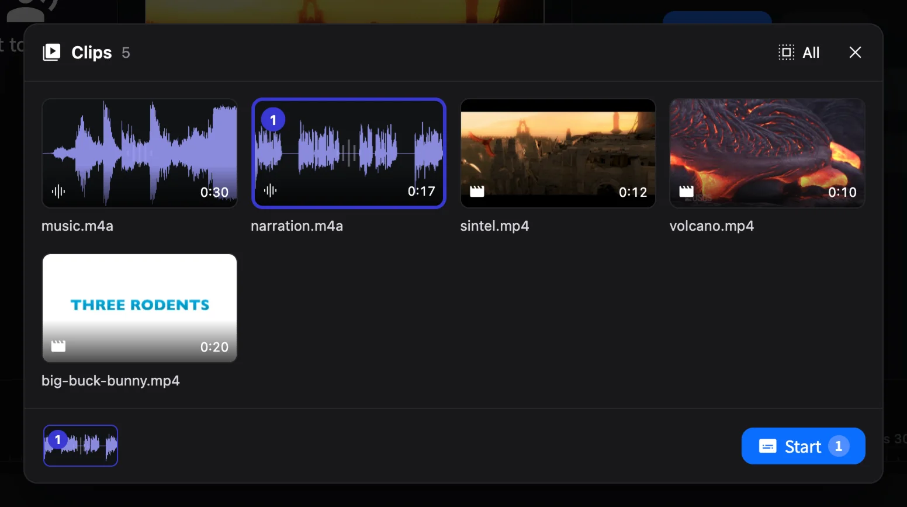
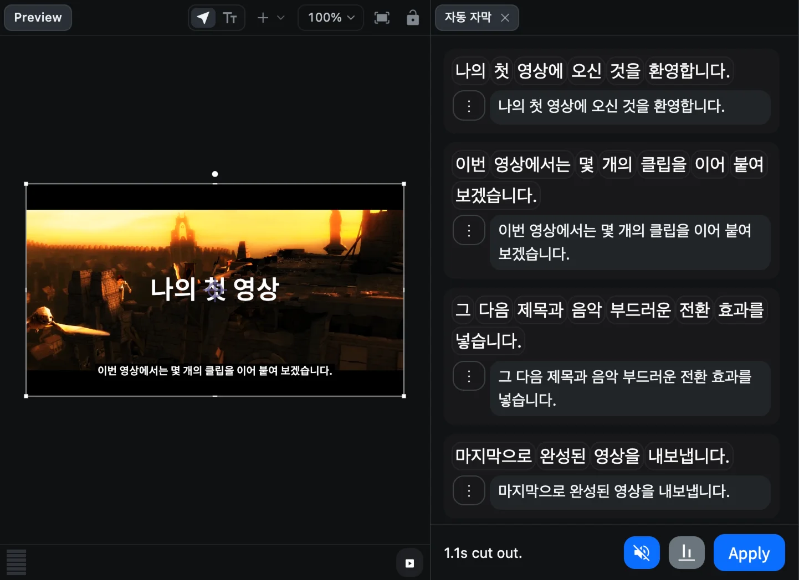
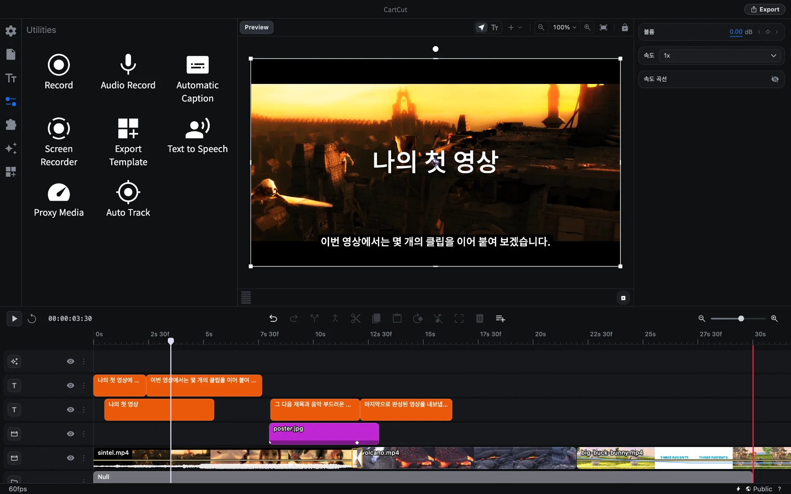
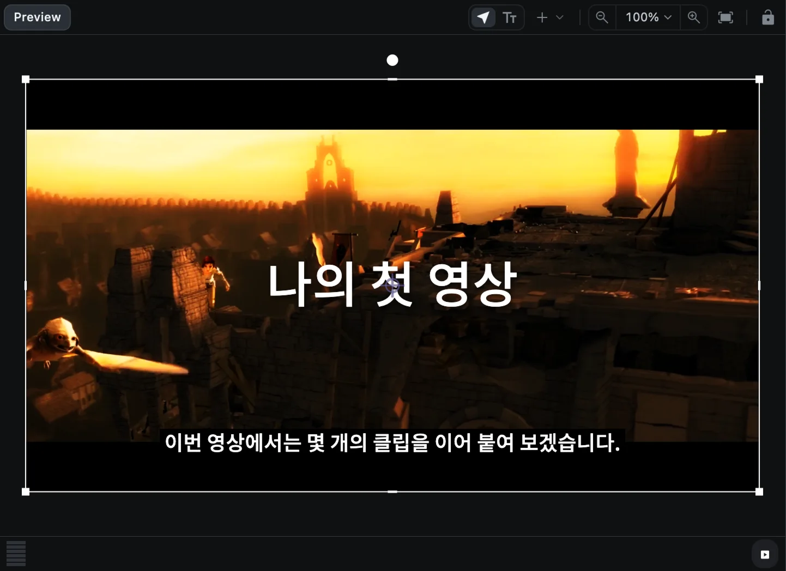

# 자동 자막

CartCut은 클립 속 말소리를 듣고 받아 적어 자막을 만들고, 타임라인에 배치하고, 말이 없는 구간까지 잘라 냅니다. 이 모든 작업이 한 번에 진행됩니다. 결과를 확인하고 틀린 단어를 고친 뒤 **Apply**만 누르면 됩니다.

## 필요한 것

받아 적는 방법은 두 가지입니다.

| 방법 | 조건 | 참고 |
| --- | --- | --- |
| **On-device** | macOS 26 이상 | Mac 안에서 처리합니다. 언어별 모델을 한 번 내려받으면 이후에는 오프라인에서도 동작합니다 |
| **OpenAI** | OpenAI API 키 | On-device를 쓸 수 없을 때 자동으로 선택됩니다 |

OpenAI를 쓰려면 먼저 키를 넣어 두세요. 창 오른쪽 아래의 **⚡** 아이콘을 누르고 **OpenAI API** 탭의 **OpenAI Key**에 키를 붙여 넣으면 됩니다. 키는 내 컴퓨터에만 저장됩니다.

## 자막 만들기

### 1. 자막 패널 열기

**유틸리티**(슬라이더 아이콘)를 열고 **Automatic Caption**을 누릅니다. 미리보기 옆에 **자동 자막** 패널이 열립니다.

### 2. 방법과 언어 고르기

- **On-device** 또는 **OpenAI**를 누릅니다. 내 Mac에서 On-device를 쓸 수 없으면 흐리게 표시되고 이유가 함께 나옵니다.
- On-device라면 말하는 **Language**(언어)를 고릅니다. 아직 Mac에 없는 언어에는 *(downloads once)* 표시가 붙습니다. OpenAI는 언어를 스스로 알아냅니다.

### 3. 클립 고르기

**Clips**를 누르면 타임라인의 모든 영상과 오디오 클립이 표시됩니다. 타임라인에서 미리 선택해 둔 클립은 이미 골라져 있습니다.

- 클립을 클릭해 넣거나 뺍니다. **All**을 누르면 모두 고릅니다.
- 아래쪽 트레이에 순서가 표시되며, 드래그해 순서를 바꿀 수 있습니다.
- **Start**(<kbd>⌘</kbd> <kbd>Return</kbd>)를 누릅니다.

### 4. 받아쓰기 기다리기

패널에 오디오 추출, 언어 모델 내려받기(처음 한 번), 받아쓰기, 말 없는 구간 찾기 단계가 차례로 표시됩니다. 그다음 자막이 하나씩 타임라인에 놓입니다. **Cancel**을 누르면 언제든 멈춥니다.

### 5. 확인하고 고치기

말한 문장 하나가 패널의 한 줄, 그리고 타임라인의 자막 하나가 됩니다.

| 하고 싶은 일 | 방법 |
| --- | --- |
| 단어 들어 보기 | 단어를 클릭하면 재생 헤드가 그 위치로 이동합니다 |
| 문구 고치기 | 줄의 입력란에 입력하면 자막이 바로 바뀝니다 |
| 줄 나누기 | 나눌 위치에 커서를 두고 <kbd>Return</kbd> |
| 윗줄과 합치기 | 줄 맨 앞에서 <kbd>Delete</kbd> |
| 아랫줄과 합치기 | 줄 맨 끝에서 <kbd>Fn</kbd> <kbd>Delete</kbd> |
| 나누기/합치기 되돌리기 | <kbd>⌘</kbd> <kbd>Z</kbd> |
| 더 보기 | **⋮** 버튼: 윗줄에 합치기, 또는 이 줄을 지우고 **해당 장면까지 잘라 내기** |

패널 아래쪽에는 잘라 낸 무음 길이와 세 개의 버튼이 있습니다.

- **무음**(음소거 스피커): 말 없는 구간은 자동으로 잘려 있습니다. 누르면 다시 넣고, 한 번 더 누르면 다시 잘라 냅니다.
- **위치**: 자막을 **Lower third**(하단, 기본값)나 **Centre of the frame**(화면 가운데)에 둡니다.
- **Apply**

### 6. 적용하기

**Apply**를 누르면 자막과 잘라 낸 부분이 편집에 반영되고 패널이 닫힙니다. 실행 취소 한 번으로 모두 되돌릴 수 있습니다.

> [!WARNING]
> **Apply**를 누르지 않고 패널의 **×** 버튼으로 닫으면 만든 자막이 모두 사라집니다.

## 알아 두면 좋은 점

- **패널이 열려 있는 동안 타임라인은 잠깁니다.** 재생, 재생 헤드 이동, 클립 선택은 되지만, 편집은 Apply를 누르거나 패널을 닫은 뒤에 할 수 있습니다. 그동안 트랙 메뉴에 자물쇠가 표시됩니다.
- **자막은 일반 텍스트 클립입니다.** 적용한 뒤 선택해서 글꼴, 크기, 색, 배경을 다른 텍스트처럼 꾸밀 수 있습니다. [텍스트](text)를 참고하세요.
- **파일로 내보낼 수 있습니다.** **File ▸ Export Subtitles…** 메뉴를 선택하면 유튜브 등에 올릴 수 있는 `.srt`나 `.vtt` 파일로 저장합니다.
- **깨끗한 소리일수록 정확합니다.** 받아쓰기 전에 배경 음악을 줄이거나, 목소리 트랙만 골라 자막을 만드세요.
