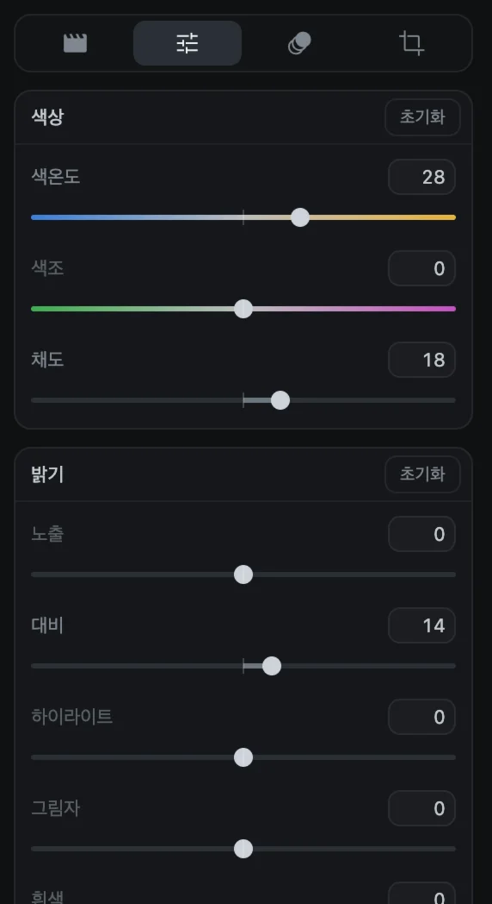
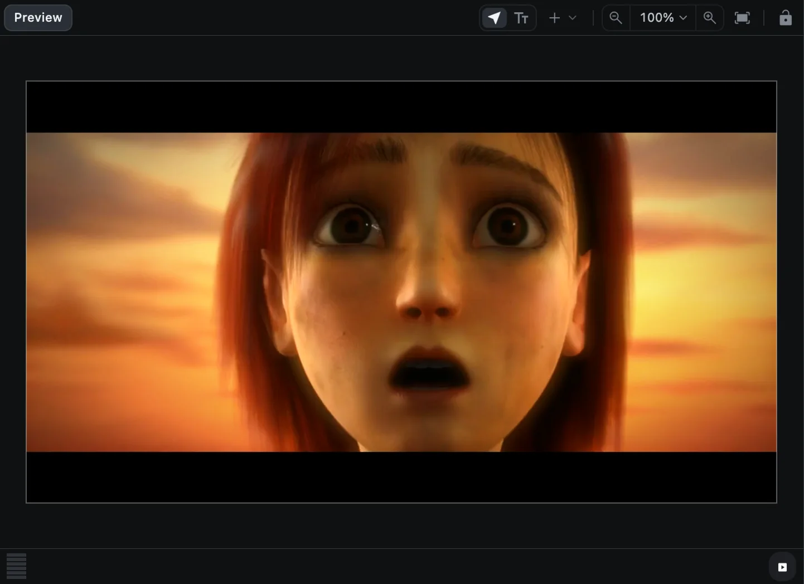
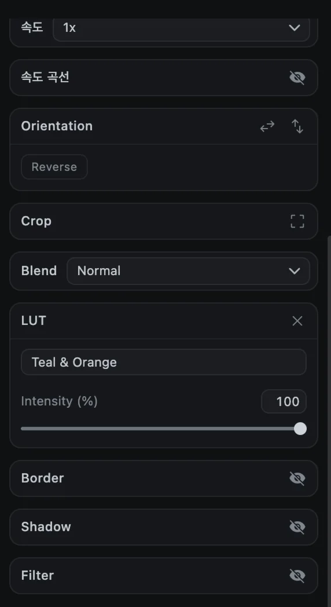
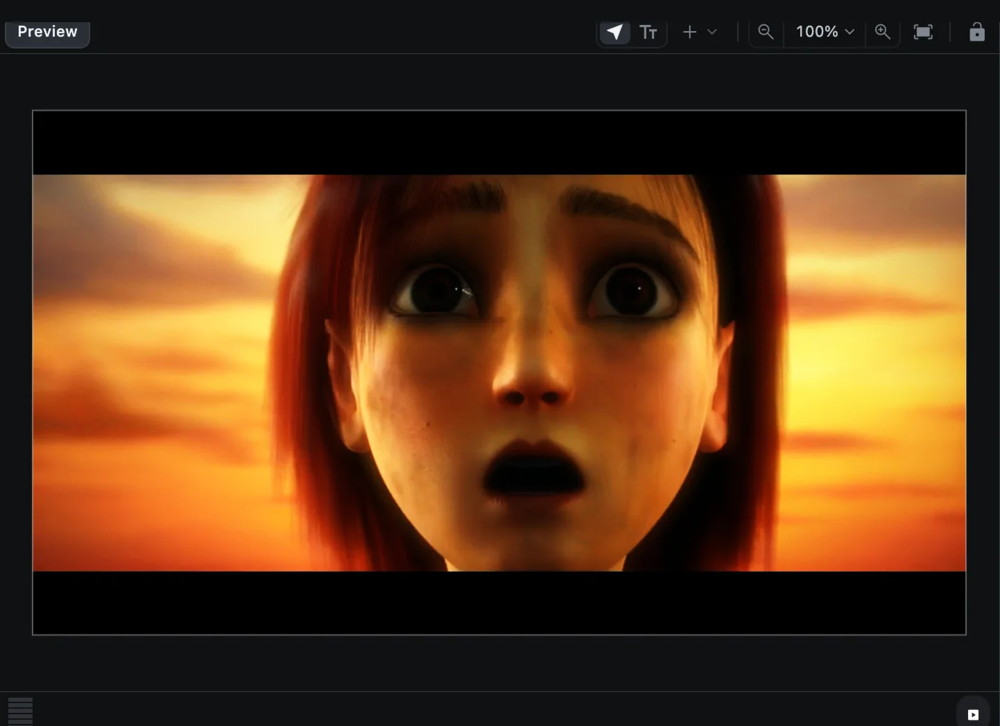

# 색 보정과 LUT

CartCut에는 색을 다루는 도구가 두 가지 있습니다. 문제를 바로잡고 세밀하게 다듬는 **Adjust** 슬라이더와, 클릭 한 번으로 전체 분위기를 입히는 **LUT**입니다. 한 클립에 둘 다 쓸 수 있습니다.

## Adjust

1. 영상, 이미지, 도형, 텍스트 클립을 선택합니다.
2. 옵션 패널의 **Adjust** 탭(두 번째 탭)을 엽니다.
3. 슬라이더를 드래그합니다. 드래그하는 동안 미리보기에 바로 반영됩니다.

| 그룹 | 슬라이더 | 하는 일 |
| --- | --- | --- |
| **색상** | 색온도, 색조, 채도 | 따뜻하게/차갑게, 초록/자홍 기운, 색의 진하기 |
| **밝기** | 노출, 대비, 하이라이트, 그림자, 흰색, 검정, 광채 | 전체 밝기와 밝은 곳/어두운 곳의 균형 |
| **효과** | 선명도, 명료도, 입자, 페이드, 비네팅 | 디테일, 필름 입자, 빛바랜 느낌, 가장자리를 어둡게/밝게 |

대부분의 슬라이더는 -100부터 100까지이며 0은 변화 없음입니다. 선명도, 명료도, 입자, 페이드는 0부터 100까지입니다.

- **슬라이더 이름을 더블클릭**하면 그 슬라이더만 초기화됩니다.
- 그룹의 **초기화**는 그 그룹을, 맨 아래 **전체 초기화**는 모든 값을 되돌립니다.

> [!TIP]
> 먼저 바로잡고 그다음에 꾸미세요. Adjust로 노출과 화이트 밸런스를 맞춘 뒤 LUT로 분위기를 더하면 좋습니다.

## LUT

LUT(룩업 테이블)는 모든 색을 정해진 규칙에 따라 바꿔, 필름 느낌이나 영화 같은 색감을 일관되게 입혀 줍니다. CartCut에는 80개가 들어 있습니다.

1. **효과** 탭(반짝이 아이콘)을 열고 위쪽의 **LUTs**를 누릅니다.
2. 타임라인에서 보정할 클립을 선택합니다.
3. LUT 타일을 클릭하면 선택한 클립에 적용됩니다.

| 분류 | 예시 |
| --- | --- |
| Film | Archive Neg, Daylight Neg, Eterna Soft, Print 2383 |
| Cinematic | Teal & Orange, Golden Hour, Blockbuster, Nordic Noir |
| Vintage | Faded Seventies, Super 8, Sepia Print |
| Black & White | Mono Contrast, Mono Neutral, Mono Platinum |
| Warm, Cool | Sunset Glow, Honey, Arctic, Winter Blue |
| Vivid, Matte | Vivid Pop, HDR Look, Matte Film, Matte Pastel |
| Log Conversion | C-Log3, D-Log, HLG, LogC3, S-Log3, V-Log to Rec.709 |
| Utility | Contrast +/-, Exposure +/-, Broadcast Safe |

**Search LUTs**에 이름을 입력해 찾을 수도 있습니다.

### LUT 세기 조절과 제거

클립을 선택하면 **Media** 탭의 **LUT** 섹션에 LUT 이름과 0~100%의 **Intensity**(세기) 슬라이더가 나타납니다. 세기를 낮추면 은은해집니다. **×** 버튼을 누르면 LUT가 제거됩니다.

### 여러 클립을 한 번에 보정하기

**아무것도 선택하지 않은 상태**에서 LUT 타일을 클릭하면, 재생 헤드 위치에 **조정 레이어**가 추가됩니다. 조정 레이어는 그 아래 트랙의 모든 클립에 색감을 입히는 효과 클립입니다. 편집 전체에 걸쳐 늘려 두면 영상 전체의 색감을 하나로 맞출 수 있습니다.

LUT 타일을 클립 위로 끌어다 놓으면 그 클립에, 빈 트랙 공간에 놓으면 그곳에 조정 레이어가 만들어집니다.

### 직접 만든 LUT 가져오기

검색창 옆의 업로드 버튼(**Import a .cube, .3dl or LUT image**)을 누르거나 파일을 패널에 끌어다 놓으세요. `.cube`, `.3dl`, HaldCLUT `.png` 파일을 읽을 수 있습니다. 가져온 LUT는 **My LUTs**에 나타납니다.

## 블렌드 모드

클립이 아래 클립과 섞이는 방식은 Media 탭의 **Blend**에서 정합니다. [위치, 크기, 회전 ▸ 블렌드 모드](transform#블렌드-모드)를 참고하세요.
