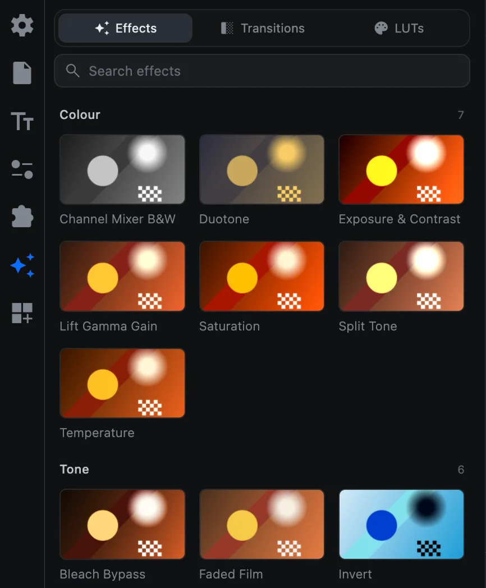
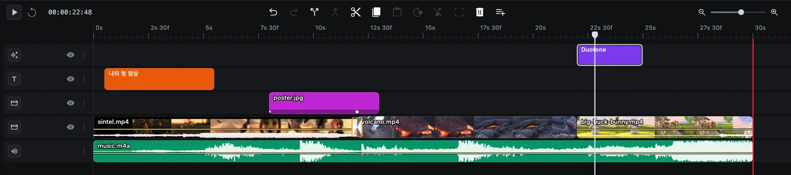
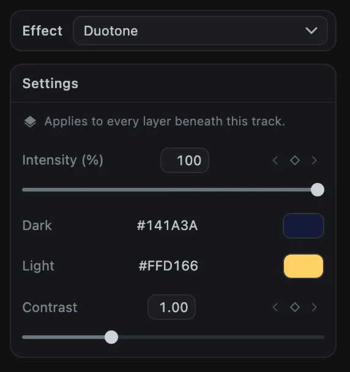
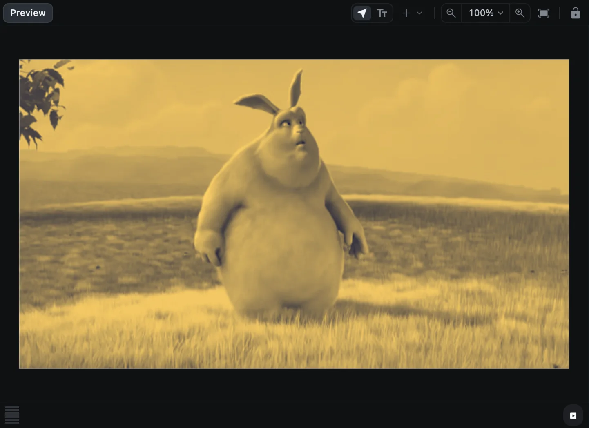
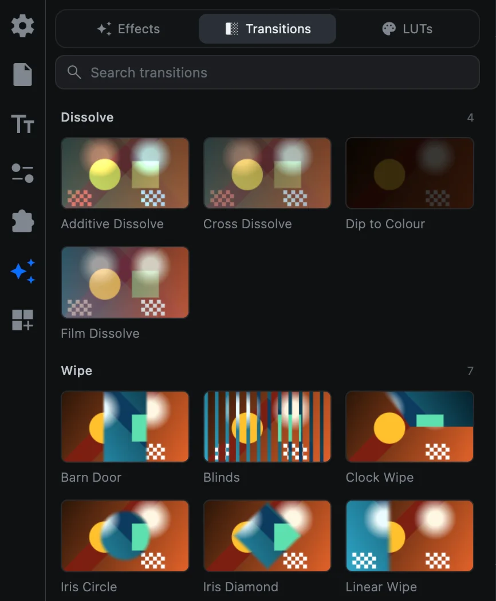
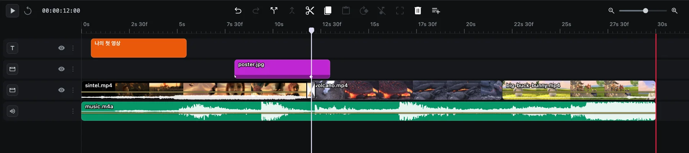
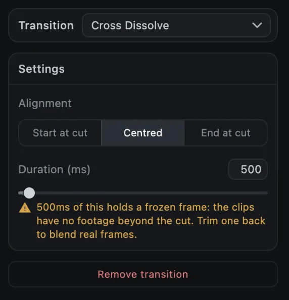
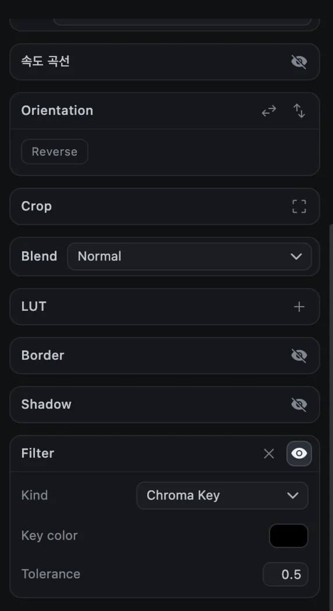

# 효과와 전환

효과는 블러와 빛 번짐부터 VHS, 글리치까지 영상의 모습을 바꿉니다. 전환 효과는 한 클립에서 다음 클립으로 자연스럽게 넘어가게 합니다. 둘 다 **효과** 탭(반짝이 아이콘)에 있으며, 이 탭은 **Effects**, **Transitions**, **LUTs** 세 부분으로 나뉩니다. LUT는 [색 보정과 LUT](color)에서 설명합니다.

타일에 마우스를 올리면 움직이는 미리보기를 볼 수 있습니다.

## 효과(Effects)

### 효과 넣기

1. 효과가 시작될 위치로 재생 헤드를 옮깁니다.
2. 효과 타일을 클릭하거나 타임라인으로 끌어다 놓습니다.
3. 3초 길이의 **효과 클립**이 별도 트랙에 생깁니다.

효과 클립은 놓인 시간 동안 **그 트랙보다 아래에 있는 모든 레이어**를 바꿉니다. 양 끝을 드래그해 시작과 끝을 정하고, 트랙을 위아래로 옮겨 어떤 레이어에 적용할지 정하세요.

### 효과 조절하기

효과 클립을 선택하면 옵션 패널에 다음이 나타납니다.

- **Effect**: 다른 효과로 바꾸는 메뉴입니다. 클립을 선택한 채 다른 타일을 클릭해도 바뀝니다.
- **Intensity**: 효과의 세기(0~100%)입니다.
- 색, 양, 각도 같은 효과별 설정입니다.
- 화면 위에 빛이나 질감을 더하는 효과에는 **Blend**가 있습니다.

Intensity와 숫자 설정에는 키프레임 마름모가 있어, 효과가 서서히 나타나거나 시간에 따라 변하게 할 수 있습니다. [키프레임 애니메이션](keyframes)을 참고하세요.

### 전체 효과 목록

| 분류 | 효과 |
| --- | --- |
| Colour | Channel Mixer B&W, Duotone, Exposure & Contrast, Lift Gamma Gain, Saturation, Split Tone, Temperature |
| Tone | Bleach Bypass, Faded Film, Invert, Posterize, Sepia, Threshold |
| Optical | Anamorphic Streak, Bloom, Chromatic Aberration, Halation, Lens Distortion, Vignette |
| Blur | Gaussian Blur, Motion Blur, Radial Blur, Tilt Shift |
| Texture | Dust & Scratches, Film Grain, Halftone, Scanlines, Static Noise, VHS |
| Stylise | Digital Glitch, Edge Detect, Kaleidoscope, Mirror, Pixelate, Sharpen, Teal & Orange |
| Light | Flicker, Light Sweep, Strobe |

## 전환 효과(Transitions)

### 전환 효과 넣기

전환 효과는 **컷**, 즉 같은 트랙에서 한 클립이 끝나고 다음 클립이 시작되는 지점에 들어갑니다.

**목록에서 넣기**

1. 컷 옆의 클립을 선택합니다.
2. 전환 효과 타일을 클릭합니다. 아직 전환 효과가 없는 가장 가까운 컷에 500ms 길이로, 컷을 가운데에 두고 들어갑니다.

**타임라인에서 넣기**

타임라인에서 두 클립 사이의 컷에 마우스를 올리고, 나타나는 표시를 클릭합니다.

### 전환 효과 조절하기

타임라인에서 전환 효과를 클릭하면 옵션 패널에 다음이 나타납니다.

- **Transition**: 다른 전환 효과로 바꾸는 메뉴
- **Alignment**: **Start at cut**(컷에서 시작), **Centred**(컷 중심), **End at cut**(컷에서 끝)
- **Duration**: 길이(밀리초)와, 이 컷에 넣을 수 있는 최대 길이
- **Remove transition**: 전환 효과 삭제

> [!NOTE]
> 전환 효과에는 컷 양쪽 클립의 여분 장면이 필요합니다. 원본 파일의 맨 처음부터 시작하는 클립처럼 가장자리 너머에 여분이 없으면, 전환 효과 일부가 멈춘 화면으로 채워진다는 경고가 나타납니다. 클립을 조금 다듬어 여분을 만들면 실제 장면끼리 자연스럽게 섞입니다.

### 전체 전환 효과 목록

| 분류 | 전환 효과 |
| --- | --- |
| Dissolve | Additive Dissolve, Cross Dissolve, Dip to Colour, Film Dissolve |
| Wipe | Barn Door, Blinds, Clock Wipe, Iris Circle, Iris Diamond, Luma Wipe, Linear Wipe |
| Slide | Push, Slide, Split, Squeeze, Stretch |
| Zoom | Cross Zoom, Whip Pan, Zoom In, Zoom Out |
| Distort | Chroma Split, Glitch, Pixelate Dissolve, Ripple, Swirl, Wave |
| Pattern | Checkerboard, Grid Flip, Halftone Reveal, Noise Dissolve |
| 3D | Card Flip, Cube Rotate, Door, Page Curl |
| Light | Burn, Flash, Light Leak |

## 비디오 필터: 크로마키와 블러

영상 클립의 Media 탭 맨 아래에는 **Filter** 섹션이 있어, 그린 스크린을 지우거나 클립 하나만 흐리게 할 수 있습니다.

1. 영상 클립을 선택하고 **Filter**로 스크롤합니다.
2. **눈** 버튼으로 필터를 켜고 **+** 버튼으로 필터를 추가합니다.
3. **Kind**(종류)를 고릅니다.
   - **Chroma Key**: 한 가지 색을 지웁니다. **Key color**를 배경색으로 정하고, 배경이 사라질 때까지 **Tolerance**를 올리세요.
   - **Blur**, **Radial Blur**: **Strength**만큼 클립을 흐리게 합니다.

**×** 버튼은 필터를 지우고, 눈 버튼은 필터를 껐다 켜서 전후를 비교할 수 있게 해 줍니다.
