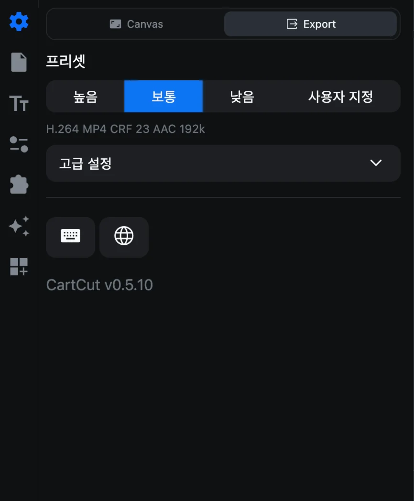
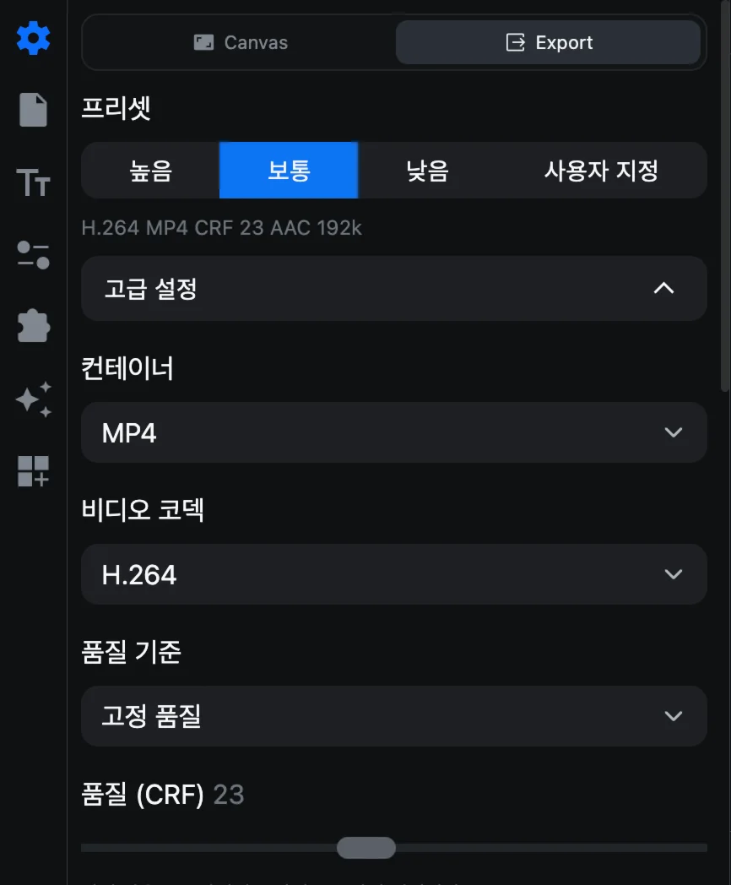
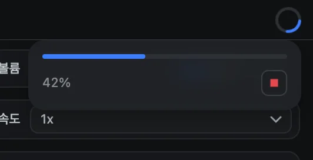

# 영상 내보내기

내보내기는 프로젝트를 업로드하고, 공유하고, 어디서든 재생할 수 있는 영상 파일로 렌더링하는 작업입니다. **설정 ▸ Export**에서 형식을 한 번 정해 두면, 버튼 한 번으로 내보낼 수 있습니다.

## 내보내기 전에 확인할 것

- **길이를 확인하세요.** 영상은 클립이 어디서 끝나든 **설정 ▸ Canvas**의 **영상 길이**와 정확히 같은 길이로 만들어집니다. [프로젝트 설정](project-settings#영상-길이)을 참고하세요.
- **숨긴 트랙을 확인하세요.** 눈 버튼으로 숨긴 트랙은 내보낸 영상에서 빠집니다.
- <kbd>⌘</kbd> <kbd>S</kbd>로 **프로젝트를 저장**해 두세요.

## 화질 고르기

**설정**(톱니바퀴 아이콘)을 열고 패널 위쪽의 **Export**를 누릅니다.

**프리셋**을 고릅니다.

| 프리셋 | 영상 | 인코딩 속도 | 오디오 | 어울리는 용도 |
| --- | --- | --- | --- | --- |
| **높음** | H.264 MP4, CRF 18 | slow | AAC 320kbps, 48kHz | 화질이 가장 중요한 최종 업로드 |
| **보통**(기본값) | H.264 MP4, CRF 23 | medium | AAC 192kbps, 48kHz | 대부분의 영상 |
| **낮음** | H.264 MP4, CRF 28 | veryfast | AAC 128kbps, 44.1kHz | 빠른 확인용, 작은 파일 |
| **사용자 지정** | 직접 정한 설정 | | | 아래 참고 |

프리셋 아래 줄에 *H.264 MP4 CRF 23 AAC 192k*처럼 현재 설정이 요약되어 표시됩니다.

### 고급 설정

**고급 설정**을 누르면(**사용자 지정**을 골라도 열립니다) 모든 값을 직접 정할 수 있습니다.

| 설정 | 선택 항목 |
| --- | --- |
| 컨테이너 | MP4, MOV, WebM |
| 비디오 코덱 | H.264, H.265(HEVC), VP9(WebM 전용), ProRes(MOV 전용) |
| 품질 기준 | **고정 품질**(CRF 값) 또는 **목표 비트레이트**(kbps) |
| 품질 (CRF) | 0~51(VP9는 0~63). 낮을수록 화질이 좋고 파일이 커집니다 |
| 하드웨어 가속 | Mac의 미디어 엔진으로 인코딩합니다. 훨씬 빠르지만 파일이 조금 커집니다. H.264, H.265, ProRes |
| 인코딩 속도 | ultrafast~veryslow. 느릴수록 같은 화질에서 파일이 작아집니다 |
| ProRes 프로파일 | Proxy, LT, 422, 422 HQ, 4444, 4444 XQ |
| 오디오 코덱 | AAC 또는 MP3(MP4), AAC 또는 PCM(MOV), Opus 또는 Vorbis(WebM) |
| 오디오 비트레이트 | 96~320kbps |
| 샘플 레이트 | 44100 또는 48000Hz |
| 채널 | 모노 또는 스테레오 |

> [!TIP]
> **공유용**으로는 어디서나 재생되는 H.264 MP4를, **다른 편집 프로그램으로 넘길 때**는 ProRes MOV를, **웹용**으로는 파일이 작은 VP9 WebM을 추천합니다. ProRes 파일은 1분에 수백 MB로 매우 큽니다.

## 내보내기

1. 창 오른쪽 위의 **Export**를 누르거나, <kbd>⌘</kbd> <kbd>E</kbd>를 누르거나, **File ▸ Export Video…** 메뉴를 선택합니다.
2. 파일 이름과 폴더를 정하고 **Export**를 누릅니다. 같은 이름의 파일이 있으면 덮어씁니다.
3. Export 버튼이 진행률을 보여 주는 원으로 바뀝니다. **렌더링하는 동안에도 계속 편집할 수 있습니다.**
4. 원을 누르면 진행 상황이 보이고, 빨간 버튼으로 내보내기를 멈출 수 있습니다.

5. **Rendering is complete** 창이 나타나면 **Open Saved Folder**를 눌러 Finder에서 파일을 확인합니다.

## 문제가 생겼을 때

- *An export is already running*: 진행 중인 내보내기가 끝날 때까지 기다리거나, 진행률 원에서 멈추세요.
- *Export failed*: 메시지에 이유가 나옵니다. FFmpeg가 언급되어 있다면 **About ▸ Setting ▸ Reinstall FFmpeg**를 실행하세요.
- 영상 끝이 검은 화면: 프로젝트 영상 길이가 편집보다 깁니다. **설정 ▸ Canvas**에서 줄이세요.
- 클립이 영상에서 빠짐: 트랙이 숨겨져 있거나, 클립이 빨간 끝선 밖에 있을 수 있습니다.
