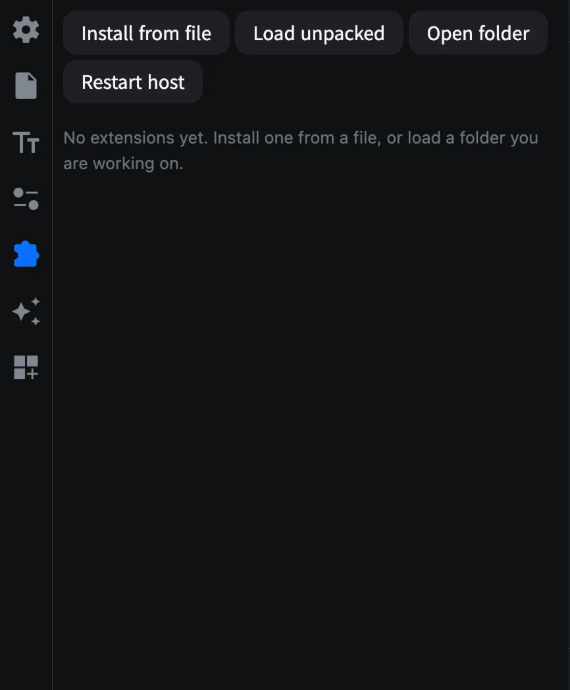
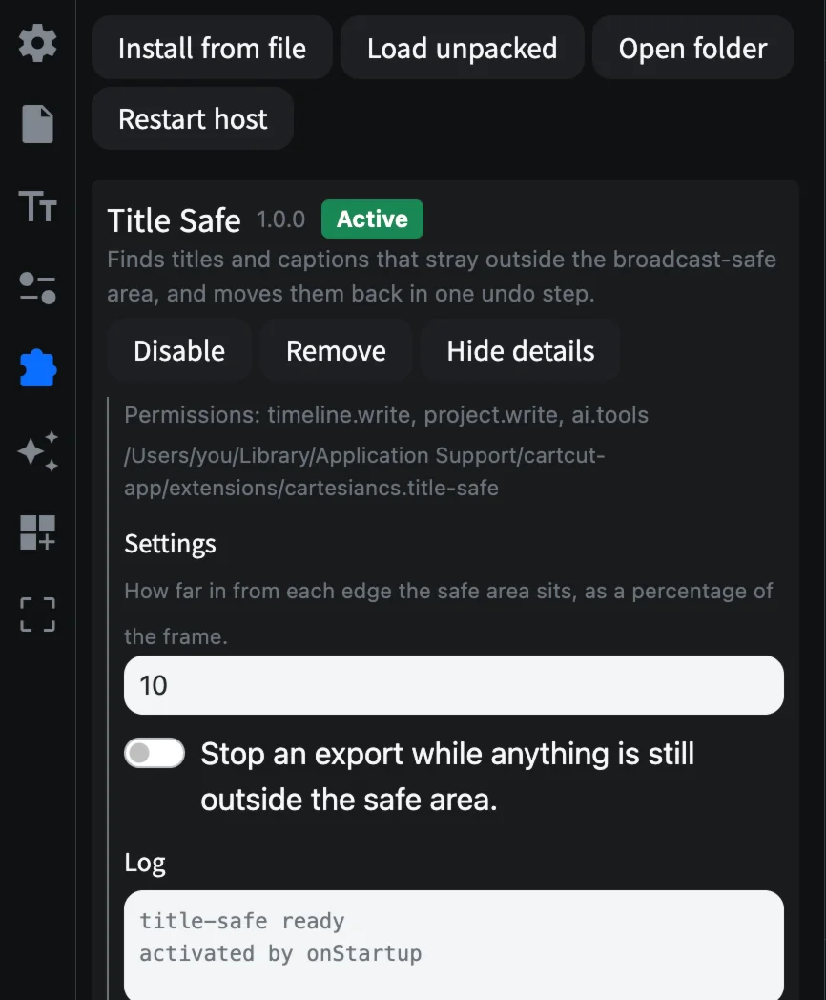

# 확장 프로그램

확장 프로그램은 CartCut에 새로운 명령, 패널, 효과, 템플릿, 애니메이션 프리셋, AI 어시스턴트용 도구까지 추가합니다. 파일로 설치하거나 폴더에서 바로 불러올 수 있습니다.

## 확장 프로그램 탭

사이드바의 **확장 프로그램** 탭(퍼즐 조각 아이콘)을 엽니다.



| 버튼 | 하는 일 |
| --- | --- |
| **Install from file** | `.cartcut-ext` 또는 `.zip` 파일로 설치 |
| **Load unpacked** | 폴더에서 불러오기(직접 개발할 때) |
| **Open folder** | 설치된 확장 프로그램이 있는 폴더 열기 |
| **Restart host** | 응답하지 않을 때 등 모든 확장 프로그램 다시 시작 |

## 설치하기

1. **Install from file**을 누르고 확장 프로그램의 `.cartcut-ext` 또는 `.zip` 파일을 고릅니다.
2. 확장 프로그램의 이름, 버전, 요청하는 모든 권한이 표시됩니다.
3. 확인을 누르면 설치되었다는 메시지가 나타납니다.


각 확장 프로그램에는 상태 배지가 표시됩니다. **Active**(실행 중), **Idle**(필요할 때까지 대기), **Disabled**(꺼짐), **Failed**(실패), **Unpacked**(폴더에서 불러옴)입니다.

| 버튼 | 하는 일 |
| --- | --- |
| **Enable** / **Disable** | 켜거나 끕니다 |
| **Remove** | 삭제합니다(폴더에서 불러온 경우 **Forget**) |
| **Details** | 권한, 폴더, 설정, 로그를 보여 줍니다 |

확장 프로그램이 명령을 추가하면 **Commands** 아래에 표시되며, 클릭해서 실행하거나 **Filter commands**로 찾을 수 있습니다. 확장 프로그램은 사이드바 아이콘, 클립 오른쪽 클릭 메뉴 항목, 메뉴 막대의 **Extensions** 메뉴, 단축키, 상태 표시줄 항목도 추가할 수 있습니다.



## 권한

설치하기 전에 CartCut이 확장 프로그램이 하려는 일을 보여 줍니다.

| 권한 | 확장 프로그램이 할 수 있는 일 |
| --- | --- |
| timeline.write | 타임라인 변경. 변경 하나가 실행 취소 한 단계입니다 |
| project.write | 프로젝트 파일에 자체 데이터 저장 |
| fs.read / fs.write | 프로젝트 폴더와 내가 고른 폴더의 파일 읽기/쓰기 |
| process.spawn | 내장 FFmpeg를 포함해 컴퓨터의 프로그램 실행 |
| net | 인터넷 연결 |
| clipboard | 클립보드 읽기/쓰기 |
| shell.open | 링크와 파일을 다른 앱에서 열기 |
| secrets | 시스템 키체인에 비밀번호와 API 키 저장 |
| ai.tools | Claude Code가 이 프로젝트를 편집할 때 도구 제공 |

> [!WARNING]
> 확장 프로그램은 CartCut과 같은 수준으로 컴퓨터에 접근할 수 있습니다. 권한 목록은 확장 프로그램이 무엇을 하려는지 알려 줄 뿐, 실행을 가두는 장치(샌드박스)는 아닙니다. 믿을 수 있는 확장 프로그램만 설치하세요.

확장 프로그램은 별도의 프로세스에서 실행됩니다. 하나가 멈추거나 오류로 종료되어도 다시 시작될 뿐, 타임라인과 실행 취소 기록, 저장하지 않은 프로젝트에는 영향이 없습니다.

## 직접 만들어 보기

확장 프로그램은 `package.json` 매니페스트와 JavaScript 파일이 든 폴더입니다. 명령 하나를 추가하는 가장 간단한 예시는 다음과 같습니다.

```json
{
  "name": "hello",
  "publisher": "acme",
  "version": "1.0.0",
  "main": "main.js",
  "engines": { "cartcut": "^1" },
  "cartcut": {
    "activationEvents": ["onCommand:hello.say"],
    "permissions": ["timeline.write"],
    "contributes": {
      "commands": [{ "id": "hello.say", "title": "Hello: Say" }]
    }
  }
}
```

```js
const cartcut = require("cartcut");

exports.activate = (ctx) => {
  ctx.subscriptions.push(
    cartcut.commands.registerCommand("hello.say", async () => {
      const info = await cartcut.project.info();
      await cartcut.timeline.addText({
        text: "Hello",
        startMs: info.playheadMs,
        durationMs: 2000,
      });
    }),
  );
};
```

1. **Load unpacked**를 누르고 폴더를 고릅니다.
2. Commands 목록에서 **Hello: Say**를 실행하면 재생 헤드 위치에 텍스트 클립이 생깁니다.
3. 폴더 안의 파일을 저장하면 확장 프로그램이 다시 시작되어, 다음 실행부터 새 코드가 적용됩니다.

에디터 자동 완성을 쓰려면 타입 정의를 설치하세요.

```bash
npm install --save-dev @cartcut/extension-api
```

방송용 안전 영역 밖으로 나간 제목을 찾아 실행 취소 한 번으로 안쪽으로 옮겨 주는 완성된 예제 **Title Safe**는 저장소의 [`examples/extensions/title-safe`](https://github.com/cartesiancs/cartcut/tree/main/examples/extensions/title-safe) 폴더에 있습니다.
