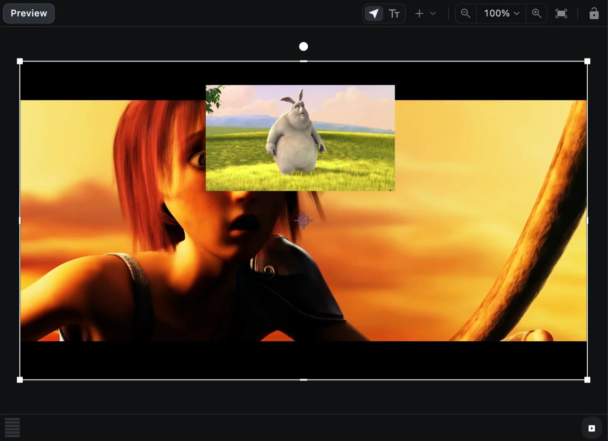
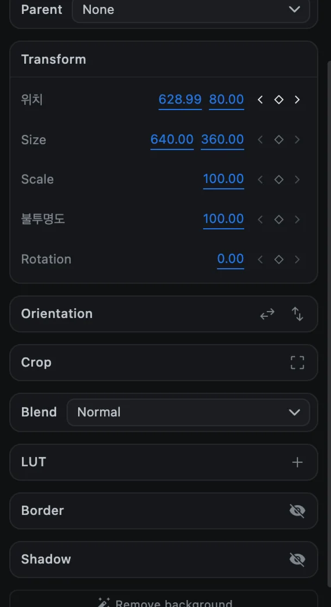
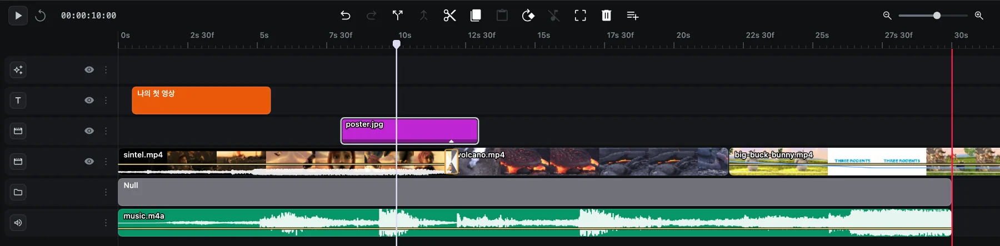

# 그룹과 부모 연결

로고와 그 아래 설명, 사진과 그 테두리처럼 여러 클립이 한 몸처럼 움직여야 할 때는 그룹으로 묶거나 부모(parent)에 연결합니다.

## 클립 그룹으로 묶기

1. 클립들을 선택합니다(예: <kbd>Shift</kbd> + 클릭).
2. <kbd>⌘</kbd> <kbd>G</kbd>를 누르거나, **Clip ▸ Group**을 선택하거나, 오른쪽 클릭 ▸ **Group selected**를 선택합니다.

그룹 트랙에 **Group** 클립이 생깁니다. 그룹을 옮기고, 크기를 바꾸고, 회전하고, 애니메이션을 주면 안에 든 모든 클립에 적용됩니다.

| 하고 싶은 일 | 방법 |
| --- | --- |
| 그룹 해제 | <kbd>⇧</kbd> <kbd>⌘</kbd> <kbd>G</kbd> 또는 오른쪽 클릭 ▸ **Ungroup** |
| 클립 하나만 빼기 | 그 클립을 오른쪽 클릭 ▸ **Remove from group** |
| 그룹과 안의 클립 모두 삭제 | 그룹을 선택하고 <kbd>Delete</kbd> |

오디오 클립은 그룹에 넣을 수 없습니다. 애니메이션이 있는 그룹을 해제하면, 그룹의 애니메이션은 사라지고 재생 헤드 위치의 상태만 남는다는 경고가 나타납니다.

## 널 오브젝트

널 오브젝트(Null Object)는 아무것도 들어 있지 않은 보이지 않는 그룹입니다. 영상에는 나타나지 않고, 다른 클립을 움직이는 손잡이 역할만 합니다.

1. 미리보기 도구 모음의 **Add a shape**(**+**)를 누르고 **Null Object**를 고릅니다.
2. 그룹 트랙에 프로젝트 길이만큼의 **Null** 클립이 생기고, 미리보기에 작은 십자 모양 손잡이가 나타납니다.

## 클립을 부모에 연결하기

1. 연결할 클립을 선택합니다.
2. **Media** 탭에서 **Transform** 위의 **Parent**를 찾습니다. 프로젝트에 그룹이나 널이 하나 이상 있어야 나타납니다.
3. 그룹이나 널을 고릅니다.

클립은 화면에서 지금 위치에 그대로 있습니다. 이제부터 부모를 옮기고, 크기를 바꾸고, 회전하고, 애니메이션을 주면 클립도 함께 따라가고, 클립에는 자기만의 애니메이션을 따로 더할 수 있습니다.

연결을 끊으려면 **None**을 고르세요. 고를 수 없는 항목은 흐리게 표시되고, 마우스를 올리면 이유를 알려 줍니다. 클립은 자기 자신의 부모가 될 수 없고, 그룹은 자기 안에 든 그룹 속으로 들어갈 수 없으며, 최대 8단계까지만 겹칠 수 있습니다.

> [!TIP]
> [Auto Track](utilities#auto-track)을 쓰면 영상 속에서 움직이는 대상을 따라가는 널을 만들 수 있습니다. 여기에 제목이나 도형을 연결하면 그 대상에 붙어 함께 움직입니다.
