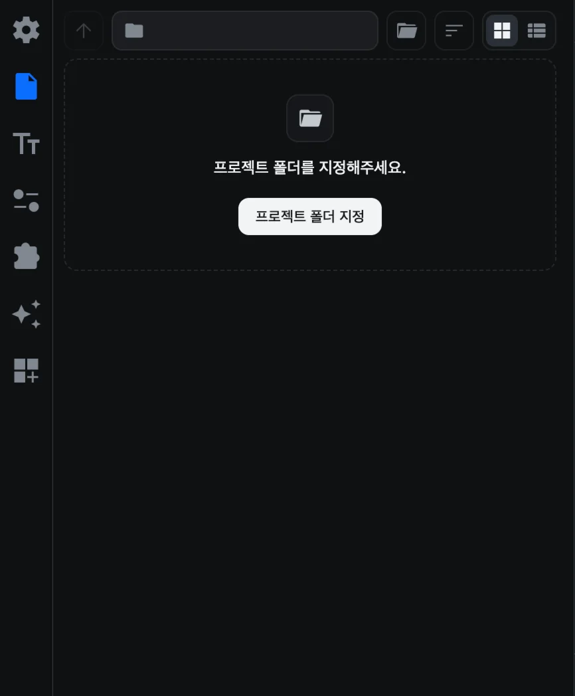
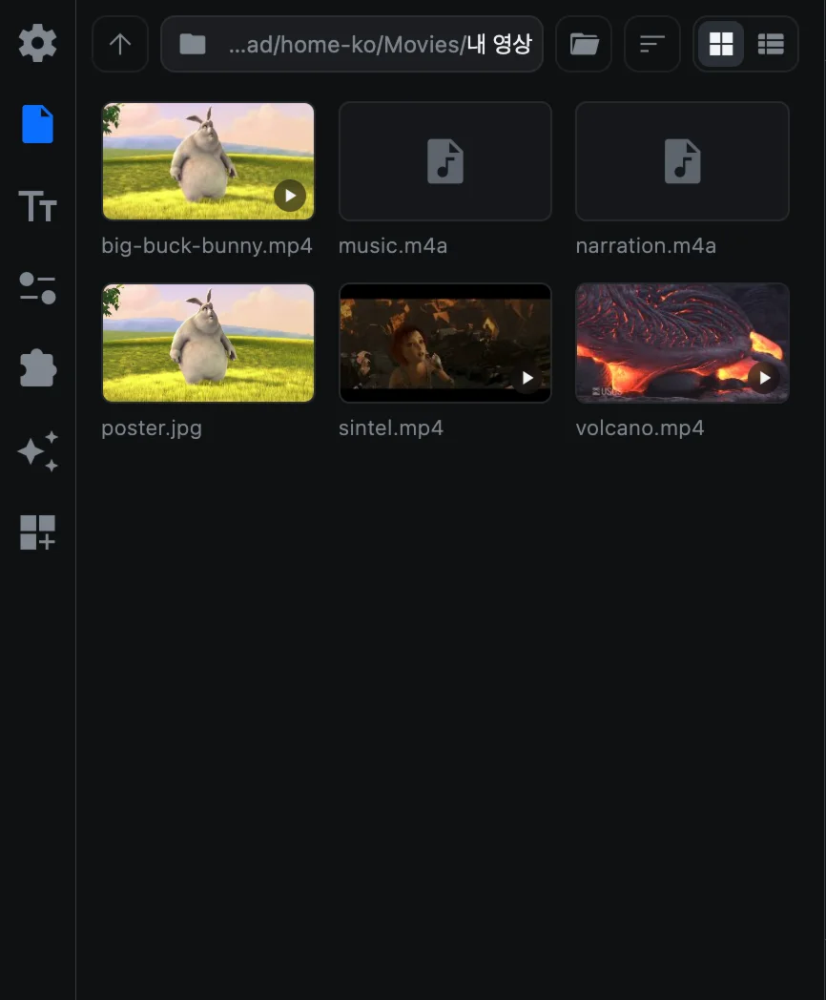
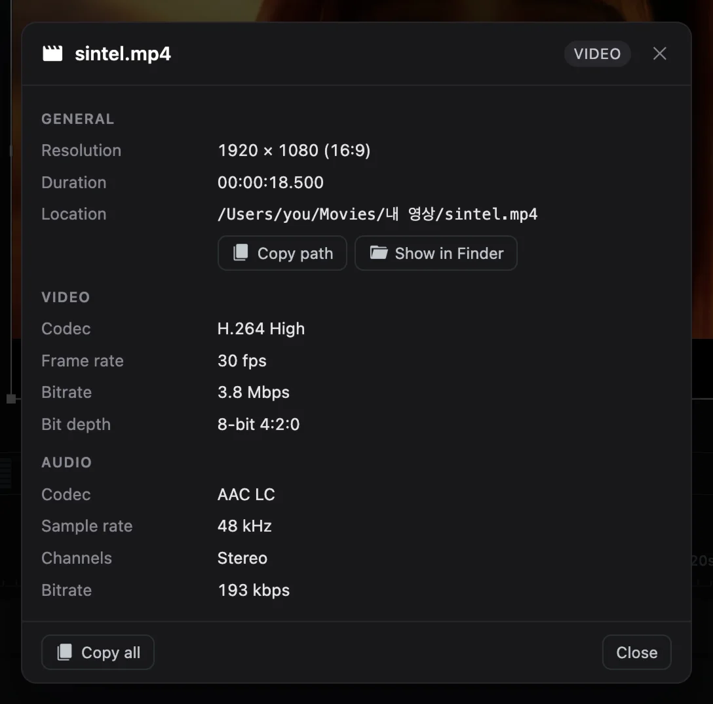

# 미디어 가져오기

클립을 편집하려면 먼저 타임라인에 올려야 합니다. CartCut에서는 네 가지 방법으로 미디어를 가져올 수 있습니다.

## 지원하는 파일

| 종류 | 형식 |
| --- | --- |
| 영상 | MP4, MOV, MKV, WebM, AVI, WMV, MPG |
| 이미지 | PNG, JPG, JPEG, WebP, SVG |
| 움직이는 이미지 | GIF |
| 오디오 | MP3, WAV, M4A |
| 자막 | SRT, VTT ([텍스트](text#자막-파일) 참고) |
| 템플릿 | CTTPL ([템플릿](templates) 참고) |

그 밖의 형식은 이유를 알려 주는 메시지와 함께 건너뜁니다.

## 파일 탭

**파일** 탭(사이드바 두 번째의 문서 아이콘)은 CartCut 안에 들어 있는 파일 탐색기입니다.

1. **프로젝트 폴더 지정**을 누르고 폴더를 고릅니다. 폴더 안의 영상, 이미지, 오디오는 썸네일로, 하위 폴더는 폴더 아이콘으로 표시됩니다.
2. 폴더 아이콘을 클릭하면 그 폴더로 들어갑니다. **상위 폴더**(위쪽 화살표)를 누르면 한 단계 위로 올라갑니다.
3. 경로 옆의 폴더 버튼(**프로젝트 폴더 변경**)을 누르면 다른 위치를 둘러볼 수 있습니다.

| 기능 | 하는 일 |
| --- | --- |
| 정렬 | 이름, 종류, 수정일, 생성일, 크기 순으로 정렬하고 방향을 바꿀 수 있습니다 |
| 격자 보기 / 목록 보기 | 썸네일로 보거나, 길이와 크기 같은 정보가 있는 목록으로 봅니다 |
| 마우스 올리기 | 영상, 이미지, GIF 위에 잠시 마우스를 올리면 크게 미리 보여 줍니다 |
| 오른쪽 클릭 | **Show Info**를 누르면 해상도, 코덱, 프레임 레이트, 오디오 형식, 파일 위치를 보여 줍니다 |

## 미디어를 넣는 네 가지 방법

### 1. 썸네일 클릭하기

파일 탭의 파일을 클릭하면 재생 헤드 위치에 추가됩니다.

### 2. 썸네일 끌어다 놓기

썸네일을 잠깐(약 0.2초) 누르고 있다가 타임라인으로 끌어다 놓습니다. 놓은 위치에 클립이 들어갑니다. 누르자마자 움직이면 패널이 스크롤됩니다.

### 3. 메뉴 사용하기

**File ▸ Import Media…**(<kbd>⌘</kbd> <kbd>I</kbd>)를 선택하고 파일을 하나 이상 고르면 재생 헤드 위치에 추가됩니다.

### 4. Finder에서 끌어오기

Finder에서 파일을 바로 끌어다 놓을 수 있습니다.

- **타임라인 위에** 놓으면 놓은 위치에 들어갑니다.
- 창의 **다른 곳에** 놓으면 재생 헤드 위치에 들어갑니다.

## 새 클립이 놓이는 위치

- 클립은 종류에 맞는 트랙에 들어갑니다. 영상, 이미지, GIF는 **비디오 트랙**에, 소리는 **오디오 트랙**에 놓입니다.
- 해당 시간에 비어 있는 같은 종류의 트랙 중 가장 아래 트랙을 사용하고, 빈 트랙이 없으면 새 트랙을 만듭니다.
- 여러 파일을 한꺼번에 넣으면 차례로 이어 붙고, 실행 취소 한 번으로 모두 되돌릴 수 있습니다.
- 이미지와 GIF는 처음에 1초 길이로 들어갑니다. 클립 끝을 드래그해 늘리세요.

## 타임라인에서 Show Info 보기

타임라인에서 영상, 이미지, GIF, 오디오 클립 하나를 오른쪽 클릭하고 **Show Info**를 선택해도 같은 정보를 볼 수 있습니다. **Show in Finder**는 파일 위치를 열어 주고, **Copy all**은 모든 정보를 텍스트로 복사합니다.

> [!TIP]
> 스마트폰 영상이나 화면 녹화 파일은 재생이 무거울 수 있습니다. 미리보기가 끊긴다면 [Proxy Media](utilities#proxy-media)로 프록시를 만들어 보세요.
