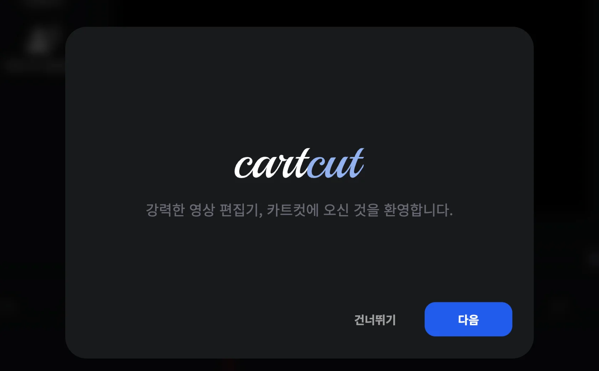
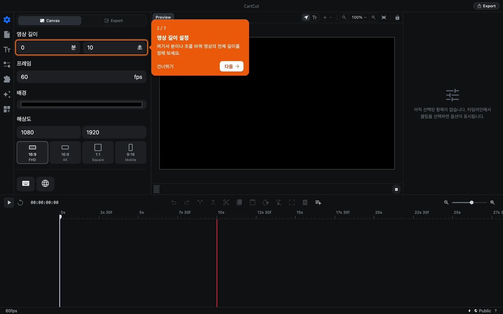

# 설치하기

CartCut은 macOS에서 실행됩니다. 이 페이지에서는 앱을 내려받아 처음 실행하고, 최신 버전으로 업데이트하는 방법을 설명합니다.

## 시스템 요구 사항

| | 요구 사항 |
| --- | --- |
| 운영체제 | macOS 13 Ventura 이상 |
| 프로세서 | Apple Silicon(M1 이상) 또는 Intel |
| 다운로드 크기 | 약 400MB |
| Mac에서 자동 자막을 만들려면 | macOS 26 이상 (그 이전 버전은 OpenAI를 대신 사용할 수 있습니다) |

> [!NOTE]
> 현재 설치 파일은 macOS용만 배포됩니다. Windows나 Linux에서는 [GitHub 저장소](https://github.com/cartesiancs/cartcut#installation)의 안내에 따라 소스 코드로 직접 빌드할 수 있습니다.

## 내려받고 설치하기

1. [cartesiancs.com/cartcut](/cartcut)에 접속해 **Download for macOS** 버튼을 누릅니다. 이 버튼은 Apple Silicon용 파일을 내려받습니다. Intel 프로세서가 탑재된 Mac이라면 버튼 아래의 **Intel Mac** 링크를 누르세요.
2. 내려받은 `.dmg` 파일을 엽니다.
3. **CartCut** 아이콘을 **응용 프로그램(Applications)** 폴더로 끌어다 놓습니다.
4. 응용 프로그램 폴더나 Spotlight(<kbd>⌘</kbd> <kbd>Space</kbd>를 누르고 "CartCut" 입력)에서 **CartCut**을 실행합니다.
5. 인터넷에서 내려받은 앱을 열 것인지 묻는 창이 나타나면 **열기**를 누릅니다. CartCut은 Apple의 서명과 공증을 받은 앱이라 이 확인은 처음 한 번만 나타납니다.

> [!TIP]
> 내 Mac이 어떤 종류인지 모르겠다면 화면 왼쪽 위 Apple 메뉴에서 **이 Mac에 관하여**를 선택하세요. **칩** 항목에 Apple M1, M2, M3 등이 적혀 있으면 Apple Silicon이고, Intel이라고 적혀 있으면 Intel용을 내려받으면 됩니다.

[GitHub 릴리스 페이지](https://github.com/cartesiancs/cartcut/releases)에서도 모든 버전을 내려받을 수 있습니다.

## 처음 실행하기

CartCut을 처음 실행하면 앱을 소개하는 짧은 환영 투어가 나타납니다. **다음**을 눌러 읽어 보거나 **건너뛰기**를 눌러 바로 시작하세요.

투어가 끝나면 주황색 안내 카드가 첫 편집에 필요한 곳을 차례로 가리킵니다. 영상 길이 설정, 파일 탭 열기, 폴더 선택, 클립 추가, 재생 헤드 이동, 텍스트 추가 순서입니다. 각 단계를 직접 해내면 카드에 **완료** 표시가 나타납니다.

두 가지 모두 언제든 다시 볼 수 있습니다.

- **Help ▸ Show Tutorial**: 단계별 안내 카드를 다시 시작합니다.
- **Help ▸ Reset Onboarding**: 환영 투어를 다시 보여 줍니다.

## macOS가 요청할 수 있는 권한

CartCut은 해당 권한이 필요한 기능을 처음 사용할 때만 권한을 요청합니다.

| 권한 | 요청되는 시점 |
| --- | --- |
| 화면 기록 | 화면 녹화 기능을 처음 사용할 때 |
| 마이크 | 오디오 녹음을 하거나 화면 녹화에 마이크를 사용할 때 |
| 카메라 | 화면 녹화에 카메라 버블을 넣을 때 |
| 음성 인식 | Mac에서 자동 자막을 만들 때 |

실수로 **허용 안 함**을 눌렀다면 **시스템 설정 ▸ 개인정보 보호 및 보안**에서 해당 권한을 찾아 CartCut을 켜고, CartCut을 종료했다가 다시 실행하세요.

## 업데이트하기

CartCut은 실행할 때마다 새 버전이 있는지 확인합니다. 새 버전이 있으면 창 오른쪽 아래에 카드가 나타납니다.

1. **다운로드**를 누릅니다. 진행 막대로 다운로드 상황을 보여 줍니다.
2. 카드에 **업데이트를 설치할 준비가 됐습니다.** 문구가 표시되면 **재시작하여 업데이트**를 누릅니다.
3. 저장하지 않은 변경 사항이 있으면 재시작 전에 한 번 더 묻습니다. 작업을 남기려면 먼저 저장하세요.

카드를 닫더라도 이미 내려받은 업데이트는 다음에 앱을 종료할 때 설치됩니다.

## 삭제하기

응용 프로그램 폴더의 **CartCut**을 휴지통으로 옮기면 됩니다. 환경 설정과 자동 저장 파일은 `~/Library/Application Support/cartcut-app` 폴더에 있으니, 모두 지우려면 이 폴더도 삭제하세요. 직접 만든 프로젝트 파일과 미디어는 이 폴더에 저장되지 않습니다.
