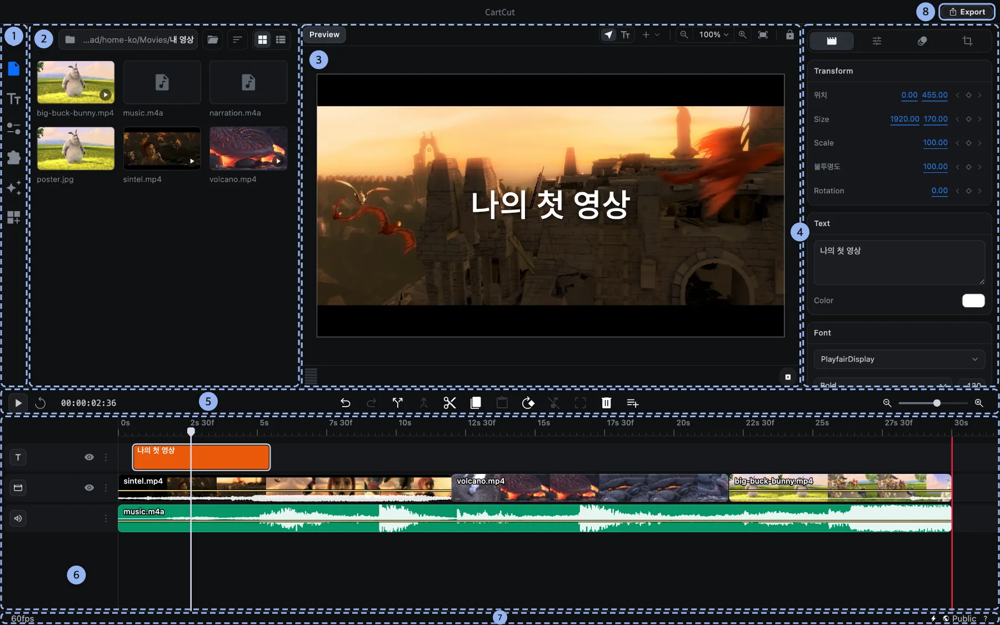
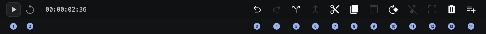

# 화면 구성

CartCut 창은 여덟 개의 영역으로 나뉩니다. 각 영역이 하는 일을 알고 나면 나머지 튜토리얼도 훨씬 쉽게 따라올 수 있습니다.

1. **사이드바**: 왼쪽 패널에 무엇을 보여 줄지 고르는 아이콘 버튼들입니다.
2. **왼쪽 패널**: 설정, 미디어 파일, 텍스트 스타일, 유틸리티, 확장 프로그램, 효과, 템플릿이 표시됩니다.
3. **미리보기**: 재생 헤드 위치의 화면을 보여 줍니다. 여기서 클립을 직접 선택하고 옮기고 크기를 바꾸고 회전할 수 있습니다.
4. **옵션 패널**: 선택한 클립의 설정이 나타납니다. 아무것도 선택하지 않았을 때는 *아직 선택된 항목이 없습니다.* 문구가 표시됩니다.
5. **타임라인 도구 모음**: 재생 버튼, 타임코드, 편집 버튼, 타임라인 확대/축소가 모여 있습니다.
6. **타임라인**: 클립을 시간 순서대로 트랙 위에 배치하는 곳입니다.
7. **상태 표시줄**: 왼쪽에는 프로젝트 프레임 레이트가, 오른쪽에는 AI 연결(⚡), 셀프 호스팅, 정보 버튼이 있습니다.
8. **Export 버튼**: 프로젝트를 영상 파일로 렌더링합니다.

영역 사이의 경계선을 드래그하면 각 영역의 크기를 조절할 수 있습니다.

## 사이드바

사이드바 아이콘에는 이름이 표시되지 않습니다. 위에서부터 차례로 다음과 같습니다.

| 아이콘 | 열리는 탭 | 용도 |
| --- | --- | --- |
| 톱니바퀴 | **설정** | 캔버스 크기, 프레임, 영상 길이, 배경, 내보내기 설정 |
| 문서 | **파일** | 폴더를 둘러보고 미디어를 타임라인에 추가 |
| Tt | **텍스트** | 미리 만들어진 스타일로 텍스트 추가 |
| 슬라이더 | **유틸리티** | 자막, 녹화, 음성 합성, 프록시, 추적 |
| 퍼즐 조각 | **확장 프로그램** | 확장 프로그램 설치와 관리 |
| 반짝이 | **효과** | 효과, 전환 효과, LUT |
| 더하기 표시가 있는 격자 | **템플릿** | 다시 쓸 수 있는 편집 템플릿 |

확장 프로그램이 이 아래에 아이콘을 더 추가할 수도 있습니다.

## 미리보기

미리보기 위쪽 막대에는 다음 기능이 있습니다.

- **Select**: 클립을 고르고 옮길 때 쓰는 기본 포인터입니다.
- **Add a shape**(**+** 버튼): 사각형, 삼각형, 원, 별, 다각형, 널 오브젝트를 추가합니다.
- **Zoom out**, 확대 비율 메뉴, **Zoom in**, **Fit to frame**: 미리보기를 확대/축소합니다.
- **Lock keyboard shortcuts**(자물쇠): 다시 누를 때까지 편집기의 단축키를 끕니다.

미리보기 아래에는 오디오 레벨 미터와 **Playback preview** 버튼이 있습니다. Playback preview를 켜면 선택 테두리와 핸들이 사라져 편집 결과를 깔끔하게 볼 수 있습니다.

## 타임라인 도구 모음

| 번호 | 버튼 | 하는 일 | 단축키 |
| --- | --- | --- | --- |
| 1 | Play / Stop | 재생 헤드 위치부터 재생 | <kbd>Space</kbd> |
| 2 | Go to start | 재생 헤드를 맨 앞으로 이동 | |
| 3 | Undo | 마지막 편집 되돌리기 | <kbd>⌘</kbd> <kbd>Z</kbd> |
| 4 | Redo | 되돌린 편집 다시 실행 | <kbd>⇧</kbd> <kbd>⌘</kbd> <kbd>Z</kbd> |
| 5 | Split at playhead | 선택한 클립을 둘로 자르기 | <kbd>⌘</kbd> <kbd>D</kbd> |
| 6 | Merge clips | 잘린 클립 조각을 다시 합치기 | |
| 7 | Cut | 선택한 클립을 복사한 뒤 삭제 | <kbd>⌘</kbd> <kbd>X</kbd> |
| 8 | Copy | 선택한 클립 복사 | <kbd>⌘</kbd> <kbd>C</kbd> |
| 9 | Paste | 재생 헤드 위치에 붙여넣기 | <kbd>⌘</kbd> <kbd>V</kbd> |
| 10 | Rotate 90° | 선택한 클립을 90도 회전 | |
| 11 | Detach audio | 영상의 소리를 별도 클립으로 분리 | |
| 12 | Crop | 영상이나 이미지 자르기(크롭) | |
| 13 | Delete | 선택한 클립 삭제 | <kbd>Delete</kbd> |
| 14 | Add track | Video, Audio, Text, Effect, Group 트랙 추가 | |

사용할 수 없는 버튼은 흐리게 표시됩니다. 예를 들어 복사한 것이 없으면 **Paste**가 흐려집니다.

## 메뉴 막대

| 메뉴 | 들어 있는 기능 |
| --- | --- |
| File | 열기, 저장, 다른 이름으로 저장, 자동 저장, 미디어 가져오기, 자막 가져오기/내보내기, 영상 내보내기 |
| Edit | 실행 취소, 다시 실행, 잘라내기, 복사, 붙여넣기, 삭제, 모두 선택, 선택 해제 |
| Clip | 자르기, 합치기, 오디오 분리, 90도 회전, 그룹, 그룹 해제, 트랙 위/아래로 이동 |
| Playback | 재생/일시정지, 이전/다음 프레임, 처음으로, 끝으로 |
| View | 미리보기 맞추기, 확대, 축소, 전체 화면 |
| Help | 단축키, 튜토리얼 보기, 온보딩 초기화 |

메뉴 이름과 항목은 영어로 표시됩니다. 설치한 확장 프로그램이 명령을 추가하면 **Extensions** 메뉴가 나타납니다.
