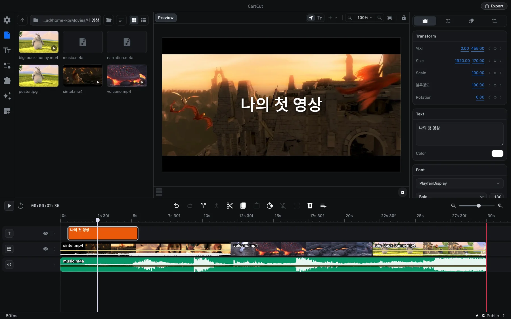

# CartCut 튜토리얼

CartCut(카트컷)은 macOS용 무료 오픈소스 영상 편집기입니다. 구독료도, 워터마크도, 계정도 필요 없습니다. 이 튜토리얼은 앱을 설치하는 것부터 첫 영상을 내보내는 것까지 안내하고, 이어서 모든 기능을 한 페이지씩 차근차근 설명합니다.



## 무엇을 만들 수 있나요

- **컷 편집**: 클립을 타임라인에 올리고, 자르고, 다듬고, 순서를 바꿉니다.
- **제목과 자막**: 20가지 내장 글꼴로 텍스트를 넣거나, 말소리를 자동으로 받아 적어 자막을 만듭니다.
- **모션**: 키프레임으로 위치, 크기, 회전, 불투명도를 움직이거나, 19가지 애니메이션 프리셋을 한 번에 적용합니다.
- **색 보정**: 15개의 슬라이더, 80개의 내장 LUT, 17가지 블렌드 모드로 색감을 만듭니다.
- **효과와 전환**: 39가지 효과와 37가지 전환 효과, 크로마키와 블러를 지원합니다.
- **화면 녹화**: 화면을 녹화하면 클릭한 곳을 자동으로 부드럽게 확대해 줍니다.
- **AI 편집**: Claude Code를 연결해 말로 편집을 요청할 수 있습니다.

## 어디서부터 시작할까요

```cards
CartCut 설치하기 | installation | 앱을 내려받고 처음 실행해 봅니다.
첫 영상 만들기 | quick-start | 빈 프로젝트에서 완성된 영상 파일까지 8단계로 따라 해 봅니다.
화면 구성 알아보기 | interface | 창의 각 영역이 무슨 일을 하는지 알아봅니다.
영상 내보내기 | export | 편집한 결과를 MP4, MOV, WebM 파일로 만듭니다.
```

## 튜토리얼 구성

| 섹션 | 다루는 내용 |
| --- | --- |
| 시작하기 | 설치, 첫 영상 빠르게 만들기, 화면 구성 |
| 프로젝트 | 캔버스 크기, 프레임 레이트, 저장, 자동 저장, 환경 설정 |
| 기본 편집 | 미디어 가져오기, 타임라인, 자르기, 위치와 크기, 오디오, 속도 |
| 그래픽과 모션 | 텍스트, 도형, 마스크, 키프레임, 그룹, 색 보정, 효과, 템플릿 |
| 도구 | 자동 자막, 화면 녹화, 기타 유틸리티 |
| 내보내기 | 렌더링 설정과 내보내기 과정 |
| 고급 | AI 편집, 확장 프로그램, 단축키 모음, 문제 해결 |

> [!NOTE]
> 이 튜토리얼은 macOS용 CartCut 0.5.10을 기준으로 작성되었습니다. 단축키는 <kbd>⌘</kbd>(Command) 키를 기준으로 표기합니다. 앱의 일부 메뉴와 버튼은 아직 영어로만 제공되기 때문에, 한국어 화면에서도 영어 표기가 섞여 보일 수 있습니다. 이 문서에서는 앱에 보이는 그대로 표기했습니다.

## 도움이 필요할 때

- <kbd>⌘</kbd> <kbd>K</kbd>를 눌러 이 튜토리얼 전체를 검색할 수 있습니다.
- 앱 안에서 **Help ▸ Show Tutorial**을 선택하면 기본 사용법을 단계별로 안내받을 수 있습니다.
- 버그 제보나 기능 제안은 [GitHub](https://github.com/cartesiancs/cartcut/issues)에 남겨 주세요.
