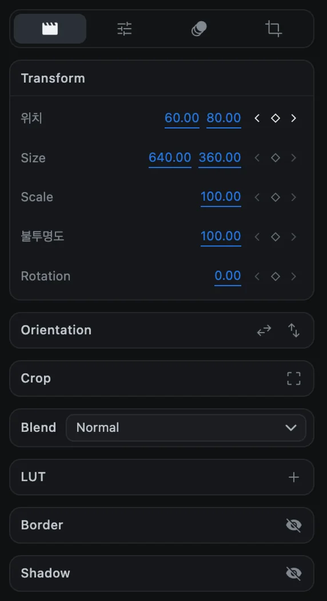
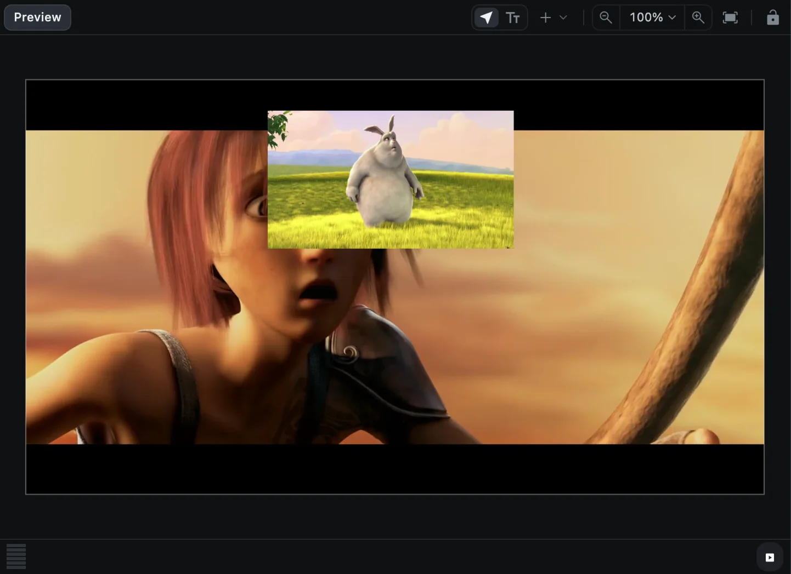
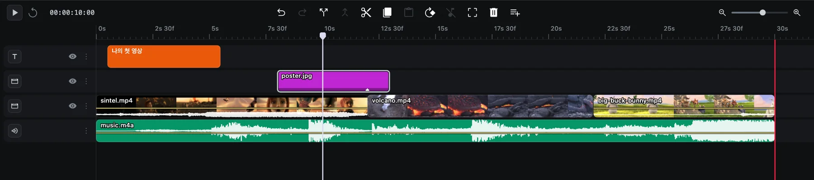
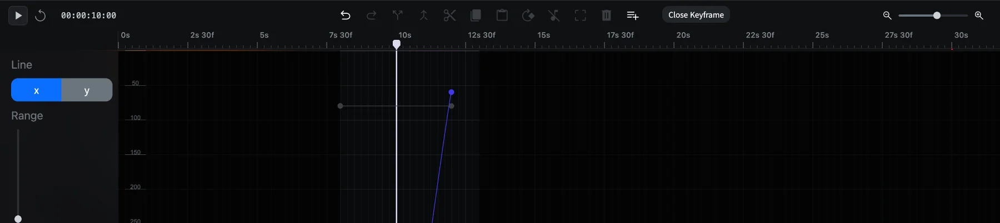

# 키프레임 애니메이션

키프레임은 특정 시점의 값을 기록한 것입니다. 한 속성에 서로 다른 값을 가진 키프레임 두 개를 만들면, CartCut이 그 사이를 부드럽게 이어 줍니다. 애니메이션은 이것이 전부입니다.

화면에 보이는 모든 클립의 **위치**, **Size**, **Scale**, **불투명도**, **Rotation**, 소리가 있는 클립의 **볼륨**, 마스크의 다섯 가지 설정, 텍스트의 **Reveal**, 효과의 세기와 설정값에 애니메이션을 줄 수 있습니다.

## 키프레임 마름모

옵션 패널에서 애니메이션을 줄 수 있는 줄 끝에는 작은 버튼 세 개가 있습니다. **‹**(이전 키프레임), **마름모**, **›**(다음 키프레임)입니다.

| 마름모 모양 | 의미 | 클릭하면 |
| --- | --- | --- |
| 속이 빈 흐린 마름모 | 애니메이션이 없는 속성 | 애니메이션을 켜고 재생 헤드 위치에 키프레임 추가 |
| 속이 빈 밝은 마름모 | 애니메이션은 있지만 이 프레임에는 키프레임이 없음 | 이 위치에 키프레임 추가 |
| 속이 찬 마름모 | 정확히 이 위치에 키프레임이 있음 | 키프레임 삭제. 마지막 하나를 지우면 애니메이션이 꺼집니다 |

애니메이션이 켜진 속성은 **어느 위치에서든 값을 바꾸면 재생 헤드 위치에 키프레임이 기록됩니다.** 마름모를 다시 누를 필요가 없습니다.

## 단계별로 따라 하기

화면 속 작은 화면(PIP)이 가로질러 움직이게 만들어 봅시다.

1. 클립을 선택하고 움직임이 시작될 위치로 재생 헤드를 옮깁니다.
2. **위치** 줄의 **마름모**를 누릅니다. 첫 번째 키프레임이 기록됩니다.
3. 움직임이 끝날 위치로 재생 헤드를 옮깁니다.
4. 숫자를 입력하거나 미리보기에서 클립을 드래그해 **위치**를 바꿉니다. 두 번째 키프레임이 기록됩니다.
5. <kbd>Space</kbd>를 눌러 재생해 봅니다.

**‹** 버튼과 **›** 버튼을 누르면 재생 헤드가 키프레임 사이를 오갑니다. 타임라인의 클립 위에 표시되는 작은 마름모가 키프레임 위치입니다.

## 곡선 편집기

곡선 편집기는 속성 값이 시간에 따라 어떻게 변하는지를 선으로 보여 주어, 변화를 원하는 모양으로 다듬을 수 있게 해 줍니다.

1. 타임라인에서 클립을 오른쪽 클릭합니다.
2. **Animate ▸** 메뉴에서 **Position** 같은 속성을 고릅니다.
3. 창 아래쪽에 편집기가 열립니다.

| 하고 싶은 일 | 방법 |
| --- | --- |
| 볼 값 고르기 | **Line** 아래의 **x** 또는 **y** (위치처럼 값이 두 개인 속성은 y도 있습니다) |
| 그래프 세로로 확대 | **Range** 드래그 |
| 키프레임 추가 | 선의 빈 곳을 클릭 |
| 키프레임 이동 | 드래그합니다. 재생 헤드에 달라붙으며, <kbd>Option</kbd>을 누르면 자유롭게 움직입니다 |
| 움직임의 완급(이징) 바꾸기 | 점 양옆의 핸들을 드래그 |
| 키프레임 삭제 | 선택하고 <kbd>Delete</kbd> |
| 편집기 닫기 | **Close Keyframe** 버튼 |

편집기에는 이름이 붙은 이징 프리셋이 따로 없습니다. 부드럽게 시작하고 멈추는 움직임은 핸들 모양으로 만듭니다.

## 애니메이션 프리셋

프리셋을 쓰면 완성된 애니메이션을 한 번에 넣을 수 있습니다.

1. 클립을 하나 이상 선택합니다.
2. 애니메이션이 들어갈 위치로 재생 헤드를 옮깁니다.
3. 옵션 패널의 **Animation** 탭을 열고 타일을 클릭합니다.

| 그룹 | 프리셋 |
| --- | --- |
| In(등장) | Fade In, Zoom In, Punch In, Overshoot, Pop, Slam, Rotate In, Move Up, Move Down, Move Left, Move Right |
| Out(퇴장) | Fade Out, Zoom Out, Exit Up, Exit Down, Exit Left, Exit Right |
| Emphasis(강조) | Drift, Shake |

타일에 마우스를 올리면 움직임을 미리 볼 수 있습니다. 재생 헤드가 클립 위에 없으면 In 프리셋은 클립 시작점에, Out 프리셋은 클립 끝에 들어갑니다. **None** 타일은 클립의 모든 애니메이션을 지웁니다.

프리셋도 일반 키프레임으로 만들어지므로, 적용한 뒤 마름모나 곡선 편집기로 자유롭게 고칠 수 있습니다.
