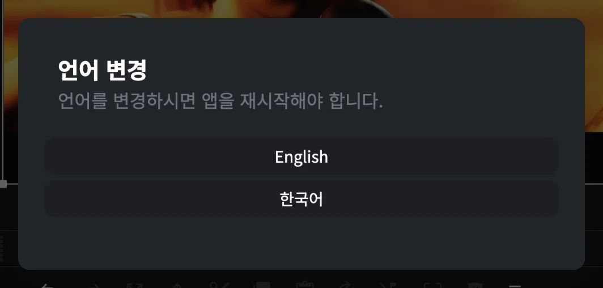

# 언어와 환경 설정

CartCut 전체에 적용되는 옵션은 몇 군데에 나뉘어 있습니다. 이 페이지에서 모두 정리합니다.

## 언어 바꾸기

CartCut은 영어와 한국어를 지원합니다.

1. **설정**(톱니바퀴 아이콘)을 엽니다.
2. 패널 아래쪽의 **지구본 버튼**을 누릅니다.
3. **English** 또는 **한국어**를 고릅니다.
4. 앱을 다시 시작해야 한다는 안내가 나타납니다. 프로젝트를 먼저 저장한 뒤 **재시작**을 누르세요.

> [!NOTE]
> 아직 모든 문구가 번역되지는 않았습니다. 메뉴, 타임라인 도구 모음, 여러 패널 이름은 한국어 화면에서도 영어로 표시됩니다.

## 단축키

지구본 옆의 **키보드 버튼**을 누르거나 **Help ▸ Keyboard Shortcuts**(<kbd>⌘</kbd> <kbd>/</kbd>)를 선택하면 앱의 모든 단축키를 볼 수 있습니다.

전체 목록은 [단축키](keyboard-shortcuts) 페이지에도 정리되어 있습니다.

다른 창에서 타자를 치거나 녹화하는 동안 CartCut이 키 입력에 반응하지 않게 하려면, 미리보기 도구 모음의 **자물쇠**(**Lock keyboard shortcuts**)를 누르세요. 다시 누르면 단축키가 켜집니다.

## 튜토리얼과 환영 투어

| 하고 싶은 일 | 선택할 메뉴 |
| --- | --- |
| 단계별 안내 카드를 다시 보기 | **Help ▸ Show Tutorial** |
| 환영 투어를 다시 보기 | **Help ▸ Reset Onboarding** |

## 업데이트

CartCut은 실행할 때마다 GitHub에서 새 버전을 확인하고, 새 버전이 있으면 오른쪽 아래에 카드를 띄웁니다. [설치하기 ▸ 업데이트하기](installation#업데이트하기)를 참고하세요.

## 버전 확인

현재 버전은 **설정** 패널 맨 아래에 *CartCut v0.5.10*처럼 표시됩니다.

## FFmpeg 복구

CartCut은 앱에 함께 들어 있는 FFmpeg로 영상을 내보냅니다. FFmpeg 관련 오류로 내보내기가 실패한다면 **About ▸ Setting**을 열고 **Reinstall FFmpeg**를 누르세요.

## 환경 설정이 저장되는 곳

언어, 튜토리얼 진행 상태, AI 연결 토큰, OpenAI 키 같은 앱 설정은 Mac의 `~/Library/Application Support/cartcut-app` 폴더에 저장됩니다. 프로젝트 파일에는 들어가지 않습니다.
