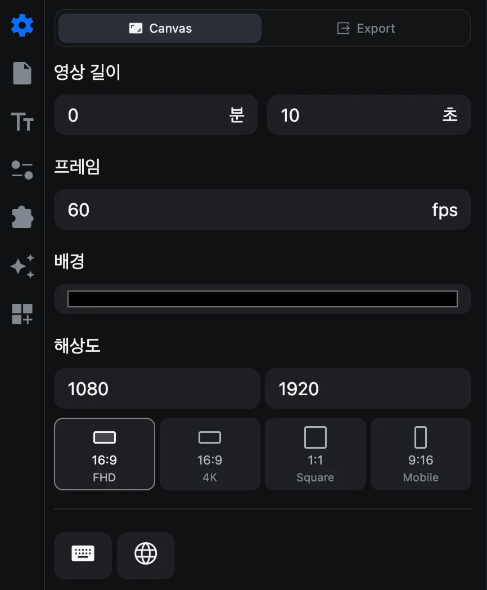

# 프로젝트 설정

모든 프로젝트에는 캔버스가 있습니다. 캔버스의 크기, 프레임 레이트, 길이, 배경색은 CartCut을 실행하면 가장 먼저 보이는 **설정 ▸ Canvas**에서 정합니다.

## 영상 길이

**영상 길이**는 완성될 영상의 길이를 **분**과 **초**로 정합니다.

- 내보낸 영상은 클립이 어디서 끝나든 항상 정확히 이 길이가 됩니다.
- 타임라인의 빨간 세로선이 끝 지점입니다. 이 선을 넘어간 클립은 내보내지지 않습니다.
- 클립을 추가해도 영상 길이는 저절로 늘어나지 않습니다. 편집이 길어지면 여기서 늘려 주세요.

> [!TIP]
> 내보낸 영상이 일찍 끝나거나 끝부분이 검은 화면이라면 가장 먼저 영상 길이를 확인하세요.

## 프레임

**프레임**은 1초에 몇 장의 화면이 들어가는지(**fps**)를 정합니다. 새 프로젝트는 60fps입니다.

- 1부터 240 사이의 정수를 쓸 수 있습니다. 많이 쓰는 값은 24(영화 느낌), 25, 30, 50, 60, 120입니다.
- 29.97처럼 소수로 된 값은 가장 가까운 정수로 반올림됩니다.
- 프레임 레이트를 바꿔도 클립 위치는 움직이지 않습니다. 편집이 맞춰지는 간격만 바뀝니다.
- 현재 프레임 레이트는 창 왼쪽 아래에 표시됩니다.

## 배경

**배경**은 캔버스에서 클립이 덮지 않은 부분에 보이는 색입니다. 색상 막대를 눌러 다른 색을 고르세요. 기본값은 검은색입니다.

## 해상도

**해상도**는 캔버스의 픽셀 크기입니다. 두 입력란은 **세로(높이)가 먼저, 가로(너비)가 나중**입니다. 16:9 HD 영상이라면 `1080`, `1920`으로 표시됩니다.

아래 네 개의 타일을 누르면 자주 쓰는 크기로 바로 바뀝니다.

| 타일 | 크기 | 어울리는 용도 |
| --- | --- | --- |
| 16:9 FHD | 1920 × 1080 | 유튜브, 발표 영상 |
| 16:9 4K | 3840 × 2160 | 고해상도 납품 |
| 1:1 Square | 1080 × 1080 | 피드 게시물 |
| 9:16 Mobile | 1080 × 1920 | 쇼츠, 릴스, 틱톡 |

> [!WARNING]
> 해상도는 편집을 시작하기 전에 정하세요. 캔버스 크기를 바꿔도 클립은 원래 위치와 크기를 그대로 유지하기 때문에, 16:9에서 9:16으로 바꾸면 클립을 새 화면에 맞게 다시 옮기고 크기를 조절해야 합니다. [위치, 크기, 회전](transform)을 참고하세요.

## 숫자를 빠르게 바꾸는 방법

CartCut의 모든 숫자 입력란은 두 가지 방법으로 바꿀 수 있습니다.

- 숫자를 좌우로 **드래그**하면 값이 연속으로 바뀝니다.
- 숫자를 **클릭**한 뒤 값을 입력하고 <kbd>Return</kbd>을 누릅니다.

## 내보내기 설정은 어디에 있나요

**Canvas** 옆의 **Export** 탭에서 영상 형식과 화질을 정합니다. 자세한 내용은 [영상 내보내기](export)를 참고하세요.
