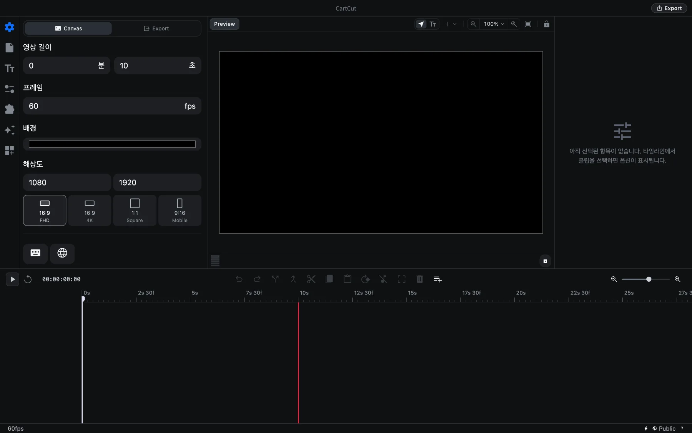

# 빠른 시작

빈 프로젝트에서 시작해 영상 파일을 내보내기까지 8단계로 따라 해 봅니다. 10분 정도면 충분합니다. 각 단계마다 더 자세한 설명 페이지로 가는 링크가 있습니다.

시작하기 전에 영상 클립 몇 개와 (원한다면) 음악 파일 하나를 한 폴더에 모아 두세요.

## 1. CartCut 실행하기

CartCut을 실행하면 이미 빈 프로젝트가 열려 있습니다. 1920 × 1080 크기, 초당 60프레임, 길이 10초인 캔버스입니다. "새 프로젝트" 메뉴는 따로 없고, 실행할 때마다 이 상태에서 시작합니다.

## 2. 영상 길이 정하기

프로젝트 길이가 곧 내보낼 영상의 길이이므로 가장 먼저 정해 둡니다.

1. 왼쪽 사이드바 맨 위의 **톱니바퀴 아이콘**을 눌러 설정을 엽니다.
2. **영상 길이**에 원하는 분과 초를 입력합니다. 이 안내에서는 `0`분 `30`초로 해 보겠습니다.

타임라인의 빨간 세로선이 새 끝 지점으로 옮겨집니다. 이 선보다 오른쪽에 있는 부분은 내보내지지 않습니다. [프로젝트 설정 자세히 보기](project-settings)

## 3. 미디어 폴더 선택하기

1. 사이드바의 두 번째 아이콘인 **문서 아이콘**을 눌러 파일 탭을 엽니다.
2. **프로젝트 폴더 지정**을 누르고 클립이 들어 있는 폴더를 고릅니다.

폴더 안의 영상, 이미지, 오디오가 썸네일로 나타납니다.

## 4. 타임라인에 클립 넣기

1. 영상 썸네일을 클릭합니다. 클립이 **재생 헤드**(흰색 세로선) 위치에 추가됩니다.
2. 타임라인 위쪽 눈금자를 따라 드래그해 재생 헤드를 첫 클립의 끝으로 옮깁니다.
3. 다음 영상을 클릭합니다. 첫 클립 바로 뒤에 붙습니다.

원하는 위치에 바로 놓고 싶다면 썸네일을 잠깐 누르고 있다가 타임라인으로 끌어다 놓으세요. [미디어 가져오기 자세히 보기](importing-media)

## 5. 필요 없는 부분 잘라내기

1. 타임라인의 클립을 클릭해 선택합니다. 선택된 클립에는 흰 테두리가 생깁니다.
2. 자르고 싶은 곳으로 재생 헤드를 옮깁니다.
3. <kbd>⌘</kbd> <kbd>D</kbd>를 누르거나, 타임라인 위 도구 모음의 **Split at playhead**(재생 헤드에서 자르기) 버튼을 누릅니다. 클립이 둘로 나뉩니다.
4. 필요 없는 쪽을 클릭하고 <kbd>Delete</kbd> 키를 누릅니다.

실수했다면 <kbd>⌘</kbd> <kbd>Z</kbd>로 되돌리면 됩니다. [자르기 자세히 보기](cutting-and-trimming)

## 6. 제목 넣기

1. 사이드바의 세 번째 아이콘인 **Tt 아이콘**을 눌러 텍스트 탭을 엽니다.
2. 제목이 나타날 위치로 재생 헤드를 옮깁니다.
3. 스타일 타일 하나를 클릭합니다. 타임라인 맨 위의 새 트랙에 텍스트 클립이 생깁니다.
4. 오른쪽 옵션 패널의 **Text** 입력란에 원하는 문구를 입력합니다.
5. 타임라인에서 텍스트 클립의 양 끝을 드래그해 보이는 시간을 조절합니다.

[텍스트 자세히 보기](text)

## 7. 음악 넣기

1. 다시 파일 탭으로 갑니다.
2. 재생 버튼 옆의 **Go to start** 버튼을 눌러 재생 헤드를 맨 앞으로 옮깁니다.
3. 음악 파일을 클릭합니다. 영상 아래의 오디오 트랙에 추가됩니다.
4. 음악 클립을 선택한 상태에서 옵션 패널의 **볼륨**을 `-8`dB 정도로 낮춰 영상 소리를 가리지 않게 합니다. 파란 숫자를 왼쪽으로 드래그하거나, 클릭한 다음 값을 입력하면 됩니다.

음악이 빨간 끝선보다 길다면 재생 헤드를 끝선에 두고 <kbd>⌘</kbd> <kbd>D</kbd>로 자른 뒤 남는 부분을 지우세요. [오디오 자세히 보기](audio)

<kbd>Space</kbd>를 누르면 재생되고, 한 번 더 누르면 멈춥니다.

## 8. 저장하고 내보내기

1. <kbd>⌘</kbd> <kbd>S</kbd>를 눌러 프로젝트를 저장합니다. 처음 저장할 때는 `.ngt` 프로젝트 파일의 이름과 위치를 정합니다.
2. 창 오른쪽 위의 **Export** 버튼을 누르거나 <kbd>⌘</kbd> <kbd>E</kbd>를 누릅니다.
3. 영상을 저장할 위치를 고르고 **Export**를 누릅니다.
4. Export 버튼이 진행 상황을 보여 주는 원 모양으로 바뀝니다. 렌더링하는 동안에도 계속 편집할 수 있습니다.
5. **Rendering is complete** 창이 나타나면 **Open Saved Folder**를 눌러 완성된 영상을 확인합니다.

[영상 내보내기 자세히 보기](export)

> [!TIP]
> 앱 안에서 단계별 안내를 받고 싶다면 **Help ▸ Show Tutorial**을 선택하세요.
