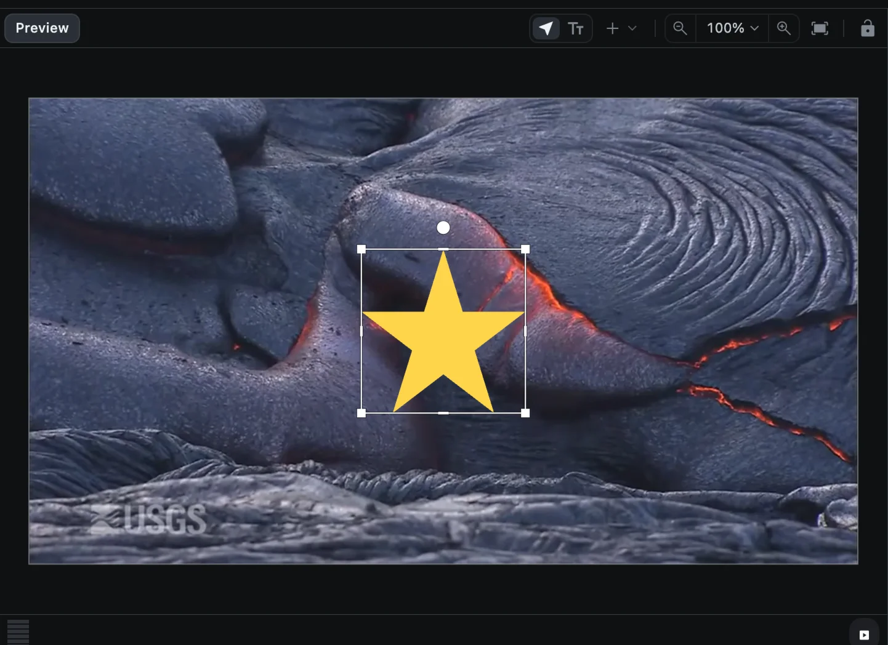
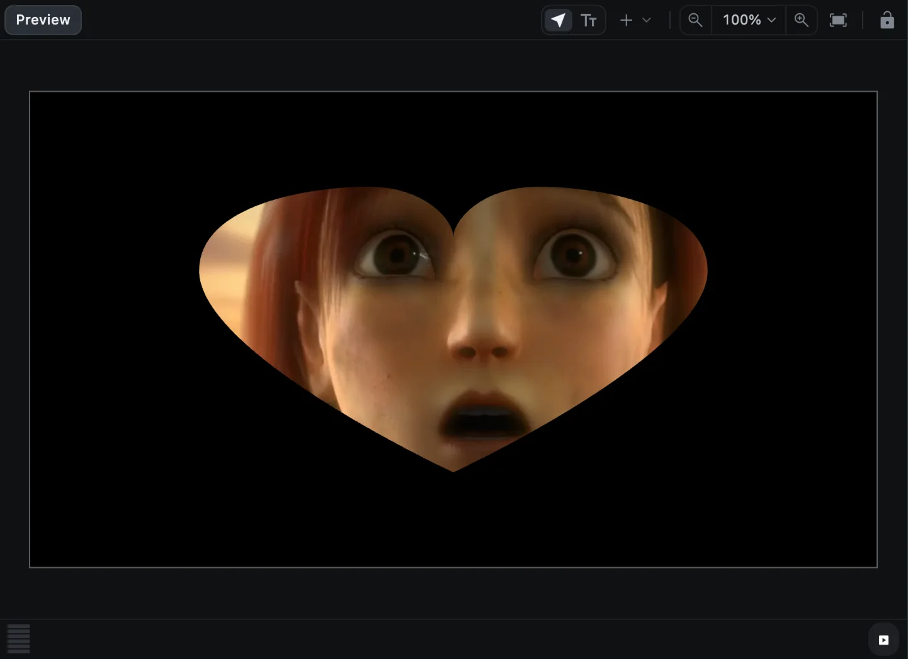

# 도형과 마스크

도형은 파일을 가져오는 대신 직접 그리는 클립입니다. 마스크는 클립을 도형 모양으로 오려 내어 일부만 보이게 합니다.

## 도형 추가하기

1. 도형이 나타날 위치로 재생 헤드를 옮깁니다.
2. 미리보기 도구 모음의 **Add a shape**(**+** 버튼)를 누릅니다.
3. **Square**(사각형), **Triangle**(삼각형), **Circle**(원), **Star**(별), **Polygon**(다각형) 중 하나를 고릅니다.

도형이 새 클립으로 추가됩니다. 다른 클립처럼 미리보기에서 옮기고 크기를 바꿀 수 있습니다. [위치, 크기, 회전](transform)을 참고하세요.

같은 메뉴 맨 아래의 **Null Object**는 여러 클립을 함께 움직일 때 쓰는 보이지 않는 손잡이입니다. [그룹과 부모 연결](groups-and-parenting)을 참고하세요.

### 원하는 모양 직접 그리기

1. **Add a shape ▸ Polygon**을 고릅니다. **+** 버튼이 강조된 상태로 유지됩니다.
2. 미리보기를 클릭해 꼭짓점을 찍습니다. 클릭할 때마다 직선이 이어집니다.
3. 미리보기 도구 모음의 **Select**를 누르면 그리기가 끝납니다.

## 도형 설정

도형 클립을 선택하고 **Shape** 섹션으로 스크롤합니다.

| 설정 | 하는 일 |
| --- | --- |
| 종류 | Rectangle(사각형), Ellipse(타원), Polygon(다각형), Star(별) |
| Arc start, Arc sweep, Hole | 타원 전용: 원의 일부만 그리거나 고리 모양을 만듭니다 |
| Count | 다각형과 별: 변이나 꼭짓점의 개수(3~60) |
| Point depth | 별 전용: 뾰족한 부분이 얼마나 깊이 파이는지 |
| Corner radius | 모서리를 둥글게 합니다. 사각형은 링크 버튼으로 모서리마다 따로 정할 수 있습니다 |
| Fill | 도형의 색 |

도형에도 영상이나 이미지처럼 **Border**와 **Shadow** 섹션이 있습니다.

## 마스크

마스크는 도형 바깥쪽을 모두 가립니다. 영상, 이미지, 도형, 텍스트에 사용할 수 있습니다.

1. 클립을 선택하고 옵션 패널의 **Mask** 탭을 엽니다.
2. 마스크 모양을 고릅니다: **rectangle**(사각형), **star**(별), **heart**(하트), **pen**(펜).
3. 아래 항목으로 마스크를 조절합니다.

| 설정 | 하는 일 |
| --- | --- |
| Position | 마스크 위치(클립 기준 %) |
| Size | 마스크 크기(클립 기준 %) |
| Rotation | 마스크 회전 |
| Feather | 가장자리를 부드럽게 흐립니다 |
| Round | 마스크 모서리를 둥글게 합니다 |
| Invert(위쪽 버튼) | 안쪽 대신 바깥쪽을 보이게 합니다 |

마스크를 없애려면 선택된 마스크 모양을 한 번 더 누르세요.

### 펜으로 마스크 그리기

1. Mask 탭에서 **pen**(또는 위쪽의 **Draw** 버튼)을 누릅니다.
2. 미리보기를 클릭해 꼭짓점을 찍거나, 클릭한 채 드래그해 곡선을 만듭니다.
3. 첫 번째 점을 다시 클릭하거나 <kbd>Return</kbd>을 누르면 모양이 닫힙니다.

| 키 | 그리는 동안 |
| --- | --- |
| <kbd>Return</kbd> | 모양 닫기 |
| <kbd>Delete</kbd> | 마지막 점 지우기 |
| <kbd>Esc</kbd> | 마스크 버리기 |

### 마스크 움직이기

마스크의 각 항목에도 키프레임 마름모가 있어서, 시간에 따라 마스크를 옮기고 키우고 부드럽게 할 수 있습니다. 클립을 오른쪽 클릭하고 **Animate mask ▸** 메뉴를 고르면 곡선 편집기에서 조절할 수도 있습니다. [키프레임 애니메이션](keyframes)을 참고하세요.
