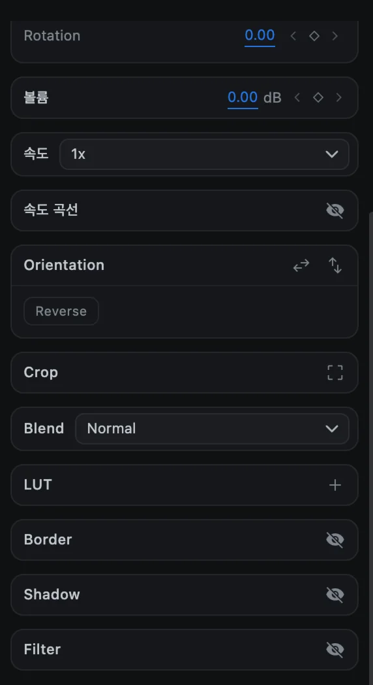
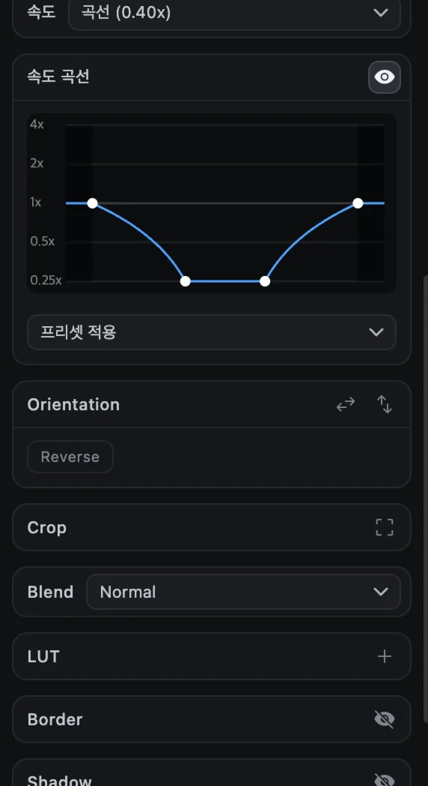

# 속도와 역재생

클립을 느리게 하거나 빠르게 하고, 속도를 부드럽게 바꾸거나 거꾸로 재생할 수 있습니다. 영상과 오디오 클립에서 사용할 수 있습니다.

## 일정한 속도

1. 영상이나 오디오 클립을 선택합니다.
2. 옵션 패널의 **속도** 메뉴를 엽니다.
3. **0.25x**, **0.5x**, **1x**, **1.5x**, **2x**, **4x** 중에서 고릅니다.

속도를 바꾸면 타임라인에서 클립의 길이도 바뀝니다. 겹치지 않도록 같은 트랙의 뒤쪽 클립이 함께 밀리거나 당겨집니다.

## 속도 곡선

속도 곡선은 클립 하나 안에서 속도를 부드럽게 바꿉니다. 예를 들어 동작의 한가운데에서 느려졌다가 다시 빨라지게 할 수 있습니다.

1. 클립을 선택합니다.
2. **속도 곡선** 줄의 **눈** 버튼을 누르면 그래프가 나타납니다.
3. **프리셋 적용**에서 모양을 고르거나 곡선을 직접 편집합니다.

| 프리셋 | 효과 |
| --- | --- |
| 일정 | 처음부터 끝까지 같은 속도 |
| 가속 | 느리게 시작해서 빠르게 끝남 |
| 감속 | 빠르게 시작해서 느리게 끝남 |
| 중간 느리게 | 가운데에서 느려짐 |
| 중간 빠르게 | 가운데에서 빨라짐 |
| 서서히 가속 | 부드럽게 빨라짐 |
| 서서히 감속 | 부드럽게 느려짐 |

### 곡선 직접 편집하기

| 하고 싶은 일 | 방법 |
| --- | --- |
| 점 추가 | 그래프를 더블클릭 |
| 점 이동 | 점을 드래그 |
| 점 삭제 | 점을 오른쪽 클릭 |

그래프는 아래쪽이 0.25x, 위쪽이 4x입니다. 곡선을 켜는 동안 속도 메뉴에는 *곡선 (0.40x)* 형태로 평균 속도가 표시됩니다. 메뉴에서 고정 속도를 고르거나 눈 버튼을 다시 누르면 곡선이 사라집니다. 곡선을 적용한 클립은 소리도 곡선에 맞춰 빨라지고 느려집니다.

## 역재생

1. 영상 클립을 선택합니다.
2. **Orientation** 섹션의 **Reverse**를 누릅니다(또는 클립 오른쪽 클릭 ▸ **Reverse**).
3. CartCut이 뒤에서 거꾸로 된 사본을 준비합니다. 버튼에 **Waiting**, 이어서 **Reversing**과 진행률이 표시되며, 그동안 계속 편집할 수 있습니다.
4. 준비가 끝나면 버튼이 **Reversed**로 바뀌고 클립이 거꾸로 재생됩니다.

다시 정방향으로 돌리려면 **Reversed**를 누르거나 오른쪽 클릭 ▸ **Un-reverse**를 선택하세요.

> [!NOTE]
> 역재생은 데스크톱 앱의 영상 클립에서 사용할 수 있습니다. 길거나 해상도가 높은 클립은 준비하는 데 시간이 더 걸립니다.
