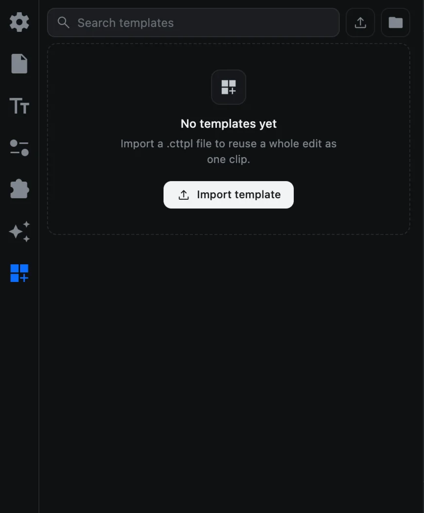

# 템플릿

템플릿은 편집 하나를 통째로 담아, 클립 하나처럼 다시 쓸 수 있게 만든 것입니다. 인트로, 하단 자막, SNS 게시물 같은 편집을 한 번 만들어 두면, 칸(슬롯)에 다른 영상과 문구를 채워 계속 다시 쓸 수 있습니다.

템플릿은 `.cttpl` 파일이며, 편집 내용과 필요한 미디어가 함께 들어 있습니다.

## 템플릿 탭

사이드바 맨 아래의 **템플릿** 탭(더하기 표시가 있는 격자 아이콘)을 엽니다.

| 기능 | 하는 일 |
| --- | --- |
| Search templates | 이름으로 템플릿 찾기 |
| 가져오기(업로드 버튼) | `.cttpl` 파일 설치하기 |
| Show the templates folder | 설치된 템플릿이 보관된 폴더 보기 |

설치된 템플릿은 **Templates**, **From Extensions**, **My Templates**로 나뉘어 표시됩니다. 내가 가져온 템플릿에 마우스를 올리면 삭제 버튼이 나타납니다.

## 템플릿 사용하기

1. 템플릿을 넣을 위치로 재생 헤드를 옮깁니다.
2. 타일을 클릭하거나 타임라인으로 끌어다 놓습니다. **템플릿 클립** 하나가 생깁니다.
3. 템플릿 클립을 선택하면 옵션 패널에 **Transform**과 **Slots**가 나타납니다.
4. 슬롯을 채웁니다.
   - **미디어 슬롯**: 클릭해서 파일을 고릅니다. 가위 모양 슬라이더로 파일의 어느 부분을 쓸지 정하고, **×** 버튼으로 슬롯을 비웁니다.
   - **텍스트 슬롯**: 새 문구를 입력합니다.

템플릿 클립도 다른 클립처럼 옮기고, 크기를 바꾸고, 애니메이션을 줄 수 있습니다.

> [!NOTE]
> 프로젝트에는 템플릿 자체가 아니라 어떤 템플릿을 썼는지만 저장됩니다. 템플릿이 설치되지 않은 컴퓨터에서 프로젝트를 열면 그 클립은 아무것도 보이지 않고, 옵션 패널에 설치되지 않았다고 표시됩니다. 그 컴퓨터에서도 `.cttpl` 파일을 가져오세요.

## 템플릿 직접 만들기

1. 평소처럼 프로젝트에서 편집을 만듭니다.
2. 바꿔 넣을 수 있게 하려는 클립마다 오른쪽 클릭 ▸ **Mark replaceable**을 선택합니다. (**Unmark replaceable**로 취소할 수 있습니다.)
3. 템플릿을 잘 보여 주는 장면으로 재생 헤드를 옮깁니다. 이 장면이 썸네일이 됩니다.
4. **유틸리티**(슬라이더 아이콘)를 열고 **Export Template**을 누릅니다.
5. 이름을 정하고 저장합니다.

알아 둘 점:

- 효과 클립과 전환 효과는 템플릿 안에서 렌더링되지 않습니다. 내보내기 전에 몇 개가 있는지 알려 줍니다.
- 템플릿 안에 다른 템플릿을 넣을 수는 없습니다.
