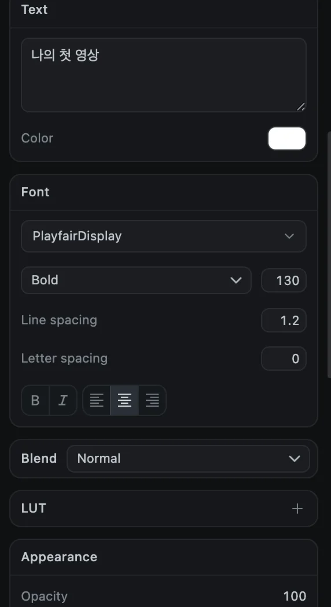
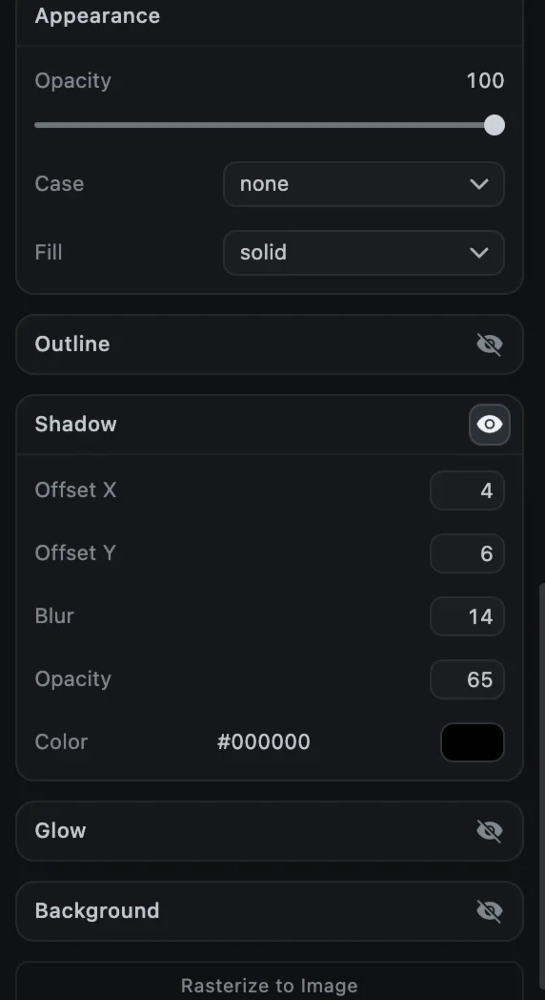

# 텍스트

제목, 하단 자막, 캡션은 모두 텍스트 클립입니다. 이 페이지에서는 텍스트를 넣고, 꾸미고, 한 글자씩 나타나게 하는 방법을 설명합니다.

## 텍스트 넣기

1. **텍스트** 탭(사이드바의 **Tt** 아이콘)을 엽니다.
2. 텍스트가 나타날 위치로 재생 헤드를 옮깁니다.
3. 타일을 클릭합니다. 영상 위쪽의 텍스트 트랙, 재생 헤드 위치에 텍스트 클립이 추가됩니다.

첫 번째 **Text** 타일은 기본 흰색 텍스트를 넣습니다. 나머지 60개 타일은 20가지 내장 글꼴과 스타일을 조합한 것입니다.

| 글꼴 | 스타일 |
| --- | --- |
| Roboto, Open Sans, Inter, Poppins, Montserrat, Raleway, Nunito, Oswald, Bebas Neue, Anton, Archivo Black, Playfair Display, Merriweather, Lora, Abril Fatface, Pacifico, Lobster, Caveat, Permanent Marker, Roboto Mono | Clean, Outline, Black Box, White Box, Yellow Pop, Pink Box, Tracked, Italic, Drop Shadow, Neon Glow, Gradient |

위쪽 **Search fonts**에 입력하면 글꼴을 빠르게 찾을 수 있습니다.

> [!TIP]
> 내장 글꼴은 대부분 한글을 포함하지 않아, 한글을 입력하면 Mac의 기본 한글 글꼴로 표시됩니다. 원하는 한글 글꼴이 있다면 옵션 패널의 **Font**에서 Mac에 설치된 글꼴을 고르세요.

## 문구 입력하기

텍스트 클립을 선택하고 옵션 패널의 **Text** 입력란에 입력합니다. <kbd>Return</kbd>을 누르면 줄이 바뀌고, 입력하는 대로 미리보기에 반영됩니다.

## 텍스트 꾸미기

| 섹션 | 설정 |
| --- | --- |
| **Text** | 문구와 글자 **Color**(색) |
| **Font** | 글꼴(내장 글꼴과 Mac에 설치된 글꼴), 굵기, 크기, 줄 간격, 자간, **B**(굵게), *I*(기울임), 정렬 |
| **Appearance** | 불투명도, 대소문자(none, uppercase, lowercase), 채우기(단색 또는 두 색과 각도로 된 그라데이션) |
| **Outline** | 글자 테두리의 두께, 불투명도, 색 |
| **Shadow** | 그림자 위치, 흐림, 불투명도, 색 |
| **Glow** | 은은한 빛 번짐의 크기, 불투명도, 색 |
| **Background** | 글자 뒤 상자의 불투명도, 여백, 모서리 둥글기, 흐림, 색 |

눈 버튼이 있는 섹션은 눈을 눌러야 켜집니다.

### 일부 글자만 꾸미기

**Text** 입력란에서 글자를 드래그해 선택한 뒤 설정을 바꾸면, 색, 크기, 글꼴, 굵기, 굵게, 기울임, 테두리가 선택한 글자에만 적용됩니다. 나머지 설정은 클립 전체에 적용됩니다.

### 텍스트를 이미지로 바꾸기

패널 맨 아래의 **Rasterize to Image**(또는 오른쪽 클릭 ▸ **Rasterize text**)를 누르면 같은 위치와 시간을 가진 이미지 클립으로 바뀝니다. 텍스트를 그림처럼 다루는 마스크나 효과를 쓰고 싶을 때 사용하세요. 이후에는 문구를 수정할 수 없습니다.

## 타자기 효과와 나타나기

텍스트가 한 글자, 한 단어, 한 줄씩 나타나게 할 수 있습니다.

1. 텍스트 클립을 선택하고 옵션 패널의 **Animation** 탭을 엽니다.
2. **Reveal**에서 **Char**(글자), **Word**(단어), **Line**(줄) 중 하나를 고릅니다.
3. 각 단위가 나타나는 간격을 밀리초로 정합니다(기본 1200).
4. **Typewriter**를 누릅니다.

재생 헤드가 클립 위에 있으면 그 위치에서, 아니면 클립 시작점에서 나타나기 시작합니다. 효과를 만든 뒤에는 **Progress**와 **Softness**로 세부 조정할 수 있습니다.

## 자막 파일

다른 프로그램의 자막을 가져오거나, 만든 자막을 다른 프로그램으로 넘길 수 있습니다.

- **File ▸ Import Subtitles…**: `.srt`나 `.vtt` 파일을 읽어 줄마다 텍스트 클립을 만듭니다. 파일의 시간이 타임라인 처음 기준인지 특정 클립 기준인지 묻습니다.
- **File ▸ Export Subtitles…**: 텍스트 클립을 `.srt`나 `.vtt` 파일로 저장합니다.

말소리에서 자막을 자동으로 만들려면 [자동 자막](auto-captions)을 참고하세요.
