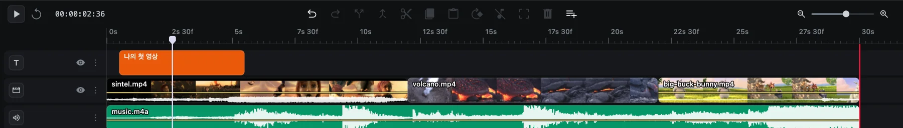
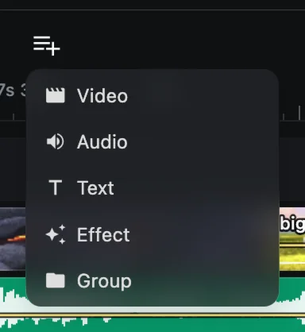
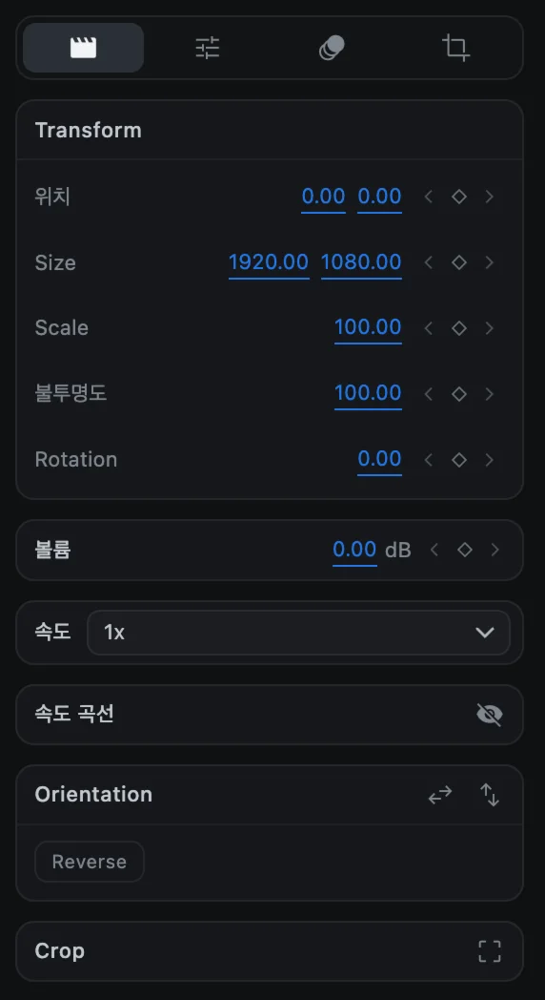
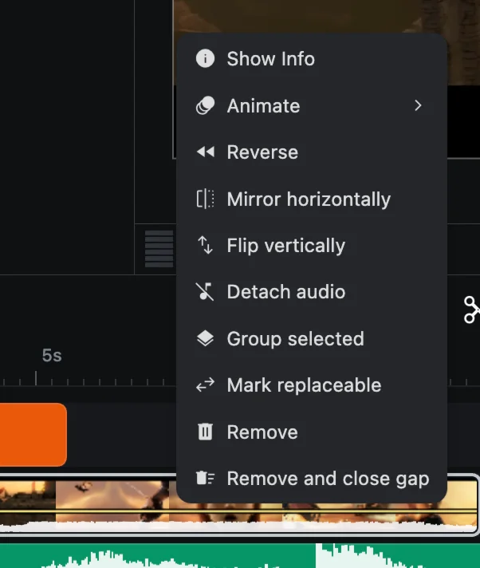

# 타임라인 다루기

타임라인은 영상을 조립하는 곳입니다. 시간은 왼쪽에서 오른쪽으로 흐르고, 트랙은 위아래로 쌓입니다.

## 타임라인의 구성

| 부분 | 설명 |
| --- | --- |
| **눈금자** | 위쪽의 시간 눈금입니다. `2s 30f`처럼 초와 프레임으로 표시합니다 |
| **재생 헤드** | 흰색 세로선입니다. 미리보기는 재생 헤드 위치의 화면을 보여 줍니다 |
| **빨간 선** | 프로젝트의 끝입니다. [프로젝트 설정](project-settings)의 **영상 길이**로 정해집니다 |
| **트랙** | 클립을 담는 줄입니다. 한 트랙에는 한 종류의 클립만 들어갑니다 |
| **트랙 헤더** | 왼쪽 열로, 트랙의 아이콘, 눈 버튼, 옵션 버튼이 있습니다 |
| **타임코드** | 재생 버튼 옆에 시:분:초:프레임으로 표시됩니다 |

## 이동하기

| 하고 싶은 일 | 방법 |
| --- | --- |
| 재생 헤드 옮기기 | 눈금자를 클릭하거나 드래그, 또는 재생 헤드를 직접 드래그 |
| 한 프레임씩 이동 | <kbd>←</kbd> 또는 <kbd>→</kbd> |
| 재생과 정지 | <kbd>Space</kbd> 또는 재생 버튼 |
| 맨 앞으로 이동 | **Go to start** 버튼 |
| 확대와 축소 | 오른쪽 위 슬라이더, 트랙패드 핀치, 또는 <kbd>Ctrl</kbd> + 스크롤 |
| 시간 방향으로 스크롤 | 트랙패드를 좌우로 쓸기, 또는 아래쪽 스크롤 막대 |
| 트랙 방향으로 스크롤 | 위아래로 스크롤 |

## 트랙

트랙은 다섯 종류가 있으며, 트랙 헤더의 아이콘으로 구분합니다.

| 트랙 | 담는 것 |
| --- | --- |
| Video | 영상, 이미지, GIF, 도형 |
| Audio | 음악, 목소리 등 소리 |
| Text | 제목과 자막 |
| Effect | 아래에 있는 모든 레이어를 바꾸는 효과 클립 |
| Group | 그룹과 널 오브젝트 |

**맨 위 트랙이 가장 앞에 보입니다.** 제목이 보이려면 영상보다 위쪽 트랙에 있어야 합니다. 순서를 바꾸려면 **Track options ▸ Move up** 또는 **Move down**을 사용하세요.

### 트랙 추가하기

도구 모음 오른쪽 끝의 **Add track**을 누르고 트랙 종류를 고릅니다. 필요할 때는 CartCut이 트랙을 자동으로 추가하기도 합니다.

### 트랙 옵션

트랙 헤더의 **⋮** 버튼을 누르면 다음 메뉴가 나타납니다.

- **Move up**, **Move down**: 레이어 순서를 바꿉니다.
- **Add effect track**: 효과 트랙을 끼워 넣습니다.
- **Delete track**: 트랙을 삭제합니다. 클립이 들어 있으면 *Delete track and N clips*로 표시됩니다. <kbd>⌘</kbd> <kbd>Z</kbd> 한 번이면 모두 되돌아옵니다.

### 트랙 숨기기

비디오, 텍스트, 효과 트랙 헤더의 **눈** 버튼을 누르면 트랙이 숨겨집니다. 숨긴 트랙은 미리보기와 **내보낸 영상에서 모두 빠지지만**, 클립은 타임라인에 그대로 남아 있어 계속 편집할 수 있습니다. 눈 버튼을 다시 누르면 보입니다.

> [!NOTE]
> 오디오 트랙에는 눈 버튼이 없고, 트랙을 숨겨도 소리는 꺼지지 않습니다. 클립의 소리를 끄려면 볼륨을 낮추세요. [오디오](audio)를 참고하세요.

## 클립 선택하기

| 하고 싶은 일 | 방법 |
| --- | --- |
| 클립 하나 선택 | 클릭 |
| 선택에 추가 | <kbd>Shift</kbd> + 클릭 |
| 여러 클립 한꺼번에 선택 | 타임라인의 빈 곳에서 드래그해 사각형 그리기 |
| 모두 선택 | <kbd>⌘</kbd> <kbd>A</kbd> |
| 선택 해제 | <kbd>⇧</kbd> <kbd>⌘</kbd> <kbd>A</kbd> 또는 빈 곳 클릭 |

선택한 클립의 설정은 오른쪽 옵션 패널에 나타납니다.

## 스냅

클립 가장자리가 다른 클립의 가장자리, 재생 헤드, 타임라인 시작점에 가까워지면 자동으로 달라붙고, 안내선이 그 위치를 보여 줍니다. 모든 편집은 프레임 단위로 맞춰집니다. 스냅은 항상 켜져 있습니다.

## 클립 메뉴

클립을 오른쪽 클릭하면 그 클립에 할 수 있는 작업이 나타납니다. 해당 클립에 쓸 수 있는 항목만 표시됩니다.

| 항목 | 하는 일 |
| --- | --- |
| Show Info | 영상, 이미지, GIF, 오디오 클립의 파일 정보 |
| Animate ▸ | 속성의 키프레임 곡선 편집기를 엽니다. [키프레임 애니메이션](keyframes) 참고 |
| Reverse | 영상을 거꾸로 재생합니다. [속도와 역재생](speed-and-reverse) 참고 |
| Mirror horizontally / Flip vertically | 화면을 좌우 또는 상하로 뒤집습니다 |
| Detach audio | 영상의 소리를 별도의 오디오 클립으로 분리합니다 |
| Rasterize text | 텍스트 클립을 이미지 클립으로 바꿉니다 |
| Group selected / Ungroup / Remove from group | [그룹과 부모 연결](groups-and-parenting) 참고 |
| Mark replaceable | [템플릿](templates)을 내보낼 때 바꿔 넣을 수 있는 칸으로 지정합니다 |
| Remove | 클립을 지우고 빈 자리를 남깁니다 |
| Remove and close gap | 클립을 지우고, 같은 트랙의 뒤쪽 클립을 당겨 빈 자리를 메웁니다 |
