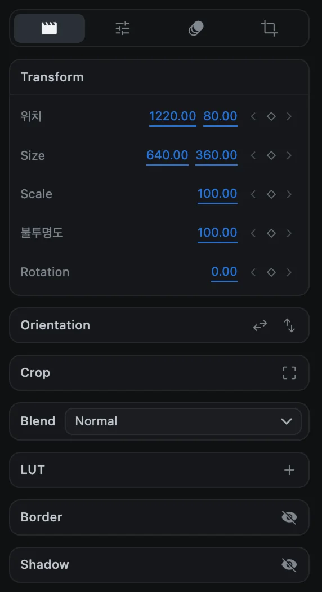
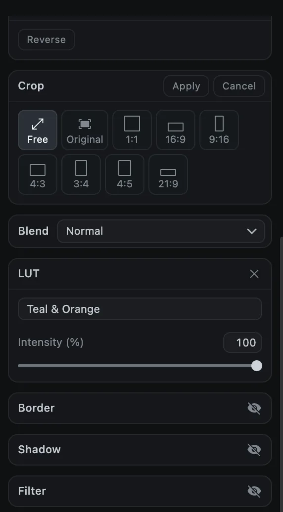

# 위치, 크기, 회전

화면에 보이는 모든 클립은 옮기고, 크기를 바꾸고, 회전하고, 투명하게 하고, 잘라 내고, 뒤집을 수 있습니다. 옵션 패널에서 숫자로 조절하거나 미리보기에서 직접 조절할 수 있습니다.

## 옵션 패널에서 조절하기

클립을 선택하고 **Media** 탭 맨 위의 **Transform** 섹션을 봅니다.

| 설정 | 의미 |
| --- | --- |
| **위치** | 클립 왼쪽 위 모서리의 X, Y 좌표(캔버스 픽셀)입니다. `0, 0`이 화면 왼쪽 위입니다 |
| **Size** | 가로, 세로 크기(픽셀) |
| **Scale** | 크기 값은 그대로 두고 가운데를 기준으로 비율만 키우거나 줄입니다(%) |
| **불투명도** | 0(보이지 않음)부터 100(불투명)까지 |
| **Rotation** | 시계 방향 회전 각도 |

파란 숫자를 드래그하거나 클릭해서 값을 입력하세요. 각 줄 오른쪽의 작은 마름모는 키프레임을 추가하는 버튼입니다. [키프레임 애니메이션](keyframes)을 참고하세요.

## 미리보기에서 직접 조절하기

미리보기에서 클립을 클릭하면 핸들이 달린 상자가 나타납니다.

과 핸들.")

| 하고 싶은 일 | 방법 |
| --- | --- |
| 옮기기 | 상자 안쪽을 드래그합니다. 화면 가장자리와 가운데에 안내선이 나타납니다 |
| 크기 바꾸기 | 네모난 핸들 여덟 개 중 하나를 드래그합니다 |
| 회전하기 | 상자 위의 동그란 손잡이를 드래그합니다 |
| 비율 고정/해제 | 크기를 바꾸는 동안 <kbd>Shift</kbd>를 누릅니다 |

영상과 이미지는 기본적으로 비율이 고정되고 <kbd>Shift</kbd>를 누르면 풀립니다. 텍스트, 도형, 그룹은 반대로 자유롭게 바뀌고 <kbd>Shift</kbd>를 누르면 비율이 고정됩니다.

### 미리보기 확대와 이동

| 하고 싶은 일 | 방법 |
| --- | --- |
| 화면 전체 맞추기 | <kbd>⌘</kbd> <kbd>0</kbd> 또는 **Fit to frame** |
| 확대/축소 | <kbd>⌘</kbd> <kbd>+</kbd> / <kbd>⌘</kbd> <kbd>-</kbd>, 핀치, 또는 비율 메뉴(25%~800%) |
| 화면 이동 | 빈 곳을 드래그하거나 두 손가락으로 쓸기 |

미리보기를 확대해도 영상 자체는 바뀌지 않고 보는 크기만 달라집니다.

## Orientation(방향)

**Orientation** 섹션에는 **좌우 반전**(Mirror the picture left to right)과 **상하 반전**(Flip the picture top to bottom) 버튼이 있습니다. 클립을 90도 돌리려면 도구 모음의 **Rotate 90°** 버튼을 누르세요.

## Crop(자르기)

크롭은 영상이나 이미지의 일부만 보이게 합니다.

1. 영상이나 이미지 클립 하나를 선택합니다.
2. 도구 모음의 **Crop**이나 **Crop** 섹션의 크롭 버튼을 누릅니다.
3. 비율을 고릅니다: **Free**, **Original**, 1:1, 16:9, 9:16, 4:3, 3:4, 4:5, 21:9.
4. 미리보기에서 크롭 상자와 핸들을 드래그합니다.
5. **Apply**를 누르거나 <kbd>Return</kbd>을 누릅니다. **Cancel**이나 <kbd>Esc</kbd>를 누르면 원래대로 돌아갑니다.

크롭한 클립에는 **Reset** 버튼이 생겨, 누르면 전체 화면이 다시 보입니다.

## 블렌드 모드

**Blend**는 클립이 아래 클립과 어떻게 섞일지 정합니다. 17가지 모드가 있습니다.

| 그룹 | 모드 |
| --- | --- |
| 기본 | Normal |
| 어둡게 | Darken, Multiply, Color Burn |
| 밝게 | Lighten, Screen, Color Dodge, Add |
| 대비 | Overlay, Soft Light, Hard Light |
| 비교 | Difference, Exclusion |
| 성분 | Hue, Saturation, Color, Luminosity |

> [!TIP]
> 빛 번짐이나 연기 영상을 원본보다 위 트랙에 놓고 **Screen**으로 설정하면 밝은 부분만 자연스럽게 겹쳐집니다.

## 테두리와 그림자

**Border**의 눈 버튼을 켜면 클립에 테두리를 그립니다. 두께, 불투명도, 색, 테두리가 가장자리 안쪽/가운데/바깥쪽 중 어디에 놓일지 정할 수 있습니다. **Shadow**는 위치, 흐림, 불투명도, 색을 조절할 수 있는 그림자를 추가합니다.
