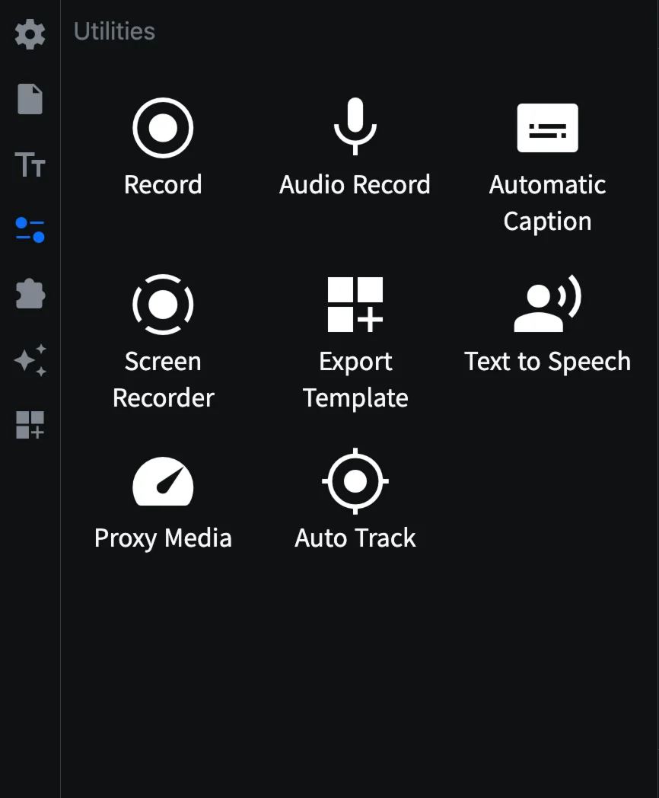
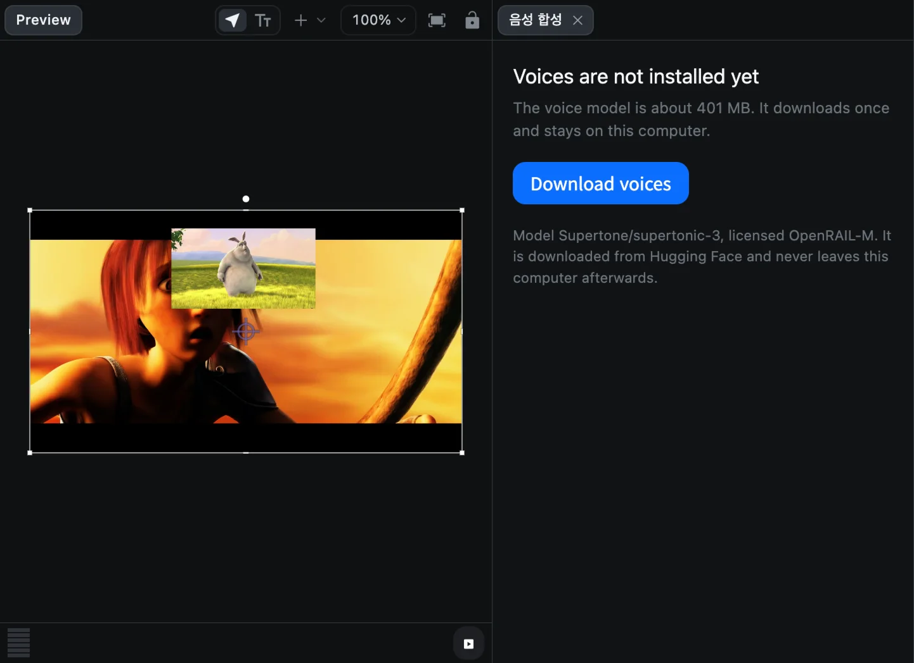
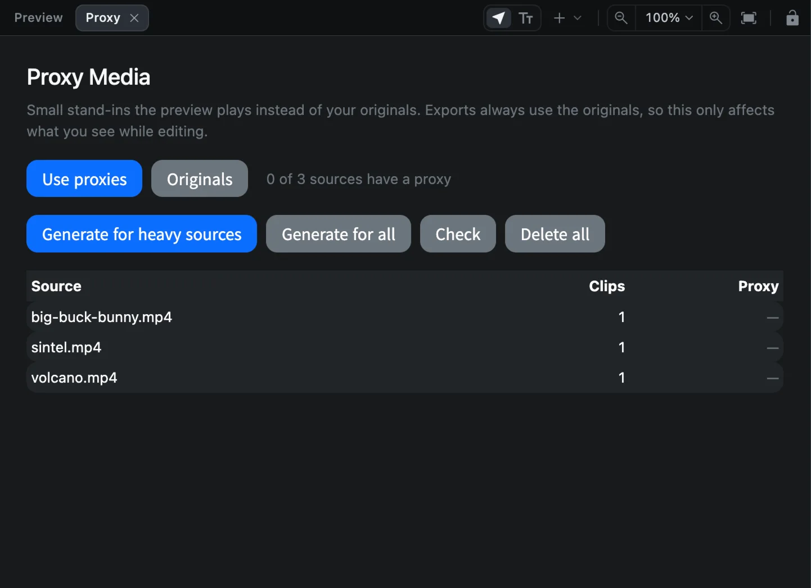
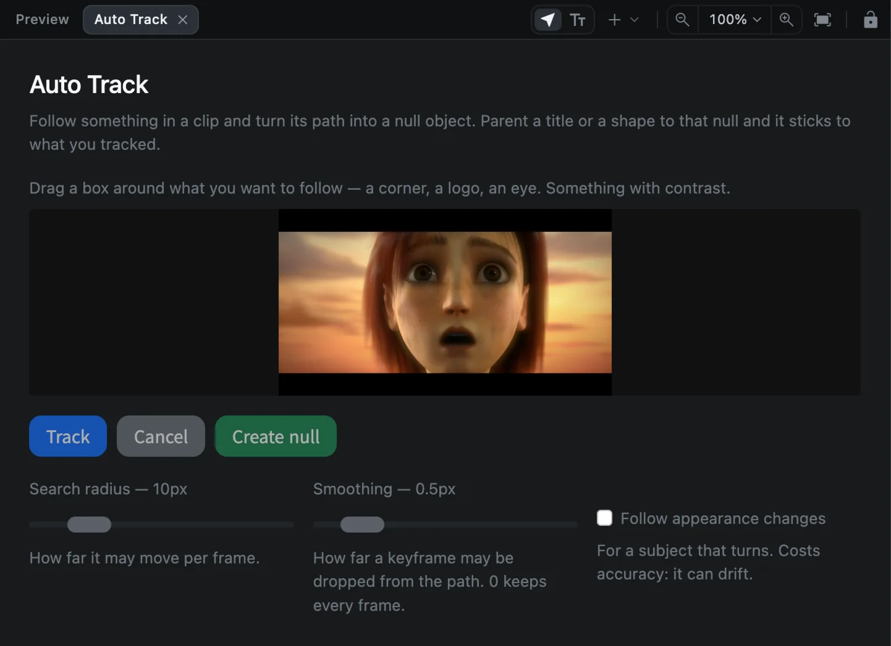

# 기타 유틸리티

**유틸리티** 탭(사이드바 네 번째의 슬라이더 아이콘)에는 한 번에 여러 작업을 해 주는 도구가 모여 있습니다.

| 유틸리티 | 하는 일 | 설명 페이지 |
| --- | --- | --- |
| Record | 미리보기 탭에서 하는 간단한 화면 녹화 | [화면 녹화](screen-recording#간단한-녹화기) |
| Audio Record | 마이크 녹음 | [오디오](audio#내레이션-녹음하기) |
| Automatic Caption | 말소리를 자막으로 바꾸고 무음 구간 제거 | [자동 자막](auto-captions) |
| Screen Recorder | 카메라, 그리기, 자동 확대를 지원하는 화면 녹화 | [화면 녹화](screen-recording) |
| Export Template | 프로젝트를 다시 쓸 수 있는 템플릿으로 저장 | [템플릿](templates#템플릿-직접-만들기) |
| Text to Speech | 입력한 문장으로 내레이션 만들기 | 아래 참고 |
| Proxy Media | 무거운 영상의 가벼운 사본을 만들어 부드럽게 재생 | 아래 참고 |
| Auto Track | 움직이는 대상을 따라가는 널 오브젝트 만들기 | 아래 참고 |

## Text to Speech

Text to Speech(음성 합성)는 입력한 문장을 Mac 안에서 목소리로 바꿔 줍니다. 계정이나 API 키가 필요 없습니다.

1. **Text to Speech**를 누르면 미리보기 옆에 패널이 열립니다.
2. 처음에는 **Download voices**를 누릅니다. 목소리 모델은 약 400MB이며 한 번만 내려받습니다.
3. 입력란에 읽어 줄 문장을 입력합니다.
4. **Voice**(목소리), **Language**(한국어, 영어, 일본어, 중국어, 스페인어, 프랑스어, 독일어, 기타), **Speed**(0.5x~2x), **Quality**(**Balanced** 또는 **Best**)를 고릅니다.
5. **Generate**를 누르면 오디오 클립이 재생 헤드 위치에 추가됩니다.

## Proxy Media

4K 스마트폰 영상이나 레티나 화면 녹화처럼 해상도나 프레임 레이트가 높은 영상은 재생이 느릴 수 있습니다. 프록시는 미리보기에서 대신 재생하는 작은 사본입니다. **내보내기에는 항상 원본 파일을 사용**하므로 최종 영상의 화질에는 영향이 없습니다.

1. **Proxy Media**를 누르면 미리보기 위에 **Proxy** 탭이 열리고, 원본 파일마다 사용 중인 클립 수와 프록시 유무가 표시됩니다.
2. **Generate for heavy sources**(무거운 파일만 만들기) 또는 **Generate for all**(모두 만들기)을 누릅니다.
3. **Use proxies**(프록시 사용)와 **Originals**(원본)를 언제든 전환할 수 있습니다.

**Check**는 목록을 다시 확인하고, **Delete all**은 모든 프록시를 지웁니다.

## Auto Track

Auto Track은 얼굴, 로고, 자동차처럼 영상 속에서 움직이는 대상을 따라가며, 그 움직임대로 움직이는 **널 오브젝트**를 만듭니다. 널에 제목, 도형, 블러를 연결하면 대상을 따라 함께 움직입니다.

1. 영상 클립을 선택하고 **Auto Track**을 누르면 미리보기 위에 탭이 열립니다.
2. 따라갈 대상 주위로 상자를 드래그합니다. 모서리나 눈처럼 대비가 뚜렷한 곳을 고르세요.
3. **Track**을 누르고 CartCut이 프레임마다 따라가는 동안 기다립니다. **Cancel**로 멈출 수 있습니다.
4. **Create null**을 누릅니다.
5. **Parent**로 새 널에 클립을 연결합니다. [그룹과 부모 연결](groups-and-parenting#클립을-부모에-연결하기)을 참고하세요.

| 설정 | 하는 일 |
| --- | --- |
| Search radius | 한 프레임 사이에 대상이 움직일 수 있는 거리 |
| Smoothing | 키프레임을 얼마나 줄여도 되는지. 0이면 모든 프레임을 유지합니다 |
| Follow appearance changes | 돌거나 모양이 바뀌는 대상을 따라갑니다. 정확도가 조금 떨어질 수 있습니다 |

유틸리티 탭을 닫으려면 미리보기 위 탭의 **×** 버튼을 누르세요.
